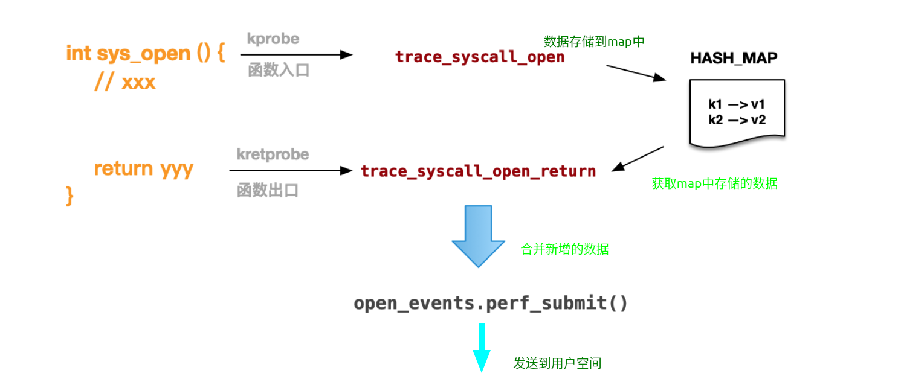

# 1

https://github.com/iovisor/bcc/blob/master/docs/tutorial.md

https://github.com/iovisor/bcc/blob/master/docs/tutorial_bcc_python_developer.md

https://github.com/iovisor/bcc/blob/b209161fd7cacd03fd082ce3c0af89cfa652792d/docs/reference_guide.md


## 四篇对比

|                                                              |                                                              |
| ------------------------------------------------------------ | ------------------------------------------------------------ |
| [【BPF入门系列-7】使用 ebpf 实时持续跟踪进程文件记录](https://www.ebpf.top/post/ebpf_trace_file_open/) | `bpf_trace_printk`：内核空间打印，只能支持3 个参数，而且只运行一个 %s，追踪函数==共享输出==<br/>`b.trace_print`：用户空间读取上面的输出<br/><br/>`b.attach_kprobe`：==追踪入口，关联钩子函数，获取入参==<br/>`b.attach_kretprobe`：==追踪出口，关联钩子函数，获取结果值==<br/> |
| [【BPF入门系列-8】文件打开记录跟踪之 perf_event 篇](https://www.ebpf.top/post/ebpf_trace_file_open_perf_output/) | <font title="gray">K</font>：<br/>`event_data_t`：自定义结构体，用于K-U通信，且不存在参数数量和数据大小等限制<br/>`BPF_PERF_OUTPUT`(==open_events==)用于追踪函数之间的==隔离==，以及向用户空间==发布==event_data_t<br/>`open_events.perf_submit`用于将 event_data_t 数据==发送==至用户空间<br/><br/><br/><font title="gray">U</font>：<br/>b["==open_events=="].`open_perf_buffer`(<font style="background-color:#8bc34a">print_event</font>)：将用户空间接收的数据与数据的处理函数(print_event)==关联==起来<br/>`b.perf_buffer_poll`：==轮询==，有数据就使用处理函数(<font style="background-color:#8bc34a">print_event</font>)进行处理<br/>b["==open_events=="].`event`(data):从data中还原出钩子函数中定义的结构体event_data_t |
| [【BPF入门系列-9】文件打开记录结果跟踪篇](https://www.ebpf.top/post/ebpf_trace_file_return) | `BPF_HASH(map, k_type, v_type)`：定义ebpf HASH_MAP<br/>ebpf hash-map c语言版操作函数`update`、`lookup`、`delete`<br/>`bpf_probe_read(dst, dst_len, src)`：安全的strncpy<br/>`bpf_get_current_comm(dst, dst_len)`：读取当前进程的 commandline 至dst中存储<br/>`PT_REGS_RC`：从 ctx 字段中读取本次函数跟踪的返回值 |
| [【BPF入门系列-10】使用 tracepoint 跟踪文件 open 系统调用](https://www.ebpf.top/post/open_tracepoint_trace/) | ==/sys/kernel/debug/tracing/events/syscalls/sys_enter_open/format==<br/>`TRACEPOINT_PROBE(category, event)`：category 就是子系统，event 代表事件名，比如（syscalls, sys_enter_open）<br/>==args==代替ctx参数和其他入参：`args->filename` <br/><br/><br/> |
|                                                              |                                                              |
| [【BPF入门系列-11】使用 eBPF 技术跟踪 Netfilter 数据流过滤结果](https://www.ebpf.top/post/iptalbes_ebpf/) | bpf_ktime_get_ns<br/>b.kprobe_poll(1)<br/>BPF_STACK_TRACE(stacks, 2048);<br/>stacks.get_stackid(ctx, 0)<br/>PT_REGS_IP(ctx)<br/>stack_traces = b.get_table("stacks")<br/>kernel_tmp = stack_traces.walk(event.kernel_stack_id)<br/> |
|                                                              |                                                              |
|                                                              |                                                              |
|                                                              | <font style="background-color:#7bc3ff"></font>               |


### [【BPF入门系列-7】使用 ebpf 实时持续跟踪进程文件记录](https://www.ebpf.top/post/ebpf_trace_file_open/)

open函数原型是：

```c
int open(const char *pathname, int flags);
```

在open函数上添加钩子`trace_syscall_open`，该钩子的入参，除了常规的`struct pt_regs *ctx`，

还需要有open函数的两个入参，即``打开的文件名``和`flag`

```python
#!/usr/bin/python
from bcc import BPF

#prog其实是注入内核执行的钩子函数
prog = """
int trace_syscall_open(struct pt_regs *ctx, const char __user *filename, int flags) {
    u32 pid = bpf_get_current_pid_tgid() >> 32;
    u32 uid = bpf_get_current_uid_gid();

    bpf_trace_printk("%d [%s]\\n", pid, filename);
    return 0;
}
"""

#下面是用户空间的代码，用于将钩子函数获取的内核数据读取出来
b = BPF(text=prog)
b.attach_kprobe(event=b.get_syscall_fnname("open"), fn_name="trace_syscall_open")
try:
    b.trace_print()
except KeyboardInterrupt:
    exit()
```


再比如，这里有一个 [名为 disksnoop 的 BPF 程序](https://github.com/iovisor/bcc/blob/0c8c179fc1283600887efa46fe428022efc4151b/examples/tracing/disksnoop.py)

```python
BPF_HASH(start, struct request *);
void trace_start(struct pt_regs *ctx, struct request *req) {
    // stash start timestamp by request ptr
    u64 ts = bpf_ktime_get_ns();
    start.update(&req, &ts);
}
...
b.attach_kprobe(event="blk_start_request", fn_name="trace_start")
b.attach_kprobe(event="blk_mq_start_request", fn_name="trace_start")
```

挂载到内核函数blk_mq_start_request，该函数原型是：

```c
//include/linux/blk-mq.h:522:
void blk_mq_start_request(struct request *rq);
```

钩子函数的入参除了常规的`struct pt_regs *ctx`，还需要有`blk_mq_start_request`的入参`struct request *rq`


### [【BPF入门系列-8】文件打开记录跟踪之 perf_event 篇](https://www.ebpf.top/post/ebpf_trace_file_open_perf_output/)

```python
prog = """
#include <uapi/linux/limits.h> // for  NAME_MAX

//  define struct
struct event_data_t {
    u32 pid;
    char fname[NAME_MAX];  // max of filename
};

//  declare BPF_PERF_OUTPUT define
# 1. open_events 作用其实算是一种隔离，可以使不同的跟踪函数的数据隔离开
BPF_PERF_OUTPUT(open_events);

int trace_syscall_open(struct pt_regs *ctx, const char __user *filename, int flags) {
    u32 pid = bpf_get_current_pid_tgid() >> 32;

    // 3.1 define event data and fill data
    struct event_data_t evt = {};

    evt.pid = pid;
    bpf_probe_read(&evt.fname, sizeof(evt.fname), (void *)filename);

    // bpf_trace_printk("%d [%s]\\n", pid, filename); =>
    // 3.2 submit the event
    open_events.perf_submit(ctx, &evt, sizeof(evt));

    return 0;
}
"""

b = BPF(text=prog)
b.attach_kprobe(event=b.get_syscall_fnname("open"), fn_name="trace_syscall_open")

# 2. define process event
def print_event(cpu, data, size):
    #1.2 这里获取到的是当前跟踪函数获取到的内核数据
  event = b["open_events"].event(data)
  print("Rcv Event %d, %s"%(event.pid, event.fname))

#  loop with callback to print_event
# 1.1 这里打开的只是当前跟踪函数的buffer
# 2.1 并将buffer与print_event关联
b["open_events"].open_perf_buffer(print_event)
while True:
    try:
        b.perf_buffer_poll()  # 2.2 perf poll，轮询，有数据就使用print_event处理，因为已经关联起来了
    except KeyboardInterrupt:
        exit()
```


### [【BPF入门系列-9】文件打开记录结果跟踪篇](https://www.ebpf.top/post/ebpf_trace_file_return)





```python
#!/usr/bin/python
from bcc import BPF

prog = """
#include <uapi/linux/limits.h> // for  NAME_MAX
#include <linux/sched.h> // for TASK_COMM_LEN

struct event_data_t {
    u32 pid;
    u32 ret; // +add
    char comm[TASK_COMM_LEN];
    char fname[NAME_MAX];
};

// +add
struct val_t {
    u64 id;
    const char *fname;
};

BPF_HASH(infotmp, u64, struct val_t);
BPF_PERF_OUTPUT(open_events);

int trace_syscall_open(struct pt_regs *ctx, const char __user *filename, int flags) {
    struct val_t val = {};
    u64 id = bpf_get_current_pid_tgid();

    val.id = id;
    val.fname = filename;

    infotmp.update(&id, &val);

    return 0;
}

int trace_syscall_open_return(struct pt_regs *ctx)
{
    u64 id = bpf_get_current_pid_tgid();
    struct val_t *valp;
    struct event_data_t evt = {};

    valp = infotmp.lookup(&id);
    if (valp == 0) {
        // missed entry
        return 0;
    }

    evt.pid = id >> 32;
    evt.ret = PT_REGS_RC(ctx);
    bpf_probe_read(&evt.fname, sizeof(evt.fname), (void *)valp->fname);
    bpf_get_current_comm(&evt.comm, sizeof(evt.comm));

    open_events.perf_submit(ctx, &evt, sizeof(evt));

    infotmp.delete(&id);
    return 0;
}
"""

b = BPF(text=prog)
b.attach_kprobe(event=b.get_syscall_fnname("open"), fn_name="trace_syscall_open")
b.attach_kretprobe(event=b.get_syscall_fnname("open"), fn_name="trace_syscall_open_return")

# process event
def print_event(cpu, data, size):
  event = b["open_events"].event(data)
  print("[%s] %d, %s, res: %d"%(event.comm, event.pid, event.fname, event.ret))

# loop with callback to print_event
b["open_events"].open_perf_buffer(print_event)
while True:
    try:
        b.perf_buffer_poll()
    except KeyboardInterrupt:
        exit()

```


<font>[Q]</font>一定要使用一个ebpf map才能在trace_syscall_open、trace_syscall_open_return这两个追踪函数之间传递数据吗？全局变量不行吗？

<font title="blue">[A]</font>


### [【BPF入门系列-10】使用 tracepoint 跟踪文件 open 系统调用](https://www.ebpf.top/post/open_tracepoint_trace/)

<font>[Q]</font>使用TRACEPOINT_PROBE(syscalls,sys_enter_open)、TRACEPOINT_PROBE(syscalls,sys_exit_open)可以改写[【BPF入门系列-9】文件打开记录结果跟踪篇](https://www.ebpf.top/post/ebpf_trace_file_return)的代码吗？用什么在两个追踪函数之间传递数据呢？

<font title="blue">[A]</font>尝试用与-9一样的ebpf hashmap实现，既然eBPF 程序可以挂载到内核跟踪点 `tracepoint`，那么肯定也支持map的使用。


`tracepoint` 的介绍可以参见 [Kernel 文档这里](https://www.kernel.org/doc/html/latest/trace/tracepoints.html)。从 Linux 内核 4.7 开始，eBPF 程序可以挂载到内核跟踪点 `tracepoint`。在此之前，要完成内核中函数跟踪的工作，只能用 `kprobes/kretprobe` 等方式挂载到导出的内核函数（参见 `/proc/kallsyms`），正如我们前几篇文章跟踪 `open` 系统调用方式那样。尽管 `kprobes` 可以达到跟踪的目的，但存在很多不足：

1. 内核的内部 API 不稳定，如果内核版本变化导致声明修改，我们的跟踪程序就不能正常工作；
2. 出于性能考虑，大部分网络相关的内层函数都是内联或者静态的，两者都不能使用 `kprobes` 方式探测；
3. 找出调用某个函数的所有地方是相当乏味的，有时所需的字段数据不全具备；

`tracepoint` 是由内核开发人员在代码中设置的静态 `hook` 点，具有稳定的 `API` 接口，不会随着内核版本的变化而变化，可以提高我们内核跟踪程序的可移植性。但是由于 `tracepoint` 是需要内核研发人员参数编写，因此在内核代码中的数量有限，并不是所有的内核函数中都具有类似的跟踪点，所以从灵活性上不如 `kprobes` 这种方式。在 3.10 内核中，`kprobe` 与 `tracepoint` 方式对比如下：

| 项目                   | kprobes | `tracepoint`              |
| :--------------------- | :------ | :------------------------ |
| 跟踪类型               | 动态    | 静态                      |
| 可跟踪数量             | 100000+ | 1200+ （perf list\|wc -l) |
| 是否需要内核开发者维护 | 不需要  | 需要                      |
| 禁止的开销             | 无      | 少许 （NOPs 和元数据）    |
| 稳定的 API             | 否      | 是                        |

> 参考：《BPF Performace Tools》 2.9 Tracepoints，数据有更新。

在我们的内核跟踪程序中，如果存在 `tracepoint` 方式，我们应该优先使用，这使得跟踪程序具有良好的可移植性。

==使用 tracepoint 实现==

https://github.com/iovisor/bcc/blob/master/docs/reference_guide.md#3-tracepoints

`open` 系统调用具有两个 `syscalls` 类型的静态跟踪点，分别是 `syscalls:sys_enter_open` 和 `syscalls:sys_exit_open`，前者是进入函数，后者是从函数返回，功能基本等同于 `kprobe/kretprobe`。其中 `syscalls` 表示子系统模块， `sys_enter_open` 表示跟踪点名称。

`tracepoint` 的完整列表可以使用 `perf` 工具的 `perf list` 命令查看，当然如果知道 `tracepoint` 的子系统，也可以进行过滤，比如 `perf list 'syscalls:*'` 命令只用于显示 `syscalls` 相关的 `tracepoints` 。

```shell
# perf list|grep open
  syscalls:sys_enter_open                            [Tracepoint event]
  syscalls:sys_exit_open                             [Tracepoint event]
```


为了在 eBPF 程序中使用，我们还需要知道 `tracepoint` 相关参数的格式，`syscalls:sys_enter_open` 格式定义在 `/sys/kernel/debug/tracing/events/syscalls/sys_enter_open/format` 文件中。

```shell
$cat /sys/kernel/debug/tracing/events/syscalls/sys_enter_open/format
name: sys_enter_open
ID: 497
format:
	field:unsigned short common_type;	offset:0;	size:2;	signed:0;
	field:unsigned char common_flags;	offset:2;	size:1;	signed:0;
	field:unsigned char common_preempt_count;	offset:3;	size:1;	signed:0;
	field:int common_pid;	offset:4;	size:4;	signed:1;

	field:int nr;	offset:8;	size:4;	signed:1;
	field:const char * filename;	offset:16;	size:8;	signed:0;
	field:int flags;	offset:24;	size:8;	signed:0;
	field:umode_t mode;	offset:32;	size:8;	signed:0;

print fmt: "filename: 0x%08lx, flags: 0x%08lx, mode: 0x%08lx", ((unsigned long)(REC->filename)), ((unsigned long)(REC->flags)), ((unsigned long)(REC->mode))
```


==TRACEPOINT_PROBE 宏==

对于 `tracepoint` 的跟踪，在 `BCC` 中可以使用 `TRACEPOINT_PROBE` 宏进行定义。宏的格式如下：

```c
TRACEPOINT_PROBE(category, event) 
```


其中 `category` 就是子系统，`event` 代表事件名。对于 `syscalls:sys_enter_open` 则为：

```c
TRACEPOINT_PROBE(syscalls,sys_enter_open)
```

> 注意子模块中的 `syscalls` 的名字最后包含 `s`。

`tracepoint` 中的所有参数都会包含在一个固定名称的 `args` 的结构体中。格式在上面我们已经进行了输出（`/sys/kernel/debug/tracing/events/category/event/format`）。`args` 结构体还可以作为内核函数中传递 `ctx` 参数的替代，比如使用 `perf_submit `的第一个参数。

```python
#!/usr/bin/python
from bcc import BPF

prog = """
#include <uapi/linux/limits.h> // for  NAME_MAX

struct event_data_t {
    u32 pid;
    char fname[NAME_MAX];  // max of filename
};

BPF_PERF_OUTPUT(open_events);

// 1. 原来的函数 trace_syscall_open 被 TRACEPOINT_PROBE 所替代
TRACEPOINT_PROBE(syscalls,sys_enter_open){  
    u32 pid = bpf_get_current_pid_tgid() >> 32;
    struct event_data_t evt = {};

    evt.pid = pid;
    // args中有ctx，以及追踪的函数的入参
    bpf_probe_read(&evt.fname, sizeof(evt.fname), (void *)args->filename);

    open_events.perf_submit((struct pt_regs *)args, &evt, sizeof(evt));
    return 0;
}
"""

b = BPF(text=prog)

# 2. 不需要在显示调用注册，该行被删除
# b.attach_kprobe(event=b.get_syscall_fnname("open"), fn_name="trace_syscall_open")

# process event
def print_event(cpu, data, size):
  event = b["open_events"].event(data)
  print("Rcv Event %d, %s"%(event.pid, event.fname))

# loop with callback to print_event
b["open_events"].open_perf_buffer(print_event)
while True:
    try:
        b.perf_buffer_poll()
    except KeyboardInterrupt:
        exit()
```


### [【BPF入门系列-11】使用 eBPF 技术跟踪 Netfilter 数据流过滤结果](https://www.ebpf.top/post/iptalbes_ebpf/)  

bpf_ktime_get_ns

<font>[Q]</font>b.kprobe_poll(1) 与 b.perf_buffer_poll() 区别？


```c
//5.5     BPF_STACK_TACK
//语法：BPF_STACK_TRACE(name, max_entries)
//创建一个栈跟踪映射，叫做stack_traces。相关函数：map.get_stackid().
BPF_STACK_TRACE(stacks, 2048);

static void get_stack(struct pt_regs *ctx, struct event_t *event)
{
    event->kernel_stack_id = stacks.get_stackid(ctx, 0);//BPF_STACK_TRACE创建的栈跟踪映射
    if (event->kernel_stack_id >= 0) {
        u64 ip = PT_REGS_IP(ctx);//获取ip寄存器值
        u64 page_offset;
        // if ip isn't sane, leave key ips as zero for later checking
        page_offset......
            
        if (ip > page_offset) {
            event->kernel_ip = ip;//保存至event
        }
    }
    return;
}

#define CALL_STACK(ctx, event) \
do { \
if (__BCC_callstack) \
    get_stack(ctx, event); \//@@@@@@@@@@@@@@
} while (0)

static int
do_trace(void *ctx, struct sk_buff *skb, const char *func_name, void *netdev)
{
    struct event_t event = {};
    
    CALL_STACK(ctx, &event);//@@@@@@@@@@@@@@
    route_event.perf_submit(ctx, &event, sizeof(event));
out:
    return 0;
}

```


用户空间

```python
b = BPF(text=bpf_text)
b["route_event"].open_perf_buffer(event_printer)
    
def print_stack(event):
    user_stack = []
    stack_traces = b.get_table("stacks")#对应K中 BPF_STACK_TRACE(stacks, 2048);

    kernel_stack = []
    if event.kernel_stack_id > 0:#钩子函数中获取
        kernel_tmp = stack_traces.walk(event.kernel_stack_id)#作用？？？
        # fix kernel stack
        for addr in kernel_tmp:#每个addr是一个frame吗？
            kernel_stack.append(addr)
    for addr in kernel_stack:
        print(("    %s" % b.ksym(addr)))
```


