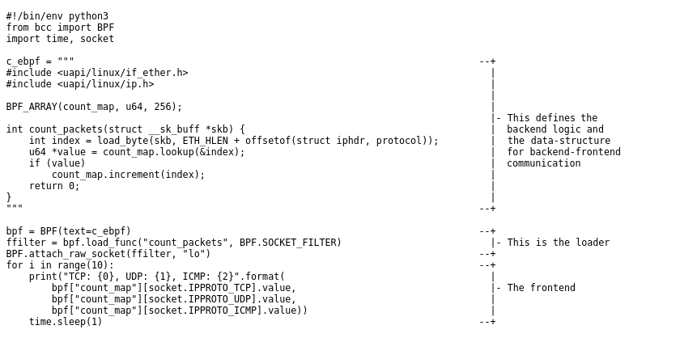

# 2


|                                                              |                                                              |
| ------------------------------------------------------------ | ------------------------------------------------------------ |
| [【译】eBPF 概述：第 1 部分：介绍](https://www.ebpf.top/post/ebpf-overview-part-1/) | ==libbpf==:<br/>bpf_create_map(BPF_MAP_TYPE_ARRAY, sizeof(key), sizeof(value),	256, 0)<br/>bpf_load_program(BPF_PROG_TYPE_SOCKET_FILTER, prog, insns_cnt, 				   "GPL", 0, bpf_log_buf, BPF_LOG_BUF_SIZE)<br/>setsockopt(sock, SOL_SOCKET, SO_ATTACH_BPF, &prog_fd, sizeof(prog_fd)<br/> |
| [【译】eBPF 概述：第 2 部分：机器和字节码](https://www.ebpf.top/post/ebpf-overview-part-2/) |                                                              |
|                                                              |                                                              |
|                                                              |                                                              |
|                                                              |                                                              |
|                                                              |                                                              |
|                                                              |                                                              |
|                                                              |                                                              |
|                                                              |                                                              |


[【译】eBPF 概述：第 1 部分：介绍](https://www.ebpf.top/post/ebpf-overview-part-1/)

```c
/* include/uapi/linux/in.h#L28 
Standard well-defined IP protocols.  
*/
enum {
  IPPROTO_IP = 0,		/* Dummy protocol for TCP		*/
#define IPPROTO_IP		IPPROTO_IP
  IPPROTO_ICMP = 1,		/* Internet Control Message Protocol	*/
#define IPPROTO_ICMP		IPPROTO_ICMP
  IPPROTO_IGMP = 2,		/* Internet Group Management Protocol	*/
#define IPPROTO_IGMP		IPPROTO_IGMP
  IPPROTO_IPIP = 4,		/* IPIP tunnels (older KA9Q tunnels use 94) */
#define IPPROTO_IPIP		IPPROTO_IPIP
  IPPROTO_TCP = 6,		/* Transmission Control Protocol	*/
#define IPPROTO_TCP		IPPROTO_TCP
  IPPROTO_EGP = 8,		/* Exterior Gateway Protocol		*/
#define IPPROTO_EGP		IPPROTO_EGP
  IPPROTO_PUP = 12,		/* PUP protocol				*/
#define IPPROTO_PUP		IPPROTO_PUP
  IPPROTO_UDP = 17,		/* User Datagram Protocol		*/
```


[【译】eBPF 概述：第 2 部分：机器和字节码](https://www.ebpf.top/post/ebpf-overview-part-2/)


**samples/bpf/sock_example.c 与 **

**samples/bpf/sockex1_kern/user.c  与**

**bcc实现版本**

**对比**


samples/bpf/sock_example.c

```c
char bpf_log_buf[BPF_LOG_BUF_SIZE];

static int test_sock(void)
{
	int sock = -1, map_fd, prog_fd, i, key;
	long long value = 0, tcp_cnt, udp_cnt, icmp_cnt;

	map_fd = bpf_create_map(BPF_MAP_TYPE_ARRAY, sizeof(key), sizeof(value),256, 0);

	struct bpf_insn prog[] = {
		BPF_MOV64_REG(BPF_REG_6, BPF_REG_1),
		BPF_LD_ABS(BPF_B, ETH_HLEN + offsetof(struct iphdr, protocol) /* R0 = ip->proto */),
		
		BPF_EXIT_INSN(),
	};
	size_t insns_cnt = sizeof(prog) / sizeof(struct bpf_insn);

	prog_fd = bpf_load_program(BPF_PROG_TYPE_SOCKET_FILTER, prog, insns_cnt,
				   "GPL", 0, bpf_log_buf, BPF_LOG_BUF_SIZE);

	sock = open_raw_sock("lo");

	setsockopt(sock, SOL_SOCKET, SO_ATTACH_BPF, &prog_fd,sizeof(prog_fd)) < 0

	for (i = 0; i < 10; i++) {
		key = IPPROTO_TCP;
		assert(bpf_map_lookup_elem(map_fd, &key, &tcp_cnt) == 0);

		key = IPPROTO_UDP;

	}

	/* maps, programs, raw sockets will auto cleanup on process exit */
	return 0;
}

int main(void)
{
	FILE *f;

	f = popen("ping -4 -c5 localhost", "r");
	(void)f;

	return test_sock();
}

```


samples/bpf/sockex1_kern/user.c

```c
struct {
	__uint(type, BPF_MAP_TYPE_ARRAY);
	__type(key, u32);
	__type(value, long);
	__uint(max_entries, 256);
} my_map SEC(".maps");

SEC("socket1")
int bpf_prog1(struct __sk_buff *skb)
{
	int index = load_byte(skb, ETH_HLEN + offsetof(struct iphdr, protocol));
	long *value;

	if (skb->pkt_type != PACKET_OUTGOING)
		return 0;

	value = bpf_map_lookup_elem(&my_map, &index);
	if (value)
		__sync_fetch_and_add(value, skb->len);

	return 0;
}
char _license[] SEC("license") = "GPL";

/*---------------------*/

int main(int ac, char **argv)
{
	struct bpf_object *obj;
	int map_fd, prog_fd;
	char filename[256];
	int i, sock;
	FILE *f;

	snprintf(filename, sizeof(filename), "%s_kern.o", argv[0]);

	bpf_prog_load(filename, BPF_PROG_TYPE_SOCKET_FILTER,&obj, &prog_fd)

	map_fd = bpf_object__find_map_fd_by_name(obj, "my_map");

	sock = open_raw_sock("lo");

	setsockopt(sock, SOL_SOCKET, SO_ATTACH_BPF, &prog_fd,sizeof(prog_fd));

	f = popen("ping -4 -c5 localhost", "r");
	(void) f;

	for (i = 0; i < 5; i++) {
		long long tcp_cnt, udp_cnt, icmp_cnt;
		int key;

		key = IPPROTO_TCP;
		assert(bpf_map_lookup_elem(map_fd, &key, &tcp_cnt) == 0);

		key = IPPROTO_UDP;

	}

	return 0;
}

```


BCC版本实现




