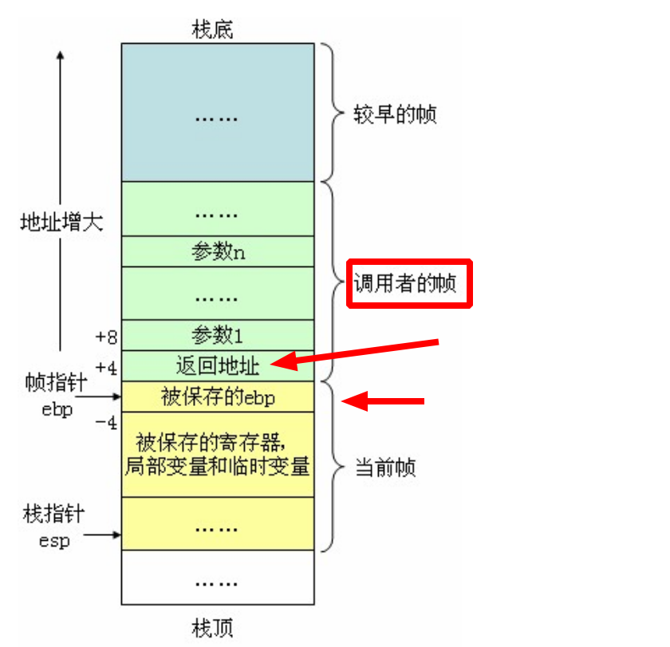

### BPF_PERF_OUTPUT

```c
BPF_PERF_OUTPUT(open_events);//定义

open_events.perf_submit(ctx, &evt, sizeof(evt));//K空间发送数据到“open_events”对应的缓冲区

b["open_events"].open_perf_buffer(print_event)//U空间打开“open_events”对应的缓冲区
    
event = b["open_events"].event(data)//获取到K空间发来的“open_events”对应的缓冲区中的数据
```

<font title="gray">K</font>：

`event_data_t`：自定义结构体，用于K-U通信，且不存在参数数量和数据大小等限制`BPF_PERF_OUTPUT`(==open_events==)用于追踪函数之间的==隔离==，以及向用户空间==发布==event_data_t

`open_events.perf_submit`用于将 event_data_t 数据==发送==至用户空间


<font title="gray">U</font>：

b["==open_events=="].`open_perf_buffer`(<font style="background-color:#8bc34a">print_event</font>)：将用户空间接收的"==open_events=="数据与数据的处理函数(print_event)==关联==起来

`b.perf_buffer_poll`：==轮询==，有数据就使用处理函数(<font style="background-color:#8bc34a">print_event</font>)进行处理

b["==open_events=="].`event`(data):从data中还原出钩子函数中定义的结构体event_data_t


### 钩子命名约定

还有一种简便的使用方式，声明函数的时候使用特定的前缀和函数名，此种约定就可以省略 `b.attach_kprobe` 显示的使用，例如：

```python
prog = """
int syscall__open(struct pt_regs *ctx, const char __user *filename, int flags) {
	// ...
}
"""

// 上述按照特定格式约定了，此处的 attach_kprobe 就不再需要调用
// b.attach_kprobe(event=b.get_syscall_fnname("open"), fn_name="trace_syscall_open")
```

函数名的组成为 ”类型“ + 内核函数的方式，`syscall`，表示类型是 `syscall`，跟踪的函数是 `open`，需要注意的是 `syscall` 与 `open` 之间为**两个连续的下划线**。相对应的类型还有 `kprobe/kretprobe` 等。详情参见[这里](https://github.com/iovisor/bcc/blob/master/docs/reference_guide.md#8-system-call-tracepoints)。


### BPF_HASH

```c
// 定义HASH_MAP，使用 BCC 宏定义，就是map，key 为 u64 类型，value 为 struct val_t 结构；
BPF_HASH(infotmp, u64, struct val_t);

infotmp.update(&id, &val);  // 保存中间结果至 hash_map 中,以 id 为 key，将 val 对象结果保存至 infotmp 中；

// 用于读取在map中保存的信息，如果未查询到则直接返回，
// 需要注意的是 lookup 函数的入参和出参都是指针类型，使用前需要判断；
valp = infotmp.lookup(&id); // infotmp[id]， 从 hash_map 中获取到  sys_open 函数保存的中间数据
if (valp == 0) {//没有找到
    // missed entry
    return 0;
}

infotmp.delete(&id);  // 删除这个k-v pair
```


### BPF_ARRAY

```c
// 定义ARRAY_MAP，使用 BCC 宏定义，不能用map观点，就是个数组，每个元素是u64类型，数组大小256
BPF_ARRAY(count_map, u64, 256);

int count_packets(struct __sk_buff *skb)
{
    int index = load_byte(skb, ETH_HLEN + offsetof(struct iphdr, protocol));
    
    //这个是类似于arr[index]，但是返回的不是对应的数据，而是&arr[index]
    u64 *val = count_map.lookup(&index);
    if(val)//如果index超出数组大小，那么返回空指针
        count_map.increment(index);
    return 0;
}
```

U中使用：

```python
# bpf["count_map"]获取到这个array
# bpf["count_map"][socket.IPPROTO_TCP]类似于arr[index]，U空间不再是&arr[index]，而是真正这个元素的值
# .value表示ctypes.c_ulong 类型转化为int
TCP_cnt = bpf["count_map"][socket.IPPROTO_TCP].value
```


如果是array类型的映射，那么可以使用==__sync_fetch_and_add==对数组的元素值进行原子计算

```c
//samples/bpf/sockex1_kern.c
struct {
	__uint(type, BPF_MAP_TYPE_ARRAY);
	__type(key, u32);
	__type(value, long);
	__uint(max_entries, 256);
} my_map SEC(".maps");

value = bpf_map_lookup_elem(&my_map, &index);
	if (value)
		__sync_fetch_and_add(value, skb->len);//对应的数组元素值增加skb->len
```


### PT_REGS_RC

不是bcc宏，是 tools/lib/bpf/bpf_tracing.h

```c
#define PT_REGS_RC(x) ((x)->rax)
```


```python
b.attach_kretprobe(event=b.get_syscall_fnname("open"), fn_name="trace_syscall_open_return")
```

```c
// 使用宏 PT_REGS_RC 从 ctx 字段中读取本次函数跟踪的返回值；
int trace_syscall_open_return(struct pt_regs *ctx)
{
    evt.ret = PT_REGS_RC(ctx); // 读取结果值，即open函数调用的返回值，fd
    
    ......
    return 0;
}
```

```shell
zhouxu@zhouxu:~$ sudo cat /sys/kernel/debug/tracing/events/syscalls/sys_exit_open/format
name: sys_exit_open
ID: 624
format:
	field:unsigned short common_type;	offset:0;	size:2;	signed:0;
	field:unsigned char common_flags;	offset:2;	size:1;	signed:0;
	field:unsigned char common_preempt_count;	offset:3;	size:1;	signed:0;
	field:int common_pid;	offset:4;	size:4;	signed:1;

	field:int __syscall_nr;	offset:8;	size:4;	signed:1;
	field:long ret;	offset:16;	size:8;	signed:1;

print fmt: "0x%lx", REC->ret

```


### TRACEPOINT_PROBE

```python
TRACEPOINT_PROBE(syscalls,sys_enter_open)
```

代替：

```python
int trace_syscall_open(struct pt_regs *ctx, const char __user *filename, int flags)

b.attach_kprobe(event=b.get_syscall_fnname("open"), fn_name="trace_syscall_open")
```


### PT_REGS_IP


### BPF_STACK_TRACE

### PT_REGS_PARMn

```c
// int openat(int dirfd, const char *pathname, int flags);
KRETFUNC_PROBE(__x64_sys_openat, struct pt_regs *regs, int ret)
{
    int dfd = PT_REGS_PARM1(regs);//int dirfd
    const char __user *filename = (char *)PT_REGS_PARM2(regs);//const char *pathname
    //int flags = PT_REGS_PARM3(regs);//int flags


    u64 id = bpf_get_current_pid_tgid();
    u32 pid = id >> 32; // PID is higher part
    u32 tid = id;       // Cast and get the lower part
    u32 uid = bpf_get_current_uid_gid();

    struct data_t data = {};
    bpf_get_current_comm(&data.comm, sizeof(data.comm));

    u64 tsp = bpf_ktime_get_ns();

    bpf_probe_read_user(&data.fname, sizeof(data.fname), (void *)filename);
    data.id    = id;
    data.ts    = tsp / 1000;
    data.uid   = bpf_get_current_uid_gid();
    data.ret   = ret;

    events.perf_submit(ctx, &data, sizeof(data));

    return 0;
}
```


### BPF_KRETPROBE_READ_RET_IP

```c
#define PT_REGS_FP(x) ((x)->rbp)

#define BPF_KRETPROBE_READ_RET_IP(ip, ctx)				    \
	({ bpf_probe_read_kernel(&(ip), sizeof(ip),			    \
			  (void *)(PT_REGS_FP(ctx) + sizeof(ip))); })
			  

long ip = 0;
			  
BPF_KRETPROBE_READ_RET_IP(ip, ctx);		

---> bpf_probe_read_kernel(&(ip), sizeof(ip),  (void *)(PT_REGS_FP(ctx) + sizeof(ip))); 
---> bpf_probe_read_kernel(&(ip), sizeof(ip),  (void *)((x)->rbp + sizeof(ip))); 
---> bpf_probe_read_kernel(&(ip), sizeof(ip),  (void *)(ctx->rbp + sizeof(ip))); 

//samples/bpf/tracex4_kern.c
SEC("kretprobe/kmem_cache_alloc_node")
int bpf_prog2(struct pt_regs *ctx)
{
	long ptr = PT_REGS_RC(ctx);
	long ip = 0;

	/* get ip address of kmem_cache_alloc_node() caller */
	BPF_KRETPROBE_READ_RET_IP(ip, ctx);

	struct pair v = {
		.val = bpf_ktime_get_ns(),
		.ip = ip,
	};

	bpf_map_update_elem(&my_map, &ptr, &v, BPF_ANY);
	return 0;
}
```

ctx->rbp + 4/8

==其实就是当前ctx对应的函数的调用者，即kmem_cache_alloc_node的调用者==

[c函数调用过程原理及函数栈帧分析](https://blog.csdn.net/zsy2020314/article/details/9429707)



