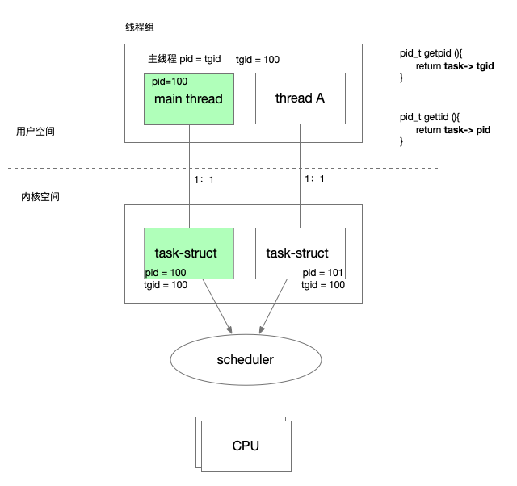
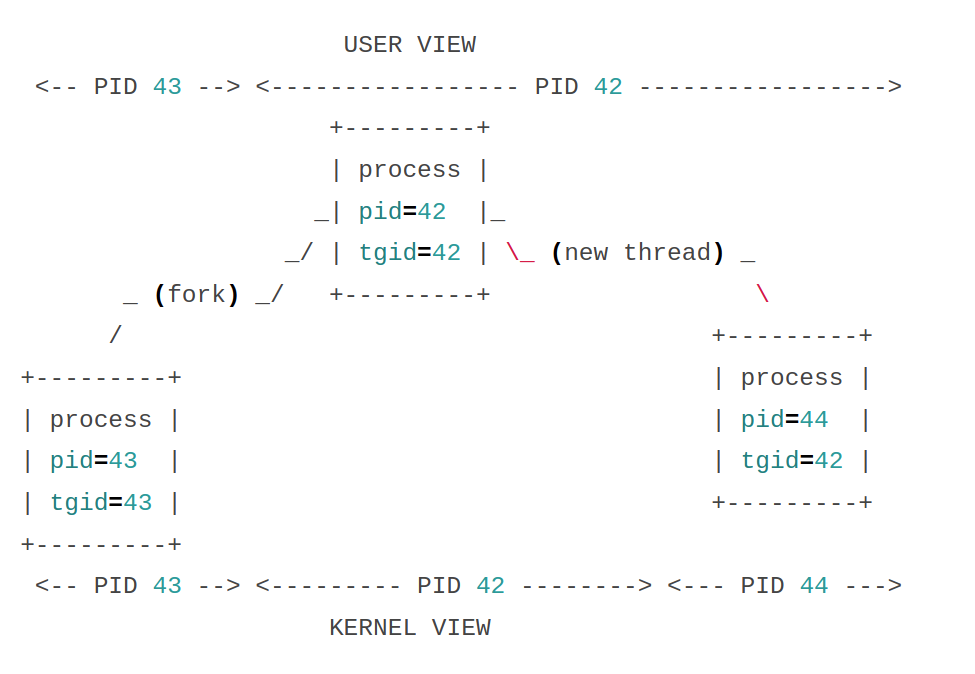

| [bpf-helpers(7) - Linux manual page (man7.org)](https://man7.org/linux/man-pages/man7/bpf-helpers.7.html) | helper函数API官方 |
| ------------------------------------------------------------ | ----------------- |
| [绿色记忆:eBPF学习笔记 (gmem.cc)](https://blog.gmem.cc/ebpf) | helper函数API中文 |
| https://blogs.oracle.com/linux/post/bpf-in-depth-bpf-helper-functions |                   |
|                                                              |                   |


### bpf_get_current_pid_tgid

[【BPF入门系列-4】如何在 BPF 程序中正确地按照 PID 过滤？](https://www.ebpf.top/post/ebpf_prog_pid_filter/)


Syntax: u64 bpf_get_current_pid_tgid(void)

Return: ( (current->tgid) << 32 ) |  (current->pid)

Returns:
the thread group ID in the upper 32 bits (what user space often thinks of as the PID). 
and the process ID in the lower 32 bits (kernel's view of the PID, which in user space is usually presented as the thread ID), 

By directly setting this to a u32, we discard the upper 32 bits.


|      | 内核空间                  | 用户空间              |
| ---- | ------------------------- | --------------------- |
| 高32 | thread group ID（`tgid`） | 进程号(`用户空间pid`) |
| 低32 | task id(内核空间pid)      | thread id             |
|      |                           |                       |

对于用户空间来说，一个进程会包含若干个线程，一个进程初始的线程，其pid就是tgid，在内核中会对应一个内核线程。

如果这个进程使用 pthread_create 创建了新的线程，那么新创建的线程在内核中也会对应一个内核线程，

新线程的进程号和初始线程的进程号是一样的，但是二者对应的内核线程是不同的。

属于同一个用户进程的线程，在内核中的tgid是一样的，也就是同一个thread group。




```text
                      USER VIEW
 <-- PID 43 --> <----------------- PID 42 ----------------->
                     +---------+
                     | process |
                    _| pid=42  |_
                  _/ | tgid=42 | \_ (new thread) _
       _ (fork) _/   +---------+                  \
      /                                        +---------+
+---------+                                    | process |
| process |                                    | pid=44  |
| pid=43  |                                    | tgid=42 |
| tgid=43 |                                    +---------+
+---------+
 <-- PID 43 --> <--------- PID 42 --------> <--- PID 44 --->
                     KERNEL VIEW
```



`bpf_get_current_pid_tgid` 的返回值为： `current->tgid << 32 | current->pid`，

高 32 位置为 tgid ，低 32 位为 pid(tid)，

如果我们计划采用进程空间传统的 pid(`用户空间pid`) 过滤，那么则可以这样写 [`tcptop.py`](https://github.com/iovisor/bcc/blob/master/tools/tcptop.py)：

```c
int kprobe__tcp_sendmsg(struct pt_regs *ctx, struct sock *sk,
    struct msghdr *msg, size_t size)
{
    if (container_should_be_filtered()) {
        return 0;
    }
    u32 pid = bpf_get_current_pid_tgid() >> 32;
    FILTER_PID  // if (pid != %s) { return 0; }  有 python 进行替换
      
    // ...
      
}
```


如果通过 `tid` 进行过滤那么写法这样写：

```c
int kprobe__tcp_sendmsg(struct pt_regs *ctx, struct sock *sk,
    struct msghdr *msg, size_t size)
{
    if (container_should_be_filtered()) {
        return 0;
    }
    u32 tid = bpf_get_current_pid_tgid(); // 只是取低 11 位
    FILTER_PID  // if (tid != %s) { return 0; }  有 python 进行替换
      
    // ...
      
}
```


### bpf_get_current_uid_gid


### bpf_get_smp_processor_id

```
u32 bpf_get_smp_processor_id(void)

Description

              Get the SMP (symmetric multiprocessing) processor id. Note that all programs run with preemption disabled, which means that the SMP processor id is stable during all the execution of the program.

Return

              The SMP id of the processor running the program.
```

### bpf_get_numa_node_id

```
int bpf_get_numa_node_id(void)

Description

              Return the id of the current NUMA node.

Return

              The id of current NUMA node.
```


------

### bpf_probe_read


### bpf_probe_read_user


### bpf_probe_read_kernel


### bpf_get_current_comm

- `bpf_get_current_comm(&evt.comm, sizeof(evt.comm));` 使用函数 `bpf_get_current_comm` 读取当前进程的 commandline 并保存至对应字段中 `evt.comm` ；


### bpf_ktime_get_ns


### bpf_get_prandom_u32

```
Description
              Get a pseudo-random number.

From a security point of view, this helper uses its own pseudo-random internal state, and cannot be used to infer the seed of other random functions in the kernel. However, it is essential to note that the generator used by the helper is not cryptographically secure.

Return
              A random 32-bit unsigned value.
```


### 字符串如何操作？
