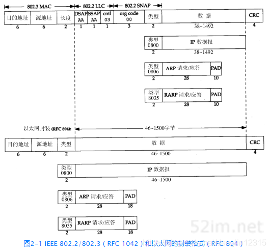
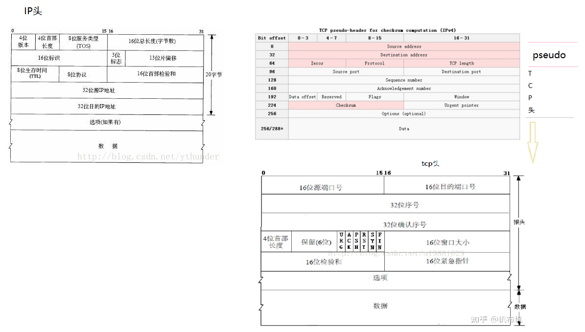

# net相关的helper函数


| [bpf-helpers(7) - Linux manual page (man7.org)](https://man7.org/linux/man-pages/man7/bpf-helpers.7.html) | helper函数API官方 |
| ------------------------------------------------------------ | ----------------- |
| [绿色记忆:eBPF学习笔记 (gmem.cc)](https://blog.gmem.cc/ebpf) | helper函数API中文 |
|                                                              |                   |
|                                                              |                   |

bpf_skb_store_bytes
    bpf_skb_store_bytes(ctx, 6, &p_conn->src_mac, 6, 0);  根据nat的修改方式，修改数据包的源目mac地址
    bpf_skb_store_bytes(ctx, 0, &p_conn->dst_mac, 6, 0);
    return bpf_redirect(p_conn->ifindex, 0);

---------------------------------------------------------------------------
## bpf_skb_store_bytes

802.3 ETH2帧格式

0        6         12    14
   6         6       2
dst_mac | src_mac | len |.....





签名： 		int bpf_skb_store_bytes(struct sk_buff *skb, u32 offset, const void *from, u32 len, u64 flags)

将从from开始的len个字节，拷贝到 ==skb->data== + offset 处。从skb->data开始计算偏移，不是从skb开始。

flags是以下位域的组合：

1. BPF_F_RECOMPUTE_CSUM：自动重新计算修改后的封包的Checksum
2. BPF_F_INVALIDATE_HASH：重置 skb->hash、skb->swhash、skb->l4hash为0

调用此助手函数会导致封包缓冲区改变，因此在加载期间校验器对指针的校验将失效，必须重新校验。

```c
// linux-5.14.14/net/core/filter.c
BPF_CALL_5(bpf_skb_store_bytes, struct sk_buff *, skb, u32, offset,
	   const void *, from, u32, len, u64, flags) // 将从from开始的len个字节，拷贝到 skb->data + offset 处
{
	void *ptr;
    if (unlikely(flags & ~(BPF_F_RECOMPUTE_CSUM | BPF_F_INVALIDATE_HASH)))
        return -EINVAL;
    if (unlikely(offset > 0xffff))
        return -EFAULT;
    if (unlikely(bpf_try_make_writable(skb, offset + len)))
        return -EFAULT;

    ptr = skb->data + offset; // 从skb->data开始计算偏移，不是从skb开始
    if (flags & BPF_F_RECOMPUTE_CSUM)
        __skb_postpull_rcsum(skb, ptr, len, offset);

    memcpy(ptr, from, len); // 拷贝len个字节

    if (flags & BPF_F_RECOMPUTE_CSUM)
        __skb_postpush_rcsum(skb, ptr, len, offset);
    if (flags & BPF_F_INVALIDATE_HASH)
        skb_clear_hash(skb);

    return 0;
}
```
```c
struct sk_buff {
	sk_buff_data_t		tail;
	sk_buff_data_t		end;
	unsigned char		*head,
				        *data; //   将从from开始的len个字节，拷贝到 skb->data + offset 处
```


https://www.cxymm.net/article/qq_17045267/103764320  

```c
// int bpf_skb_store_bytes(struct sk_buff *skb, u32 offset, const void *from, u32 len, u64 flags)
#define ETH_ALEN	6		/* Octets in one ethernet addr	 */

/* 交换报文的mac源和目的地址 */
bpf_skb_store_bytes(skb, offsetof(struct ethhdr, h_source), dst_mac, ETH_ALEN, 0);
bpf_skb_store_bytes(skb, offsetof(struct ethhdr, h_dest), src_mac, ETH_ALEN, 0);

/* 交换报文的源IP和目的IP地址 */
bpf_skb_store_bytes(skb, IP_SRC_OFF, &dst_ip, sizeof(dst_ip), 0);
bpf_skb_store_bytes(skb, IP_DST_OFF, &src_ip, sizeof(src_ip), 0);

// 将ICMP报文的类型修改为回显类型，并重新计算校验码
__u8 new_type = 0;
bpf_l4_csum_replace(skb, ICMP_CSUM_OFF, ICMP_PING, new_type, ICMP_CSUM_SIZE);
bpf_skb_store_bytes(skb, ICMP_TYPE_OFF, &new_type, sizeof(new_type), 0);
```

------

## bpf_skb_load_bytes

签名： 		int bpf_skb_load_bytes(const struct sk_buff *skb, u32 offset, void *to, u32 len)

从skb->data + offset 位置读取len长的数据，存放到to缓冲区。

从4.7开始，该函数的功能基本被直接封包访问（direct packet access）代替，skb->data 和 skb->data_end给出了封包数据的位置。

如果希望一次性读取大量数据到eBPF，仍然可以使用该函数。

```c
// linux-5.14.14/net/core/filter.c
BPF_CALL_4(bpf_skb_load_bytes, const struct sk_buff *, skb, u32, offset, void *, to, u32, len)
{
	void *ptr;

	if (unlikely(offset > 0xffff))
		goto err_clear;

	ptr = skb_header_pointer(skb, offset, len, to);// 从skb->data开始计算偏移，不是从skb开始
	if (unlikely(!ptr))
		goto err_clear;
	if (ptr != to)
		memcpy(to, ptr, len);

	return 0;
err_clear:
	memset(to, 0, len);
	return -EFAULT;
}

// linux-5.14.14/include/linux/skbuff.h
static inline void * __must_check
__skb_header_pointer(const struct sk_buff *skb, int offset, int len,
		     const void *data, int hlen, void *buffer)
{
    // 在当前页的数据大小 - offset = 偏移后当前页还有多少数据，若大于需要拷贝的长度len，那么需要拷贝的数据都在当前页中
	if (likely(hlen - offset >= len))
		return (void *)data + offset;

	/*if (!skb || unlikely(skb_copy_bits(skb, offset, buffer, len) < 0))
		return NULL;*/    // zx注释掉的

	return buffer;
}

// skb->len是数据包长度，在IPv4中就是单个完整IP包的总长，但这些数据并不一定都在当前内存页，可能跨页存储
// skb->data_len表示在其他页的数据长度（包括本skb在其他页中的数据以及分片skb中的数据）
static inline unsigned int skb_headlen(const struct sk_buff *skb)
{
	return skb->len - skb->data_len;// 表示在当前页的数据大小，skb->data_len可能为0（线性），可能不为0（非线性）
}

// http://blog.chinaunix.net/uid-22227409-id-2656918.html	关于skb_header_pointer函数
// 先判断要拷贝的数据是否都在当前页面内，如果是，则可以直接对数据处理，返回所求数据指针；
// 否则用skb_copy_bits()函数进行拷贝
static inline void * __must_check
skb_header_pointer(const struct sk_buff *skb, int offset, int len, void *buffer)// 就是 data + offset
{
	return __skb_header_pointer(skb, offset, len, skb->data,
				    skb_headlen(skb), buffer);
}

// 如果skb->data_len不为0，表示该IP包的数据分属不同的页，该数据包也就被成为非线性化的，一般刚进行完碎片重组的skb包就属于非线性化的
static inline bool skb_is_nonlinear(const struct sk_buff *skb)
{
	return skb->data_len;
}
```


```c
// int bpf_skb_load_bytes(const struct sk_buff *skb, u32 offset, void *to, u32 len)
static __always_inline __u32 tcp_load(struct __ctx_buf *ctx,  __u64 offset, ipv4_tuple_s *tuple, ipv4_extra_s *extra) {
    ......
#ifdef CFG_PROG_TYPE_TC
    // 从ctx->data + offset 位置读取sizeof(struct tcphdr)长的数据，存放到hdr_tcp缓冲区。
    ret = bpf_skb_load_bytes(ctx, offset, &hdr_tcp, sizeof(struct tcphdr));
    if (ret < 0) {
        TRACE_LOG(TRACE_LOG_ERROR, PARSE_LOG_PREFIX"failed to load tcp %d\n", ret); 
        return BPFM_ERR;
    }
    
    tuple->src_port = hdr_tcp.source; 
    tuple->dst_port = hdr_tcp.dest; 
    extra->tcp.flags = hdr_tcp.flags;
    extra->tcp.seq_n = hdr_tcp.seq;
    extra->tcp.ack_n = hdr_tcp.ack_seq;
    return BPFM_OK;
```


------

## 校检和checksum

bpf_csum_diff
bpf_l3_csum_replace
bpf_l4_csum_replace



ip ip报文仅检查ip报文头自己
tcp udp 需要一个 伪头 + tcp / udp 头 + 数据载荷
icmp icmp头 + 数据载荷

l3sum = bpf_csum_diff(&tmp_ip, 4, &(dnat_ip), 4, l3sum);  						 ip变化造成的csum变化
l4sum = bpf_csum_diff(&tmp_port, 4, &new_port, 4, l4sum);  					 port变化造成的csum变化

（1）三层协议（比如icmp），只有单纯的ip变化
bpf_l3_csum_replace(ctx, CSUM_OFFSET_IP_V4, 0, l3sum, 0);                  ip变化导致三层 csum变化

（2）四层协议，会有ip、port都变化
bpf_l4_csum_replace(ctx, CSUM_OFFSET_TCP_V4, 0, l3sum, IS_PSEUDO | 0);     ip变化导致四层 伪头 csum变化
bpf_l4_csum_replace(ctx, CSUM_OFFSET_TCP_V4, 0, l4sum, 0);                 端口变化导致四层 csum变化
bpf_l3_csum_replace(ctx, CSUM_OFFSET_IP_V4, 0, l3sum, 0);                  ip变化导致三层 csum变化

对照着samples\bpf\tcbpf1_kern.c

```c
static inline void set_tcp_ip_src(struct __sk_buff *skb, __u32 new_ip)
{
	__u32 old_ip = _htonl(load_word(skb, IP_SRC_OFF));

	bpf_l4_csum_replace(skb, TCP_CSUM_OFF, old_ip, new_ip, IS_PSEUDO | sizeof(new_ip)); //  ip变化导致四层 伪头 csum变化
	bpf_l3_csum_replace(skb, IP_CSUM_OFF, old_ip, new_ip, sizeof(new_ip)); // ip变化导致三层 csum变化
	bpf_skb_store_bytes(skb, IP_SRC_OFF, &new_ip, sizeof(new_ip), 0);
}

#define TCP_DPORT_OFF (ETH_HLEN + sizeof(struct iphdr) + offsetof(struct tcphdr, dest))
static inline void set_tcp_dest_port(struct __sk_buff *skb, __u16 new_port)
{
	__u16 old_port = htons(load_half(skb, TCP_DPORT_OFF));

	bpf_l4_csum_replace(skb, TCP_CSUM_OFF, old_port, new_port, sizeof(new_port)); //  端口变化导致四层 csum变化
	bpf_skb_store_bytes(skb, TCP_DPORT_OFF, &new_port, sizeof(new_port), 0);
}

static inline void set_ip_tos(struct __sk_buff *skb, __u8 new_tos)
{
	__u8 old_tos = load_byte(skb, TOS_OFF);// 8位服务类型：包含一个4位优先权字段：最小延时，最大吞吐量，最高可靠性和最小费用。

	bpf_l3_csum_replace(skb, IP_CSUM_OFF, htons(old_tos), htons(new_tos), 2);
	bpf_skb_store_bytes(skb, TOS_OFF, &new_tos, sizeof(new_tos), 0);
}
```


#### bpf_csum_diff

签名： s64 bpf_csum_diff(__be32 *from, u32 from_size, __be32 ***to**, u32 to_size, __wsum seed)

计算两个缓冲区from到to的checksum difference。

​              Description
​                     Compute a checksum difference, from the raw buffer
​                     pointed by from, of length from_size (that must be
​                     a multiple of 4), towards the raw buffer pointed by
​                     to, of size to_size (same remark). An optional seed
​                     can be added to the value (this can be cascaded,
​                     the seed may come from a previous call to the
​                     helper).

​                     This is flexible enough to be used in several ways:

​                     • With from_size == 0, to_size > 0 and seed set to
​                       checksum, it can be used when pushing new data.

​                     • With from_size > 0, to_size == 0 and seed set to
​                       checksum, it can be used when removing data from
​                       a packet.

​                     • With from_size > 0, to_size > 0 and seed set to
​                       0, it can be used to compute a diff. Note that
​                       from_size and to_size do not need to be equal.

​                     This helper can be used in combination with
​                     bpf_l3_csum_replace() and bpf_l4_csum_replace(), to
​                     which one can feed in the difference computed with
​                     bpf_csum_diff().

​              Return The checksum result, or a negative error code in
​                     case of failure.

#### bpf_l3_csum_replace

签名： **int** bpf_l3_csum_replace(**struct** sk_buff *skb, u32 offset, u64 from, u64 **to**, u64 size)

重新计算L3（IP）的Checksum。计算是增量进行的，因此助手函数必须知道被修改的头字段的前值（from）、修改后的值（to），以及被修改字段的字节数（size，2或4）。你亦可将from和size设置为0，并将字段修改前后的差存放到to。offset用于指示封包的IP Checksum的位置

调用此助手函数会导致封包缓冲区改变，因此在加载期间校验器对指针的校验将失效，必须重新校验。

​              Description
​                     Recompute the layer 3 (e.g. IP) checksum for the
​                     packet associated to skb. Computation is
​                     incremental, so the helper must know the former
​                     value of the header field that was modified (from),
​                     the new value of this field (to), and the number of
​                     bytes (2 or 4) for this field, stored in size.
​                     Alternatively, it is possible to store the
​                     difference between the previous and the new values
​                     of the header field in to, by setting from and size
​                     to 0. For both methods, offset indicates the
​                     location of the IP checksum within the packet.

​                     This helper works in combination with
​                     bpf_csum_diff(), which does not update the checksum
​                     in-place, but offers more flexibility and can
​                     handle sizes larger than 2 or 4 for the checksum to
​                     update.

​                     A call to this helper is susceptible to change the
​                     underlying packet buffer. Therefore, at load time,
​                     all checks on pointers previously done by the
​                     verifier are invalidated and must be performed
​                     again, if the helper is used in combination with
​                     direct packet access.

​              Return 0 on success, or a negative error in case of
​                     failure.

#### bpf_l4_csum_replace

签名： **int** bpf_l4_csum_replace(**struct** sk_buff *skb, u32 offset, u64 from, u64 **to**, u64 flags)

重新计算L4（TCP/UDP/ICMP）的Checksum。计算是增量进行的，因此助手函数必须知道被修改的头字段的前值（from）、修改后的值（to），以及被修改字段的字节数（存放在flags的低4bit，2或4）。你亦可将from和flags低4bit设置为0，并将字段修改前后的差存放到to。offset用于指示封包的IP Checksum的位置。

flags的高位用于存放以下标记：

1. BPF_F_MARK_MANGLED_0，如果Checksum是null，则不去修改它，除非设置了BPF_F_MARK_ENFORCE
2. CSUM_MANGLED_0，对于导致Checksum为null的更新操作，设置此标记
3. BPF_F_PSEUDO_HDR，提示使用pseudo-header来计算Checksum

调用此助手函数会导致封包缓冲区改变，因此在加载期间校验器对指针的校验将失效，必须重新校验。

