# experiment-1

## 1. [你的第一个XDP BPF 程序](https://davidlovezoe.club/wordpress/archives/937)

### 1.1 主机和虚拟机

```shell
zx@u18-1:~$ clang-13 -O2 -target bpf -c xdp-drop-world.c -o xdp-drop-world.o
In file included from tc-xdp-drop-tcp.c:2:
In file included from /usr/include/linux/bpf.h:11:
/usr/include/linux/types.h:5:10: fatal error: 'asm/types.h' file not found
#include <asm/types.h>
        ^~~~~~~~~~~~~
1 error generated.

```

- 原因分析

    在源代码文件中引用了某些系统目录（一般为`/usr/include/`，是==绝对路径==）下的头文件，而这些头文件没有出现在目标路径下，导致编译失败。

    如上述问题中的asm相关文件，asm全称`Architecture Specific Macros`，直译过来“与机器架构相关的宏文件”，顾名思义它是跟机器架构密切相关的，不同的架构x86、x64、arm实现是不一样的，而操作系统并没有提供`/usr/include/asm/`这样通用的目录，只提供了具体架构相关的目录，如`/usr/include/x86_64-linux-gnu/asm/`，因此无法找到引用。

- 解决方案

    添加软链`/usr/include/asm/`，指向操作系统自带的asm目录：

    ```shell
    cd /usr/include
    sudo ln -s ./x86_64-linux-gnu/asm asm
    ```


```shell
#win10， used to ping the virtual machine in it
C:\Users\zhouxu>ping -n 100 192.168.28.133

#virtual machine, 用于抓包
zx@u18-1:~$ ip addr
2: ens33: <BROADCAST,MULTICAST,UP,LOWER_UP> mtu 1500 qdisc fq_codel state UNKNOWN group default qlen 1000
    link/ether 00:0c:29:c4:d3:78 brd ff:ff:ff:ff:ff:ff
    inet 192.168.28.133/24 brd 192.168.28.255 scope global dynamic noprefixroute ens33
       valid_lft 1702sec preferred_lft 1702sec
    inet6 fe80::c6fd:b0ad:be8:94b4/64 scope link noprefixroute 
       valid_lft forever preferred_lft forever

#ens33这个if是对外的，所以win10 ping的时候，会走这个if
zx@u18-1:~$ sudo tcpdump -i ens33

#virtual machine, 另一个终端，用于开启或者关闭xdp程序
zx@u18-1:~$ sudo ip link set dev ens33 xdp object /home/zx/works/ebpf/src_from_github/linux-bpf-learning/xdp/xdp-drop-world.o section xdp verbose

Prog section 'xdp' loaded (5)!
 - Type:         6
 - Instructions: 2 (0 over limit)
 - License:      GPL

Verifier analysis:

0: (b7) r0 = 1
1: (95) exit
processed 2 insns (limit 1000000) max_states_per_insn 0 total_states 0 peak_states 0 mark_read 0


```


#### 1.1.1 未开启xdp程序

未开启xdp程序，正常ping


#### 1.1.2 开启xdp程序

开启xdp程序，开始丢包


#### 1.1.3 关闭xdp程序

关闭xdp程序后，又可以ping通


### 1.2 虚拟机和其上的docker

```shell
zx@zx:/etc/docker$ sudo docker run -d -p 80:80 --name=nginx-xdp nginx:alpine

zx@zx:/etc/docker$ ip a
1: lo: <LOOPBACK,UP,LOWER_UP> mtu 65536 qdisc noqueue state UNKNOWN group default qlen 1000
    link/loopback 00:00:00:00:00:00 brd 00:00:00:00:00:00
    inet 127.0.0.1/8 scope host lo
       valid_lft forever preferred_lft forever
    inet6 ::1/128 scope host 
       valid_lft forever preferred_lft forever
2: enp0s3: <BROADCAST,MULTICAST,UP,LOWER_UP> mtu 1500 qdisc fq_codel state UP group default qlen 1000
    link/ether 08:00:27:b6:50:91 brd ff:ff:ff:ff:ff:ff
    inet 10.0.2.15/24 brd 10.0.2.255 scope global dynamic noprefixroute enp0s3
       valid_lft 65787sec preferred_lft 65787sec
    inet6 fe80::c7cf:3b07:7f39:68c8/64 scope link noprefixroute 
       valid_lft forever preferred_lft forever
3: docker0: <BROADCAST,MULTICAST,UP,LOWER_UP> mtu 1500 qdisc noqueue state UP group default 
    link/ether 02:42:cc:40:33:a0 brd ff:ff:ff:ff:ff:ff
    inet 172.17.0.1/16 brd 172.17.255.255 scope global docker0
       valid_lft forever preferred_lft forever
    inet6 fe80::42:ccff:fe40:33a0/64 scope link 
       valid_lft forever preferred_lft forever
5: veth0afb74f@if4: <BROADCAST,MULTICAST,UP,LOWER_UP> mtu 1500 qdisc noqueue master docker0 state UP group default 
    link/ether e2:2d:5e:ee:af:97 brd ff:ff:ff:ff:ff:ff link-netnsid 0
    inet6 fe80::e02d:5eff:feee:af97/64 scope link 
       valid_lft forever preferred_lft forever
       
#一个窗口开启抓包       
zx@zx:~$ sudo tcpdump -i veth0afb74f -vv -nn tcp        

#另一个curl
zx@zx:~/works/ebpf/src_from_github/linux-bpf-learning/tc$ curl localhost       
```


#### 1.2.1 未开启xdp程序

没有启用xdp程序时，可以在docker外部通过curl命令获取docker-nginx的服务

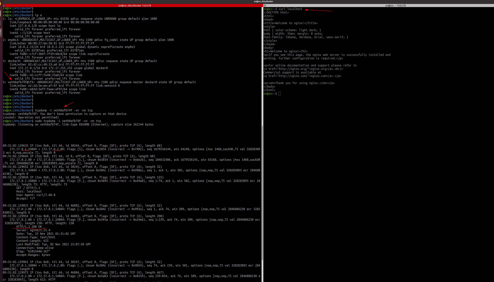

#### 1.2.2 启动xdp程序

```shell
zx@zx:~/works/ebpf/src_from_github/linux-bpf-learning/tc$ clang -I ./headers/ -O2 -target bpf -c tc-xdp-drop-tcp.c -o tc-xdp-drop-tcp.o

zx@zx:~/works/ebpf/src_from_github/linux-bpf-learning/tc$ llvm-objdump-13 -S tc-xdp-drop-tcp.o

tc-xdp-drop-tcp.o:	file format elf64-bpf

Disassembly of section xdp:

0000000000000000 <xdp_drop_tcp>:
       0:	61 12 04 00 00 00 00 00	r2 = *(u32 *)(r1 + 4)
       1:	61 11 00 00 00 00 00 00	r1 = *(u32 *)(r1 + 0)
       2:	bf 13 00 00 00 00 00 00	r3 = r1
       3:	07 03 00 00 0e 00 00 00	r3 += 14
       4:	2d 23 0b 00 00 00 00 00	if r3 > r2 goto +11 <LBB0_4>
       5:	71 13 0d 00 00 00 00 00	r3 = *(u8 *)(r1 + 13)
       6:	67 03 00 00 08 00 00 00	r3 <<= 8
       7:	71 14 0c 00 00 00 00 00	r4 = *(u8 *)(r1 + 12)
       8:	4f 43 00 00 00 00 00 00	r3 |= r4
       9:	55 03 06 00 08 00 00 00	if r3 != 8 goto +6 <LBB0_4>
      10:	bf 13 00 00 00 00 00 00	r3 = r1
      11:	07 03 00 00 22 00 00 00	r3 += 34
      12:	2d 23 03 00 00 00 00 00	if r3 > r2 goto +3 <LBB0_4>
      13:	b7 00 00 00 01 00 00 00	r0 = 1
      14:	71 11 17 00 00 00 00 00	r1 = *(u8 *)(r1 + 23)
      15:	15 01 01 00 06 00 00 00	if r1 == 6 goto +1 <LBB0_5>

0000000000000080 <LBB0_4>:
      16:	b7 00 00 00 02 00 00 00	r0 = 2

0000000000000088 <LBB0_5>:
      17:	95 00 00 00 00 00 00 00	exit

Disassembly of section tc:

0000000000000000 <tc_drop_tcp>:
       0:	61 12 50 00 00 00 00 00	r2 = *(u32 *)(r1 + 80)
       1:	61 11 4c 00 00 00 00 00	r1 = *(u32 *)(r1 + 76)
       2:	bf 13 00 00 00 00 00 00	r3 = r1
       3:	07 03 00 00 0e 00 00 00	r3 += 14
       4:	2d 23 0b 00 00 00 00 00	if r3 > r2 goto +11 <LBB1_4>
       5:	71 13 0d 00 00 00 00 00	r3 = *(u8 *)(r1 + 13)
       6:	67 03 00 00 08 00 00 00	r3 <<= 8
       7:	71 14 0c 00 00 00 00 00	r4 = *(u8 *)(r1 + 12)
       8:	4f 43 00 00 00 00 00 00	r3 |= r4
       9:	55 03 06 00 08 00 00 00	if r3 != 8 goto +6 <LBB1_4>
      10:	bf 13 00 00 00 00 00 00	r3 = r1
      11:	07 03 00 00 22 00 00 00	r3 += 34
      12:	2d 23 03 00 00 00 00 00	if r3 > r2 goto +3 <LBB1_4>
      13:	b7 00 00 00 02 00 00 00	r0 = 2
      14:	71 11 17 00 00 00 00 00	r1 = *(u8 *)(r1 + 23)
      15:	15 01 01 00 06 00 00 00	if r1 == 6 goto +1 <LBB1_5>

0000000000000080 <LBB1_4>:
      16:	b7 00 00 00 00 00 00 00	r0 = 0

0000000000000088 <LBB1_5>:
      17:	95 00 00 00 00 00 00 00	exit


#一个窗口开启抓包
zx@zx:~$ sudo tcpdump -i veth0afb74f -vv -nn tcp 

#另一个开启xdp后，curl
zx@zx:~/works/ebpf/src_from_github/linux-bpf-learning/tc$ sudo ip link set dev veth0afb74f xdp object tc-xdp-drop-tcp.o section xdp verbose
zx@zx:~/works/ebpf/src_from_github/linux-bpf-learning/tc$ curl localhost


```


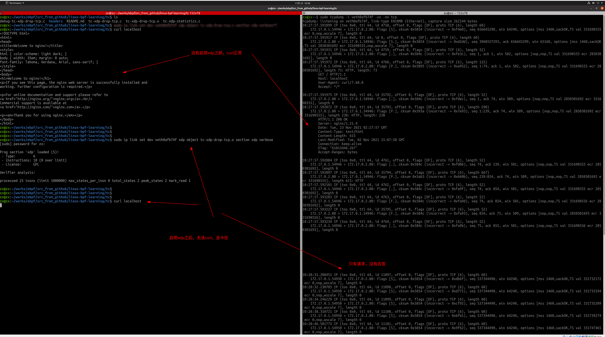


#### 1.2.3 关闭xdp程序

```
#关闭xdp
zx@zx:~/works/ebpf/src_from_github/linux-bpf-learning/tc$ sudo ip link set dev veth0afb74f xdp off
```

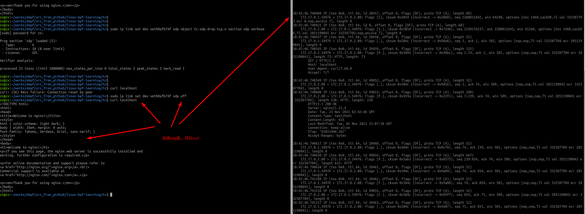


#### 1.2.4 xdp程序开启前后，接口的变化

```shell
x@zx:~$ ip a
5: veth0afb74f@if4: <BROADCAST,MULTICAST,UP,LOWER_UP> mtu 1500 qdisc noqueue master docker0 state UP group default 
    link/ether e2:2d:5e:ee:af:97 brd ff:ff:ff:ff:ff:ff link-netnsid 0
    inet6 fe80::e02d:5eff:feee:af97/64 scope link 
       valid_lft forever preferred_lft forever
zx@zx:~$ ip a
5: veth0afb74f@if4: <BROADCAST,MULTICAST,UP,LOWER_UP> mtu 1500 xdp/id:107 qdisc noqueue master docker0 state UP group default 
    link/ether e2:2d:5e:ee:af:97 brd ff:ff:ff:ff:ff:ff link-netnsid 0
    inet6 fe80::e02d:5eff:feee:af97/64 scope link 
       valid_lft forever preferred_lft forever


【Q】xdp/id:107  含义是什么
```


## 2. [你的第一个TC BPF 程序](https://davidlovezoe.club/wordpress/archives/952)

### 2.1 准备工作

```shell
x@zx:~$ sudo docker inspect nginx-xdp -f "{{.NetworkSettings.SandboxKey}}"
/var/run/docker/netns/1ce50d102049
zx@zx:~$ 
zx@zx:~$ sudo ls -l /var/run/docker/netns/1ce50d102049
-r--r--r-- 1 root root 0 11月 23 08:56 /var/run/docker/netns/1ce50d102049
zx@zx:~$ sudo mkdir -p /var/run/netns
zx@zx:~$ sudo ln -s /var/run/docker/netns/1ce50d102049 /var/run/netns/httpserver
zx@zx:~$ ll /var/run/netns/httpserver
lrwxrwxrwx 1 root root 34 11月 23 11:08 /var/run/netns/httpserver -> /var/run/docker/netns/1ce50d102049

zx@zx:~$ sudo ip netns exec httpserver ip a   #此时相当于进入了这个docker容器的内部执行ip a 命令
1: lo: <LOOPBACK,UP,LOWER_UP> mtu 65536 qdisc noqueue state UNKNOWN group default qlen 1000
    link/loopback 00:00:00:00:00:00 brd 00:00:00:00:00:00
    inet 127.0.0.1/8 scope host lo
       valid_lft forever preferred_lft forever
#这个if是该docker对外的接口，有ip地址
4: eth0@if5: <BROADCAST,MULTICAST,UP,LOWER_UP> mtu 1500 qdisc noqueue state UP group default 
    link/ether 02:42:ac:11:00:02 brd ff:ff:ff:ff:ff:ff link-netnsid 0
    inet 172.17.0.2/16 brd 172.17.255.255 scope global eth0
       valid_lft forever preferred_lft forever

#docker的主机执行
zx@zx:~$ ip addr 
1: lo: <LOOPBACK,UP,LOWER_UP> mtu 65536 qdisc noqueue state UNKNOWN group default qlen 1000
    link/loopback 00:00:00:00:00:00 brd 00:00:00:00:00:00
    inet 127.0.0.1/8 scope host lo
       valid_lft forever preferred_lft forever
    inet6 ::1/128 scope host 
       valid_lft forever preferred_lft forever
2: enp0s3: <BROADCAST,MULTICAST,UP,LOWER_UP> mtu 1500 qdisc fq_codel state UP group default qlen 1000
    link/ether 08:00:27:b6:50:91 brd ff:ff:ff:ff:ff:ff
    inet 10.0.2.15/24 brd 10.0.2.255 scope global dynamic noprefixroute enp0s3
       valid_lft 59330sec preferred_lft 59330sec
    inet6 fe80::c7cf:3b07:7f39:68c8/64 scope link noprefixroute 
       valid_lft forever preferred_lft forever
3: docker0: <BROADCAST,MULTICAST,UP,LOWER_UP> mtu 1500 qdisc noqueue state UP group default 
    link/ether 02:42:cc:40:33:a0 brd ff:ff:ff:ff:ff:ff
    inet 172.17.0.1/16 brd 172.17.255.255 scope global docker0
       valid_lft forever preferred_lft forever
    inet6 fe80::42:ccff:fe40:33a0/64 scope link 
       valid_lft forever preferred_lft forever
#这个docker主机的if是和docker的eth0@if5 成对的，通过网桥docker0和eth0@if5连接
5: veth0afb74f@if4: <BROADCAST,MULTICAST,UP,LOWER_UP> mtu 1500 qdisc noqueue master docker0 state UP group default 
    link/ether e2:2d:5e:ee:af:97 brd ff:ff:ff:ff:ff:ff link-netnsid 0
    inet6 fe80::e02d:5eff:feee:af97/64 scope link 
       valid_lft forever preferred_lft forever
zx@zx:~$ 
zx@zx:~$ 

```


docker curl 使用[==还是别用curl了==，目的是为了验证tcp协议，用==nping==]

```shell
x@zx:~$ sudo ip netns exec httpserver curl --dns-servers 8.8.8.8 www.baidu.com
curl: (6) Could not resolve host: www.baidu.com
zx@zx:~$ sudo ip netns exec httpserver curl  www.baidu.com
curl: (6) Could not resolve host: www.baidu.com
zx@zx:~$ #说明无法解析域名
zx@zx:~$ sudo ip netns exec httpserver ping  www.baidu.com
ping: www.baidu.com: Temporary failure in name resolution

zx@zx:~$ sudo ip netns exec httpserver cat /etc/resolv.conf
nameserver 127.0.0.53
options edns0 trust-ad

#添加一个，如果还是不行，那么就给docker的主机也添加这一条（docker主机可能是虚拟机，也没有这一条）
zx@zx:~$ sudo ip netns exec httpserver vi /etc/resolv.conf
x@zx:~$ sudo ip netns exec httpserver cat /etc/resolv.conf
nameserver 8.8.8.8
#nameserver 127.0.0.53
options edns0 trust-ad

x@zx:~$ sudo ip netns exec httpserver ping  www.baidu.com
PING www.wshifen.com (104.193.88.77) 56(84) bytes of data.
64 bytes from 104.193.88.77 (104.193.88.77): icmp_seq=1 ttl=61 time=205 ms
64 bytes from 104.193.88.77 (104.193.88.77): icmp_seq=2 ttl=61 time=204 ms
^C
--- www.wshifen.com ping statistics ---
2 packets transmitted, 2 received, 0% packet loss, time 1001ms
rtt min/avg/max/mdev = 203.984/204.691/205.398/0.707 ms
zx@zx:~$ 
zx@zx:~$ sudo ip netns exec httpserver curl  www.baidu.com

```


### 2.2 反复开启、关闭xdp程序访问外网

这个和 ==https://davidlovezoe.club/wordpress/archives/952 2. 在Nginx容器内部curl外部网站==结果不一样

```shell
#第一个终端上编译xdp，反复加载和卸载xdp程序
zx@zx:~/works/ebpf/src_from_github/linux-bpf-learning/tc$ clang -I ./headers/ -O2 -target bpf -c tc-xdp-drop-tcp.c -o tc-xdp-drop-tcp.o

zx@zx:~/works/ebpf/src_from_github/linux-bpf-learning/tc$ sudo ip link set dev veth0afb74f xdp object tc-xdp-drop-tcp.o section xdp verbose

Prog section 'xdp' loaded (5)!
 - Type:         6
 - Instructions: 18 (0 over limit)
 - License:      GPL

Verifier analysis:

processed 25 insns (limit 1000000) max_states_per_insn 0 total_states 2 peak_states 2 mark_read 1

zx@zx:~/works/ebpf/src_from_github/linux-bpf-learning/tc$ 
zx@zx:~/works/ebpf/src_from_github/linux-bpf-learning/tc$ sudo ip link set dev veth0afb74f xdp off
zx@zx:~/works/ebpf/src_from_github/linux-bpf-learning/tc$ 
zx@zx:~/works/ebpf/src_from_github/linux-bpf-learning/tc$ sudo ip link set dev veth0afb74f xdp object tc-xdp-drop-tcp.o section xdp verbose

Prog section 'xdp' loaded (5)!
 - Type:         6
 - Instructions: 18 (0 over limit)
 - License:      GPL

Verifier analysis:

processed 25 insns (limit 1000000) max_states_per_insn 0 total_states 2 peak_states 2 mark_read 1

zx@zx:~/works/ebpf/src_from_github/linux-bpf-learning/tc$ sudo ip link set dev veth0afb74f xdp off
zx@zx:~/works/ebpf/src_from_github/linux-bpf-learning/tc$ 
zx@zx:~/works/ebpf/src_from_github/linux-bpf-learning/tc$ sudo ip link set dev veth0afb74f xdp object tc-xdp-drop-tcp.o section xdp verbose

Prog section 'xdp' loaded (5)!
 - Type:         6
 - Instructions: 18 (0 over limit)
 - License:      GPL

Verifier analysis:

processed 25 insns (limit 1000000) max_states_per_insn 0 total_states 2 peak_states 2 mark_read 1


#第二个终端上从docker内部使用nping+tcp 去ping外网
#一对SEND-RECV 表示ping通了，只有SEND表示没有ping通
x@zx:~$ sudo ip netns exec httpserver sudo nping -c 200 --tcp www.baidu.com

Starting Nping 0.7.80 ( https://nmap.org/nping ) at 2021-11-23 14:06 CST
SENT (0.5159s) TCP 172.17.0.2:61797 > 104.193.88.123:80 S ttl=64 id=11469 iplen=40  seq=1502809973 win=1480 
SENT (1.5161s) TCP 172.17.0.2:61797 > 104.193.88.123:80 S ttl=64 id=11469 iplen=40  seq=1502809973 win=1480 
SENT (2.5172s) TCP 172.17.0.2:61797 > 104.193.88.123:80 S ttl=64 id=11469 iplen=40  seq=1502809973 win=1480 
SENT (3.5223s) TCP 172.17.0.2:61797 > 104.193.88.123:80 S ttl=64 id=11469 iplen=40  seq=1502809973 win=1480 
SENT (4.5225s) TCP 172.17.0.2:61797 > 104.193.88.123:80 S ttl=64 id=11469 iplen=40  seq=1502809973 win=1480 
SENT (5.5237s) TCP 172.17.0.2:61797 > 104.193.88.123:80 S ttl=64 id=11469 iplen=40  seq=1502809973 win=1480 
SENT (6.5248s) TCP 172.17.0.2:61797 > 104.193.88.123:80 S ttl=64 id=11469 iplen=40  seq=1502809973 win=1480 
RCVD (6.7772s) TCP 104.193.88.123:80 > 172.17.0.2:61797 SA ttl=63 id=6536 iplen=44  seq=3543249409 win=65535 <mss 1460>
SENT (7.5261s) TCP 172.17.0.2:61797 > 104.193.88.123:80 S ttl=64 id=11469 iplen=40  seq=1502809973 win=1480 
RCVD (7.8120s) TCP 104.193.88.123:80 > 172.17.0.2:61797 SA ttl=63 id=6537 iplen=44  seq=3543441409 win=65535 <mss 1460>
SENT (8.5279s) TCP 172.17.0.2:61797 > 104.193.88.123:80 S ttl=64 id=11469 iplen=40  seq=1502809973 win=1480 
RCVD (8.8222s) TCP 104.193.88.123:80 > 172.17.0.2:61797 SA ttl=63 id=6538 iplen=44  seq=3543633409 win=65535 <mss 1460>
SENT (9.5290s) TCP 172.17.0.2:61797 > 104.193.88.123:80 S ttl=64 id=11469 iplen=40  seq=1502809973 win=1480 
RCVD (9.8139s) TCP 104.193.88.123:80 > 172.17.0.2:61797 SA ttl=63 id=6539 iplen=44  seq=3543761409 win=65535 <mss 1460>
SENT (10.5305s) TCP 172.17.0.2:61797 > 104.193.88.123:80 S ttl=64 id=11469 iplen=40  seq=1502809973 win=1480 
RCVD (10.8148s) TCP 104.193.88.123:80 > 172.17.0.2:61797 SA ttl=63 id=6540 iplen=44  seq=3543953409 win=65535 <mss 1460>
SENT (11.5311s) TCP 172.17.0.2:61797 > 104.193.88.123:80 S ttl=64 id=11469 iplen=40  seq=1502809973 win=1480 
RCVD (11.8254s) TCP 104.193.88.123:80 > 172.17.0.2:61797 SA ttl=63 id=6541 iplen=44  seq=3544145409 win=65535 <mss 1460>
SENT (12.5323s) TCP 172.17.0.2:61797 > 104.193.88.123:80 S ttl=64 id=11469 iplen=40  seq=1502809973 win=1480 
RCVD (12.8059s) TCP 104.193.88.123:80 > 172.17.0.2:61797 SA ttl=63 id=6542 iplen=44  seq=3544273409 win=65535 <mss 1460>
SENT (13.5338s) TCP 172.17.0.2:61797 > 104.193.88.123:80 S ttl=64 id=11469 iplen=40  seq=1502809973 win=1480 
SENT (14.5345s) TCP 172.17.0.2:61797 > 104.193.88.123:80 S ttl=64 id=11469 iplen=40  seq=1502809973 win=1480 
SENT (15.5357s) TCP 172.17.0.2:61797 > 104.193.88.123:80 S ttl=64 id=11469 iplen=40  seq=1502809973 win=1480 
SENT (16.5366s) TCP 172.17.0.2:61797 > 104.193.88.123:80 S ttl=64 id=11469 iplen=40  seq=1502809973 win=1480 
SENT (17.5378s) TCP 172.17.0.2:61797 > 104.193.88.123:80 S ttl=64 id=11469 iplen=40  seq=1502809973 win=1480 
SENT (18.5385s) TCP 172.17.0.2:61797 > 104.193.88.123:80 S ttl=64 id=11469 iplen=40  seq=1502809973 win=1480 
SENT (19.5397s) TCP 172.17.0.2:61797 > 104.193.88.123:80 S ttl=64 id=11469 iplen=40  seq=1502809973 win=1480 
SENT (20.5409s) TCP 172.17.0.2:61797 > 104.193.88.123:80 S ttl=64 id=11469 iplen=40  seq=1502809973 win=1480 
RCVD (20.7844s) TCP 104.193.88.123:80 > 172.17.0.2:61797 SA ttl=63 id=6543 iplen=44  seq=3545297409 win=65535 <mss 1460>
SENT (21.5423s) TCP 172.17.0.2:61797 > 104.193.88.123:80 S ttl=64 id=11469 iplen=40  seq=1502809973 win=1480 
RCVD (21.8139s) TCP 104.193.88.123:80 > 172.17.0.2:61797 SA ttl=63 id=6544 iplen=44  seq=3545489409 win=65535 <mss 1460>
SENT (22.5456s) TCP 172.17.0.2:61797 > 104.193.88.123:80 S ttl=64 id=11469 iplen=40  seq=1502809973 win=1480 
RCVD (22.7993s) TCP 104.193.88.123:80 > 172.17.0.2:61797 SA ttl=63 id=6545 iplen=44  seq=3545617409 win=65535 <mss 1460>
SENT (23.5465s) TCP 172.17.0.2:61797 > 104.193.88.123:80 S ttl=64 id=11469 iplen=40  seq=1502809973 win=1480 
RCVD (23.7998s) TCP 104.193.88.123:80 > 172.17.0.2:61797 SA ttl=63 id=6546 iplen=44  seq=3545809409 win=65535 <mss 1460>
SENT (24.5477s) TCP 172.17.0.2:61797 > 104.193.88.123:80 S ttl=64 id=11469 iplen=40  seq=1502809973 win=1480 
RCVD (24.7993s) TCP 104.193.88.123:80 > 172.17.0.2:61797 SA ttl=63 id=6547 iplen=44  seq=3546001409 win=65535 <mss 1460>
SENT (25.5529s) TCP 172.17.0.2:61797 > 104.193.88.123:80 S ttl=64 id=11469 iplen=40  seq=1502809973 win=1480 
RCVD (25.7986s) TCP 104.193.88.123:80 > 172.17.0.2:61797 SA ttl=63 id=6548 iplen=44  seq=3546129409 win=65535 <mss 1460>
SENT (26.5545s) TCP 172.17.0.2:61797 > 104.193.88.123:80 S ttl=64 id=11469 iplen=40  seq=1502809973 win=1480 
RCVD (26.7965s) TCP 104.193.88.123:80 > 172.17.0.2:61797 SA ttl=63 id=6549 iplen=44  seq=3546257409 win=65535 <mss 1460>
SENT (27.5563s) TCP 172.17.0.2:61797 > 104.193.88.123:80 S ttl=64 id=11469 iplen=40  seq=1502809973 win=1480 
SENT (28.5575s) TCP 172.17.0.2:61797 > 104.193.88.123:80 S ttl=64 id=11469 iplen=40  seq=1502809973 win=1480 
SENT (29.5585s) TCP 172.17.0.2:61797 > 104.193.88.123:80 S ttl=64 id=11469 iplen=40  seq=1502809973 win=1480 
SENT (30.5597s) TCP 172.17.0.2:61797 > 104.193.88.123:80 S ttl=64 id=11469 iplen=40  seq=1502809973 win=1480 
SENT (31.5607s) TCP 172.17.0.2:61797 > 104.193.88.123:80 S ttl=64 id=11469 iplen=40  seq=1502809973 win=1480 
SENT (32.5620s) TCP 172.17.0.2:61797 > 104.193.88.123:80 S ttl=64 id=11469 iplen=40  seq=1502809973 win=1480 
SENT (33.5625s) TCP 172.17.0.2:61797 > 104.193.88.123:80 S ttl=64 id=11469 iplen=40  seq=1502809973 win=1480 
^C 
Max rtt: 294.219ms | Min rtt: 241.908ms | Avg rtt: 266.434ms
Raw packets sent: 34 (1.360KB) | Rcvd: 14 (616B) | Lost: 20 (58.82%)
Nping done: 1 IP address pinged in 33.68 seconds

```

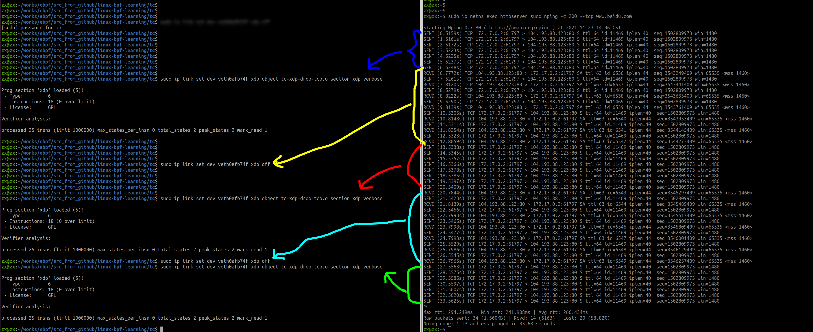


开启xdp后，docker容器去ping外网地址，需要经过主机上的docker0，也就是此时的veth6c30d72@if4接口，该接口上即开启了xdp程序，对于所有的ingress的tcp流量，是drop的，所以docker容器经过这个接口去外网的流量是出不去的，直接被veth6c30d72@if4接口丢弃，`由于xdp比抓包工具更早的接触到流量并抛弃`，因此tcpdump抓不到包的。

如图，容器通过docker0访问外网，配对的veth上开启了xdp，丢弃tcp数据，那么此时容器发出的nping-tcp就被丢弃了。

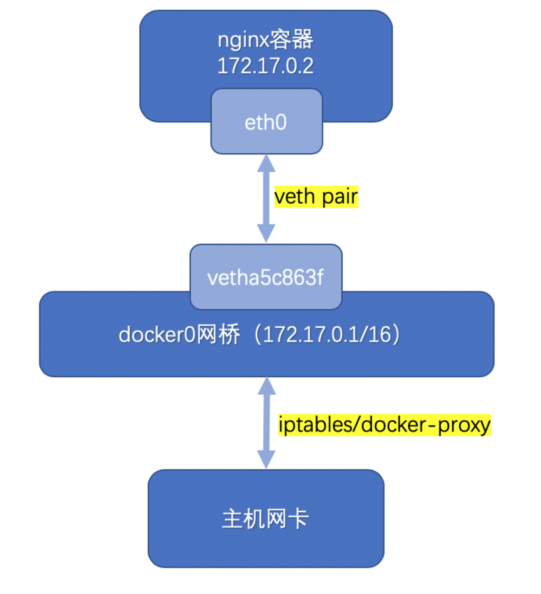


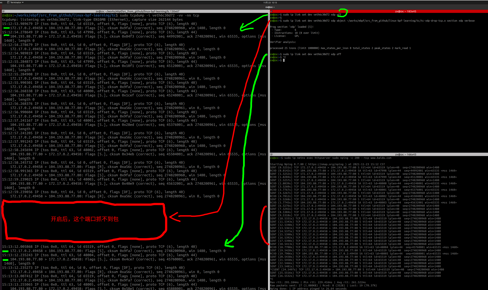


### 2.3 反复开启、关闭xdp程序访问配对的veth

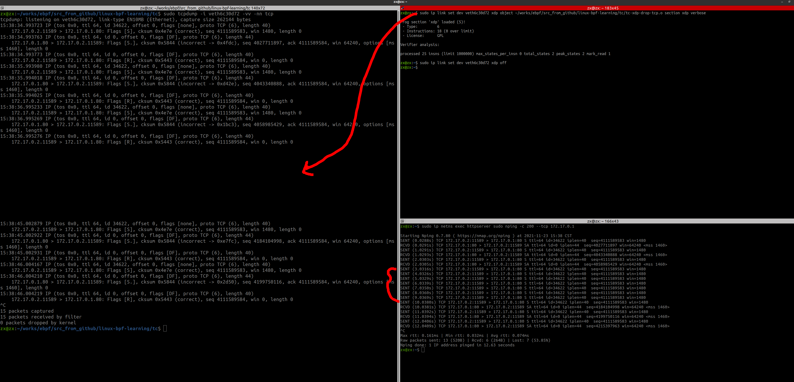


### 2.4 同时使用XDP和TC程序

验证同时使用XDP和TC，控制RX和TX的TCP流量

#### 2.4.1 准备工作

```shell
x@zx:~$ sudo ip link set dev veth6c30d72 xdp object ~/works/ebpf/src_from_github/linux-bpf-learning/tc/tc-xdp-drop-tcp.o section xdp verbose
[sudo] password for zx: 

Prog section 'xdp' loaded (5)!
 - Type:         6
 - Instructions: 18 (0 over limit)
 - License:      GPL

Verifier analysis:

processed 25 insns (limit 1000000) max_states_per_insn 0 total_states 2 peak_states 2 mark_read 1


#tc
zx@zx:~$ tc qdisc show dev veth6c30d72
qdisc noqueue 0: root refcnt 2 
zx@zx:~$ sudo tc qdisc add dev veth6c30d72 clsact
zx@zx:~$ sudo tc qdisc show dev veth6c30d72
qdisc noqueue 0: root refcnt 2 
qdisc clsact ffff: parent ffff:fff1 

zx@zx:~$ sudo tc filter add dev veth6c30d72 egress bpf da obj ~/works/ebpf/src_from_github/linux-bpf-learning/tc/tc-xdp-drop-tcp.o sec tc

zx@zx:~$ sudo tc qdisc show dev veth6c30d72
qdisc noqueue 0: root refcnt 2 
qdisc clsact ffff: parent ffff:fff1 

zx@zx:~$ tc filter show dev veth6c30d72 egress
filter protocol all pref 49152 bpf chain 0 
filter protocol all pref 49152 bpf chain 0 handle 0x1 tc-xdp-drop-tcp.o:[tc] direct-action not_in_hw id 37 tag 2606b497477d080a 
zx@zx:~$ 


```


#### 2.4.2 开启xdp和tc程序

##### 2.4.2.1 docker容器nping-tcp外网地址和docker0

docker容器对外网地址和docker0进行nping-tcp，均失败。

因为主机上的veth口开启了xdp，所以docker容器发到该接口或者由该接口转发的数据，均被丢弃。

==而且tcpdump不能抓到数据。==


（1）外网地址

（2）docker0

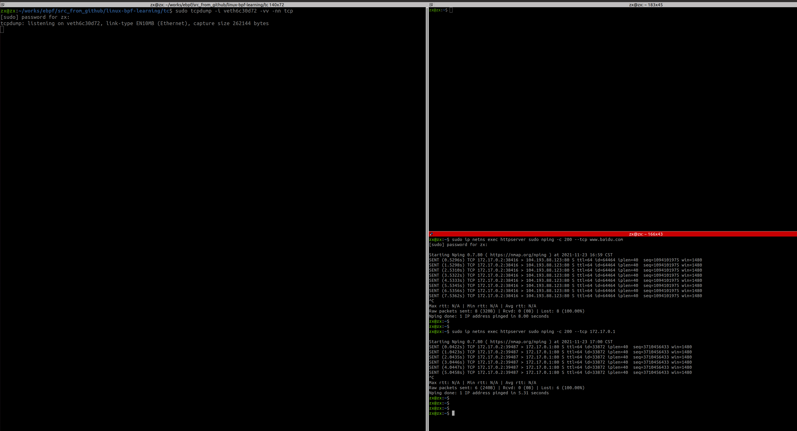


##### 2.4.2.2 主机访问docker容器的nginx服务

主机访问docker容器的nginx服务，因为主机的egress是drop tcp的，所以失败

```shell
curl -m 5 -vvv   localhost
```


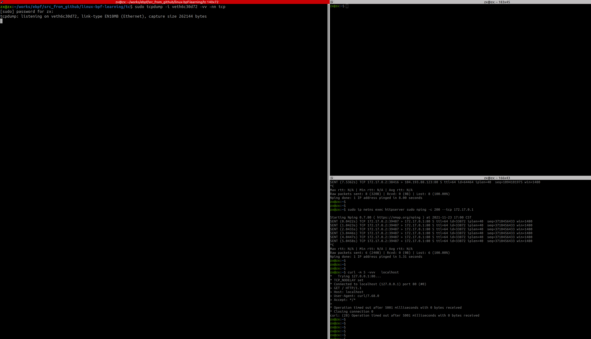


==那如何解释此处抓包也抓不到呢？==

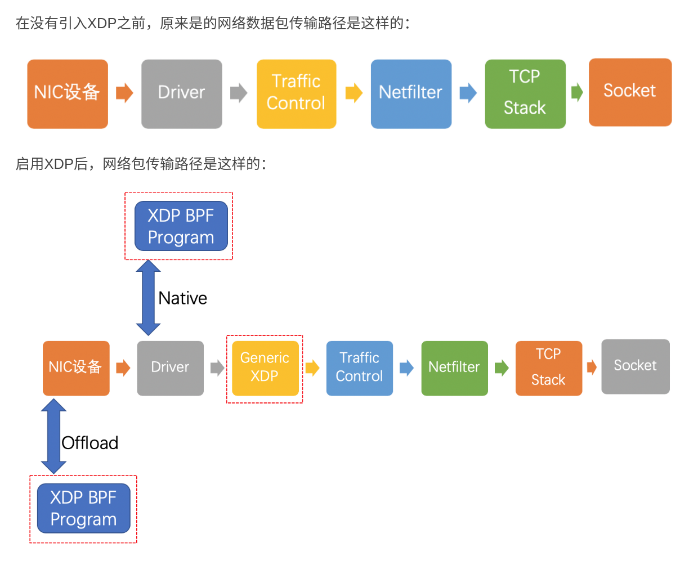


这样看，应该是tcpdump的钩子点比TC更晚，导致流量被TC丢弃了，类似于上面的xdp丢弃流量

【确认这一点？】


##### 2.4.2.3 主机nping-tcp docker容器的eth0

主机nping-tcp docker容器的eth0，因为主机的egress是drop tcp的，所以失败，==同样抓不到包==

```shell
zx@zx:~$ sudo nping -c 100 --tcp 172.17.0.2
[sudo] password for zx: 

Starting Nping 0.7.80 ( https://nmap.org/nping ) at 2021-11-23 17:16 CST
SENT (0.0301s) TCP 172.17.0.1:61418 > 172.17.0.2:80 S ttl=64 id=63792 iplen=40  seq=3749636460 win=1480 
SENT (1.0303s) TCP 172.17.0.1:61418 > 172.17.0.2:80 S ttl=64 id=63792 iplen=40  seq=3749636460 win=1480 
SENT (2.0315s) TCP 172.17.0.1:61418 > 172.17.0.2:80 S ttl=64 id=63792 iplen=40  seq=3749636460 win=1480 
SENT (3.0326s) TCP 172.17.0.1:61418 > 172.17.0.2:80 S ttl=64 id=63792 iplen=40  seq=3749636460 win=1480 
SENT (4.0338s) TCP 172.17.0.1:61418 > 172.17.0.2:80 S ttl=64 id=63792 iplen=40  seq=3749636460 win=1480 
SENT (5.0350s) TCP 172.17.0.1:61418 > 172.17.0.2:80 S ttl=64 id=63792 iplen=40  seq=3749636460 win=1480 
SENT (6.0362s) TCP 172.17.0.1:61418 > 172.17.0.2:80 S ttl=64 id=63792 iplen=40  seq=3749636460 win=1480 
SENT (7.0367s) TCP 172.17.0.1:61418 > 172.17.0.2:80 S ttl=64 id=63792 iplen=40  seq=3749636460 win=1480 
^C 
Max rtt: N/A | Min rtt: N/A | Avg rtt: N/A
Raw packets sent: 8 (320B) | Rcvd: 0 (0B) | Lost: 8 (100.00%)
Nping done: 1 IP address pinged in 8.03 seconds

```

==与【2.4.2.2】问题一样，为何不能抓包？==


##### 2.4.2.4 主机ping docker容器的eth0

主机ping docker容器的eth0，因为ping是icmp协议，不是tcp协议，没有配置icmp协议的规则，所以通

```shell
zx@zx:~$ sudo ping -c 5  172.17.0.2
PING 172.17.0.2 (172.17.0.2) 56(84) bytes of data.
64 bytes from 172.17.0.2: icmp_seq=1 ttl=64 time=0.038 ms
64 bytes from 172.17.0.2: icmp_seq=2 ttl=64 time=0.045 ms
64 bytes from 172.17.0.2: icmp_seq=3 ttl=64 time=0.044 ms
64 bytes from 172.17.0.2: icmp_seq=4 ttl=64 time=0.043 ms
64 bytes from 172.17.0.2: icmp_seq=5 ttl=64 time=0.041 ms

--- 172.17.0.2 ping statistics ---
5 packets transmitted, 5 received, 0% packet loss, time 4075ms
rtt min/avg/max/mdev = 0.038/0.042/0.045/0.002 ms
zx@zx:~$ 


x@zx:~$ sudo nping -c 5 --icmp 172.17.0.2
Starting Nping 0.7.80 ( https://nmap.org/nping ) at 2021-11-23 17:31 CST
SENT (0.0372s) ICMP [172.17.0.1 > 172.17.0.2 Echo request (type=8/code=0) id=54397 seq=1] IP [ttl=64 id=35334 iplen=28 ]
RCVD (0.0374s) ICMP [172.17.0.2 > 172.17.0.1 Echo reply (type=0/code=0) id=54397 seq=1] IP [ttl=64 id=63620 iplen=28 ]
 
Max rtt: 0.114ms | Min rtt: 0.025ms | Avg rtt: 0.055ms
Raw packets sent: 5 (140B) | Rcvd: 5 (140B) | Lost: 0 (0.00%)
Nping done: 1 IP address pinged in 4.07 seconds

```


##### 2.4.2.5 docker容器ping外部地址

同样道理,docker容器可以ping外部：

```shell
x@zx:~$ sudo ip netns exec httpserver sudo nping -c 5 --icmp 172.17.0.1

Starting Nping 0.7.80 ( https://nmap.org/nping ) at 2021-11-23 17:28 CST
SENT (0.0340s) ICMP [172.17.0.2 > 172.17.0.1 Echo request (type=8/code=0) id=48168 seq=1] IP [ttl=64 id=31276 iplen=28 ]
RCVD (0.0341s) ICMP [172.17.0.1 > 172.17.0.2 Echo reply (type=0/code=0) id=48168 seq=1] IP [ttl=64 id=19702 iplen=28 ]

 
Max rtt: 0.034ms | Min rtt: 0.027ms | Avg rtt: 0.029ms
Raw packets sent: 5 (140B) | Rcvd: 5 (140B) | Lost: 0 (0.00%)
Nping done: 1 IP address pinged in 4.07 seconds
zx@zx:~$ 
zx@zx:~$ 
zx@zx:~$ sudo ip netns exec httpserver sudo nping -c 5 --icmp www.baidu.com

Starting Nping 0.7.80 ( https://nmap.org/nping ) at 2021-11-23 17:29 CST
SENT (0.5314s) ICMP [172.17.0.2 > 104.193.88.123 Echo request (type=8/code=0) id=53164 seq=1] IP [ttl=64 id=36694 iplen=28 ]
RCVD (0.7198s) ICMP [104.193.88.123 > 172.17.0.2 Echo reply (type=0/code=0) id=53164 seq=1] IP [ttl=61 id=48401 iplen=28 ]
SENT (1.5316s) ICMP [172.17.0.2 > 104.193.88.123 Echo request (type=8/code=0) id=53164 seq=3] IP [ttl=64 id=36694 iplen=28 ]

 
Max rtt: 188.727ms | Min rtt: 188.219ms | Avg rtt: 188.512ms
Raw packets sent: 5 (140B) | Rcvd: 5 (140B) | Lost: 0 (0.00%)
Nping done: 1 IP address pinged in 4.76 seconds

```


#### 2.4.3 先单独关闭xdp程序

```shell
sudo ip link set dev veth6c30d72 xdp off
```


##### 2.4.3.1 docker容器nping-tcp对外网地址和docker0

docker容器对外网地址和docker0进行nping-tcp，均失败。

主机上的veth口关闭了xdp，所以可以接收docker容器发到该接口或者由该接口转发的数据，因此==可以抓包==。

```shell
x@zx:~$ route -n#当前路由表
Kernel IP routing table
Destination     Gateway         Genmask         Flags Metric Ref    Use Iface
0.0.0.0         10.0.2.2        0.0.0.0         UG    100    0        0 enp0s3
10.0.2.0        0.0.0.0         255.255.255.0   U     100    0        0 enp0s3
169.254.0.0     0.0.0.0         255.255.0.0     U     1000   0        0 enp0s3
172.17.0.0      0.0.0.0         255.255.0.0     U     0      0        0 docker0######


x@zx:~$ sudo ip netns exec httpserver route -n#容器路由表
[sudo] password for zx: 
Kernel IP routing table
Destination     Gateway         Genmask         Flags Metric Ref    Use Iface
0.0.0.0         172.17.0.1      0.0.0.0         UG    0      0        0 eth0
172.17.0.0      0.0.0.0         255.255.0.0     U     0      0        0 eth0
```


（1）外网地址

```shell
x@zx:~$ sudo ip netns exec httpserver sudo nping -c 200 --tcp www.baidu.com

Starting Nping 0.7.80 ( https://nmap.org/nping ) at 2021-11-23 17:42 CST
SENT (0.5268s) TCP 172.17.0.2:32750 > 104.193.88.77:80 S ttl=64 id=31271 iplen=40  seq=1526118025 win=1480 
SENT (1.5272s) TCP 172.17.0.2:32750 > 104.193.88.77:80 S ttl=64 id=31271 iplen=40  seq=1526118025 win=1480 
SENT (2.5289s) TCP 172.17.0.2:32750 > 104.193.88.77:80 S ttl=64 id=31271 iplen=40  seq=1526118025 win=1480 
SENT (3.5301s) TCP 172.17.0.2:32750 > 104.193.88.77:80 S ttl=64 id=31271 iplen=40  seq=1526118025 win=1480 
SENT (4.5315s) TCP 172.17.0.2:32750 > 104.193.88.77:80 S ttl=64 id=31271 iplen=40  seq=1526118025 win=1480 
SENT (5.5326s) TCP 172.17.0.2:32750 > 104.193.88.77:80 S ttl=64 id=31271 iplen=40  seq=1526118025 win=1480 
^C 
Max rtt: N/A | Min rtt: N/A | Avg rtt: N/A
Raw packets sent: 6 (240B) | Rcvd: 0 (0B) | Lost: 6 (100.00%)
Nping done: 1 IP address pinged in 6.34 seconds

```

需要继续对外转发，该接口开启了tc egress，会使 tcp 流量被丢弃，无法从该接口出去


（2）docker0

172.17.0.1，这里docker0会回复容器的nping，该接口开启了tc egress，会使 tcp 流量被丢弃，无法从该接口出去。

```shell
x@zx:~$ sudo ip netns exec httpserver sudo nping -c 200 --tcp 172.17.0.1

Starting Nping 0.7.80 ( https://nmap.org/nping ) at 2021-11-23 17:43 CST
SENT (0.0329s) TCP 172.17.0.2:5843 > 172.17.0.1:80 S ttl=64 id=26083 iplen=40  seq=2928133642 win=1480 
SENT (1.0331s) TCP 172.17.0.2:5843 > 172.17.0.1:80 S ttl=64 id=26083 iplen=40  seq=2928133642 win=1480 
SENT (2.0343s) TCP 172.17.0.2:5843 > 172.17.0.1:80 S ttl=64 id=26083 iplen=40  seq=2928133642 win=1480 
SENT (3.0350s) TCP 172.17.0.2:5843 > 172.17.0.1:80 S ttl=64 id=26083 iplen=40  seq=2928133642 win=1480 
SENT (4.0359s) TCP 172.17.0.2:5843 > 172.17.0.1:80 S ttl=64 id=26083 iplen=40  seq=2928133642 win=1480 
SENT (5.0371s) TCP 172.17.0.2:5843 > 172.17.0.1:80 S ttl=64 id=26083 iplen=40  seq=2928133642 win=1480 
^C 
Max rtt: N/A | Min rtt: N/A | Avg rtt: N/A
Raw packets sent: 6 (240B) | Rcvd: 0 (0B) | Lost: 6 (100.00%)
Nping done: 1 IP address pinged in 5.43 seconds

```


这里疑惑的是contrack类似的功能，==并不是，没有关系==，是docker0开启了tc egress tcp drop，丢弃了要返回给容器的nping答复报文，和容器无关。

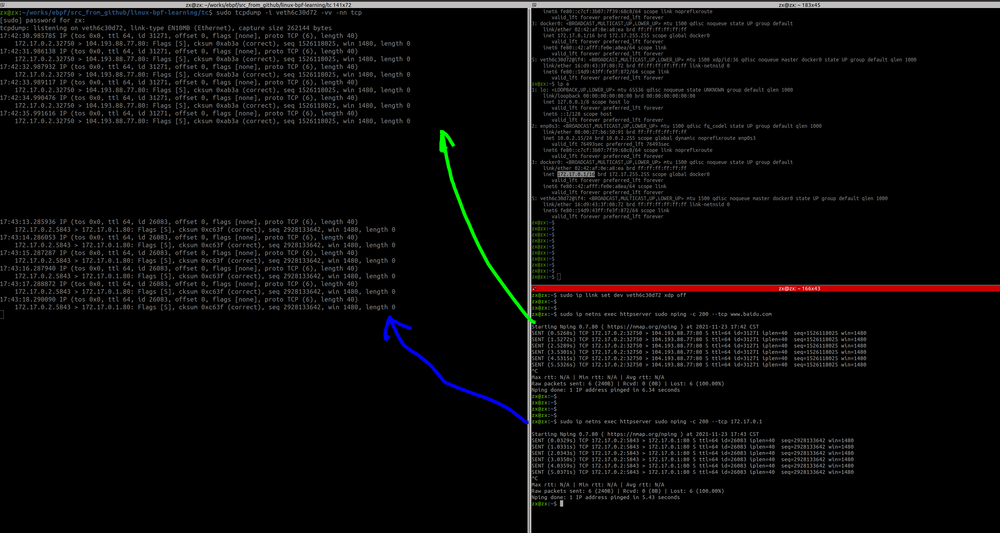


##### 2.4.3.2 主机访问docker容器的nginx服务

主机访问docker容器的nginx服务，因为主机的egress是drop tcp的，所以失败

```shell
zx@zx:~$ curl -m 5 -vvv   localhost
```

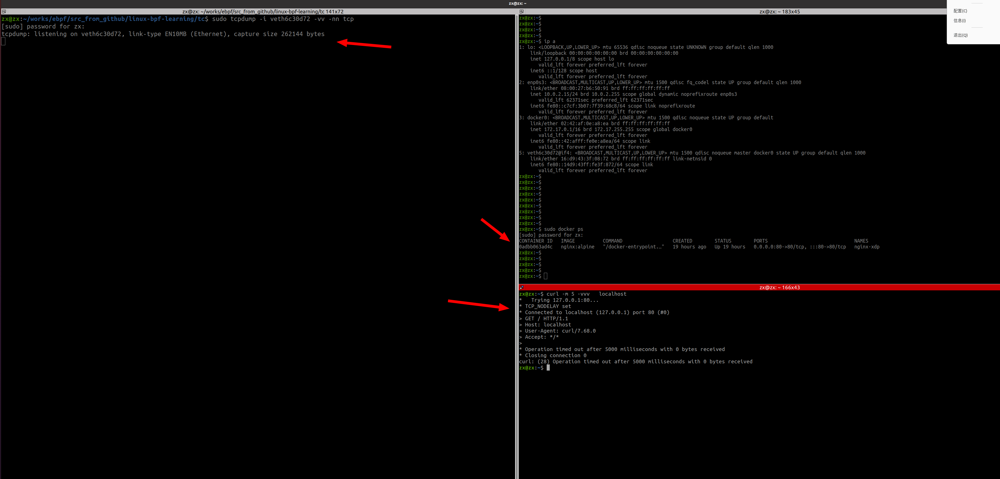


==同样抓不到包==，参考【2.4.2.2】，为何不能抓包


##### 2.4.3.3 主机nping-tcp docker容器的eth0

主机nping-tcp docker容器的eth0，因为主机的egress是drop tcp的，所以不通，==同样抓不到包==

```shell
x@zx:~$ sudo nping -c 100 --tcp 172.17.0.2
[sudo] password for zx: 

Starting Nping 0.7.80 ( https://nmap.org/nping ) at 2021-11-24 09:54 CST
SENT (0.0277s) TCP 172.17.0.1:9801 > 172.17.0.2:80 S ttl=64 id=6382 iplen=40  seq=2753650376 win=1480 
SENT (1.0278s) TCP 172.17.0.1:9801 > 172.17.0.2:80 S ttl=64 id=6382 iplen=40  seq=2753650376 win=1480 
SENT (2.0287s) TCP 172.17.0.1:9801 > 172.17.0.2:80 S ttl=64 id=6382 iplen=40  seq=2753650376 win=1480 
SENT (3.0301s) TCP 172.17.0.1:9801 > 172.17.0.2:80 S ttl=64 id=6382 iplen=40  seq=2753650376 win=1480 
SENT (4.0314s) TCP 172.17.0.1:9801 > 172.17.0.2:80 S ttl=64 id=6382 iplen=40  seq=2753650376 win=1480 
SENT (5.0319s) TCP 172.17.0.1:9801 > 172.17.0.2:80 S ttl=64 id=6382 iplen=40  seq=2753650376 win=1480 
SENT (6.0334s) TCP 172.17.0.1:9801 > 172.17.0.2:80 S ttl=64 id=6382 iplen=40  seq=2753650376 win=1480 
SENT (7.0347s) TCP 172.17.0.1:9801 > 172.17.0.2:80 S ttl=64 id=6382 iplen=40  seq=2753650376 win=1480 
^C 
Max rtt: N/A | Min rtt: N/A | Avg rtt: N/A
Raw packets sent: 8 (320B) | Rcvd: 0 (0B) | Lost: 8 (100.00%)
Nping done: 1 IP address pinged in 7.26 seconds

```

与【2.4.2.3】，为何不能抓包


##### 2.4.3.4 主机ping docker容器的eth0

主机ping docker容器的eth0，因为ping是icmp协议，不是tcp协议，没有配置icmp协议的规则，所以通

```shell
x@zx:~$ sudo ping -c 5  172.17.0.2
PING 172.17.0.2 (172.17.0.2) 56(84) bytes of data.
64 bytes from 172.17.0.2: icmp_seq=1 ttl=64 time=0.045 ms
64 bytes from 172.17.0.2: icmp_seq=2 ttl=64 time=0.045 ms
64 bytes from 172.17.0.2: icmp_seq=3 ttl=64 time=0.038 ms
64 bytes from 172.17.0.2: icmp_seq=4 ttl=64 time=0.039 ms
^C
--- 172.17.0.2 ping statistics ---
4 packets transmitted, 4 received, 0% packet loss, time 3072ms
rtt min/avg/max/mdev = 0.038/0.041/0.045/0.003 ms
zx@zx:~$ 
zx@zx:~$ 
zx@zx:~$ sudo nping -c 5 --icmp 172.17.0.2

Starting Nping 0.7.80 ( https://nmap.org/nping ) at 2021-11-24 10:00 CST
SENT (0.0359s) ICMP [172.17.0.1 > 172.17.0.2 Echo request (type=8/code=0) id=64817 seq=1] IP [ttl=64 id=26298 iplen=28 ]
RCVD (0.0361s) ICMP [172.17.0.2 > 172.17.0.1 Echo reply (type=0/code=0) id=64817 seq=1] IP [ttl=64 id=45024 iplen=28 ]
SENT (1.0395s) ICMP [172.17.0.1 > 172.17.0.2 Echo request (type=8/code=0) id=64817 seq=2] IP [ttl=64 id=26298 iplen=28 ]
RCVD (1.0397s) ICMP [172.17.0.2 > 172.17.0.1 Echo reply (type=0/code=0) id=64817 seq=2] IP [ttl=64 id=45249 iplen=28 ]
^C 
Max rtt: 0.132ms | Min rtt: 0.130ms | Avg rtt: 0.131ms
Raw packets sent: 2 (56B) | Rcvd: 2 (56B) | Lost: 0 (0.00%)
Nping done: 1 IP address pinged in 1.91 seconds

```


##### 2.4.3.5 docker容器ping外部地址

同样道理,docker容器可以ping外部：

```shell
x@zx:~$ sudo ip netns exec httpserver sudo nping -c 5 --icmp 172.17.0.1

Starting Nping 0.7.80 ( https://nmap.org/nping ) at 2021-11-24 10:02 CST
SENT (0.0329s) ICMP [172.17.0.2 > 172.17.0.1 Echo request (type=8/code=0) id=63949 seq=1] IP [ttl=64 id=3384 iplen=28 ]
RCVD (0.0331s) ICMP [172.17.0.1 > 172.17.0.2 Echo reply (type=0/code=0) id=63949 seq=1] IP [ttl=64 id=63272 iplen=28 ]

^C 
Max rtt: 0.047ms | Min rtt: 0.032ms | Avg rtt: 0.038ms
Raw packets sent: 3 (84B) | Rcvd: 3 (84B) | Lost: 0 (0.00%)
Nping done: 1 IP address pinged in 2.60 seconds
zx@zx:~$ sudo ip netns exec httpserver sudo nping -c 5 --icmp www.baidu.com

Starting Nping 0.7.80 ( https://nmap.org/nping ) at 2021-11-24 10:02 CST
SENT (0.5266s) ICMP [172.17.0.2 > 104.193.88.77 Echo request (type=8/code=0) id=40387 seq=1] IP [ttl=64 id=25149 iplen=28 ]
RCVD (0.7184s) ICMP [104.193.88.77 > 172.17.0.2 Echo reply (type=0/code=0) id=40387 seq=1] IP [ttl=61 id=50790 iplen=28 ]

^C 
Max rtt: 192.464ms | Min rtt: 191.472ms | Avg rtt: 191.890ms
Raw packets sent: 3 (84B) | Rcvd: 3 (84B) | Lost: 0 (0.00%)
Nping done: 1 IP address pinged in 3.02 seconds

```


##### 2.4.3.6 主机nping-tcp自己的ip地址

```shell
x@zx:~$ sudo nping -c 100 --tcp 172.17.0.1

Starting Nping 0.7.80 ( https://nmap.org/nping ) at 2021-11-24 14:13 CST
SENT (0.0478s) TCP 10.0.2.15:48299 > 172.17.0.1:80 S ttl=64 id=22560 iplen=40  seq=2592198885 win=1480 
SENT (1.0481s) TCP 10.0.2.15:48299 > 172.17.0.1:80 S ttl=64 id=22560 iplen=40  seq=2592198885 win=1480 
SENT (2.0493s) TCP 10.0.2.15:48299 > 172.17.0.1:80 S ttl=64 id=22560 iplen=40  seq=2592198885 win=1480 
SENT (3.0505s) TCP 10.0.2.15:48299 > 172.17.0.1:80 S ttl=64 id=22560 iplen=40  seq=2592198885 win=1480 
SENT (4.0517s) TCP 10.0.2.15:48299 > 172.17.0.1:80 S ttl=64 id=22560 iplen=40  seq=2592198885 win=1480 
SENT (5.0529s) TCP 10.0.2.15:48299 > 172.17.0.1:80 S ttl=64 id=22560 iplen=40  seq=2592198885 win=1480 
SENT (6.0531s) TCP 10.0.2.15:48299 > 172.17.0.1:80 S ttl=64 id=22560 iplen=40  seq=2592198885 win=1480 
SENT (7.0543s) TCP 10.0.2.15:48299 > 172.17.0.1:80 S ttl=64 id=22560 iplen=40  seq=2592198885 win=1480 
^C 
Max rtt: N/A | Min rtt: N/A | Avg rtt: N/A
Raw packets sent: 8 (320B) | Rcvd: 0 (0B) | Lost: 8 (100.00%)
Nping done: 1 IP address pinged in 7.88 seconds
```


抓tcp类型的包，抓不到；

`sudo tcpdump -i veth6c30d72 -vv -nn` 也抓不到


#### 2.4.4 再关闭tc程序

```shell
x@zx:~$ sudo tc qdisc show dev veth6c30d72
qdisc noqueue 0: root refcnt 2 
qdisc clsact ffff: parent ffff:fff1 
zx@zx:~$ 
zx@zx:~$ tc filter show dev veth6c30d72 egress
filter protocol all pref 49152 bpf chain 0 
filter protocol all pref 49152 bpf chain 0 handle 0x1 tc-xdp-drop-tcp.o:[tc] direct-action not_in_hw id 37 tag 2606b497477d080a

zx@zx:~$ sudo tc filter delete dev veth6c30d72 egress#关闭tc程序
zx@zx:~$ 
zx@zx:~$ sudo tc qdisc show dev veth6c30d72
qdisc noqueue 0: root refcnt 2 
qdisc clsact ffff: parent ffff:fff1 
zx@zx:~$ 
zx@zx:~$ tc filter show dev veth6c30d72 egress
zx@zx:~$ 
x@zx:~$ ip a
5: veth6c30d72@if4: <BROADCAST,MULTICAST,UP,LOWER_UP> mtu 1500 qdisc noqueue master docker0 state UP group default qlen 1000
    link/ether 16:d9:43:3f:08:72 brd ff:ff:ff:ff:ff:ff link-netnsid 0
    inet6 fe80::14d9:43ff:fe3f:872/64 scope link 
       valid_lft forever preferred_lft forever


```


##### 2.4.4.1 docker容器nping-tcp对外网地址和docker0

docker容器对外网地址和docker0进行nping-tcp，均成功

（1）外网地址

```shell
zx@zx:~$ sudo ip netns exec httpserver sudo nping -c 200 --tcp www.baidu.com
[sudo] password for zx: 

Starting Nping 0.7.80 ( https://nmap.org/nping ) at 2021-11-24 10:14 CST
SENT (0.5272s) TCP 172.17.0.2:48169 > 103.235.46.39:80 S ttl=64 id=11068 iplen=40  seq=1903093559 win=1480 
RCVD (0.5688s) TCP 103.235.46.39:80 > 172.17.0.2:48169 SA ttl=63 id=50800 iplen=44  seq=811328001 win=65535 <mss 1460>

^C 
Max rtt: 42.915ms | Min rtt: 39.111ms | Avg rtt: 41.169ms
Raw packets sent: 3 (120B) | Rcvd: 3 (132B) | Lost: 0 (0.00%)
Nping done: 1 IP address pinged in 3.18 seconds

```

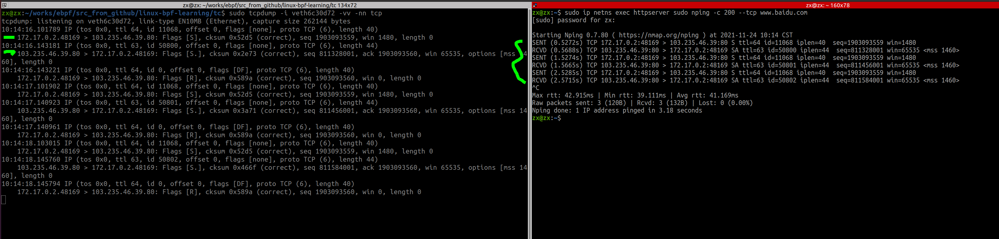


（2）docker0

```
x@zx:~$ sudo ip netns exec httpserver sudo nping -c 200 --tcp 172.17.0.1

Starting Nping 0.7.80 ( https://nmap.org/nping ) at 2021-11-24 10:17 CST
SENT (0.0418s) TCP 172.17.0.2:44922 > 172.17.0.1:80 S ttl=64 id=54789 iplen=40  seq=4081847795 win=1480 
RCVD (0.0421s) TCP 172.17.0.1:80 > 172.17.0.2:44922 SA ttl=64 id=0 iplen=44  seq=80718525 win=64240 <mss 1460>
SENT (1.0423s) TCP 172.17.0.2:44922 > 172.17.0.1:80 S ttl=64 id=54789 iplen=40  seq=4081847795 win=1480 
RCVD (1.0425s) TCP 172.17.0.1:80 > 172.17.0.2:44922 SA ttl=64 id=0 iplen=44  seq=96350485 win=64240 <mss 1460>
^C 
Max rtt: 0.164ms | Min rtt: 0.044ms | Avg rtt: 0.104ms
Raw packets sent: 2 (80B) | Rcvd: 2 (88B) | Lost: 0 (0.00%)
Nping done: 1 IP address pinged in 1.68 seconds

```

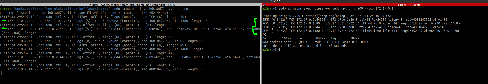


##### 2.4.4.2 主机访问docker容器的nginx服务

主机访问docker容器的nginx服务，成功

```shell
x@zx:~$ curl -m 5 -vvv   localhost
*   Trying 127.0.0.1:80...
* TCP_NODELAY set
* Connected to localhost (127.0.0.1) port 80 (#0)
> GET / HTTP/1.1
> Host: localhost
> User-Agent: curl/7.68.0
> Accept: */*
> 
* Mark bundle as not supporting multiuse
< HTTP/1.1 200 OK
< Server: nginx/1.21.4
< Date: Wed, 24 Nov 2021 02:24:42 GMT
< Content-Type: text/html
< Content-Length: 615
< Last-Modified: Tue, 02 Nov 2021 15:07:50 GMT
< Connection: keep-alive
< ETag: "61815446-267"
< Accept-Ranges: bytes
< 
<!DOCTYPE html>
<html>
<head>
<title>Welcome to nginx!</title>
<style>
html { color-scheme: light dark; }
body { width: 35em; margin: 0 auto;
font-family: Tahoma, Verdana, Arial, sans-serif; }
</style>
</head>
<body>
<h1>Welcome to nginx!</h1>
<p>If you see this page, the nginx web server is successfully installed and
working. Further configuration is required.</p>

<p>For online documentation and support please refer to
<a href="http://nginx.org/">nginx.org</a>.<br/>
Commercial support is available at
<a href="http://nginx.com/">nginx.com</a>.</p>

<p><em>Thank you for using nginx.</em></p>
</body>
</html>
* Connection #0 to host localhost left intact

```


##### 2.4.4.3 主机nping-tcp docker容器的eth0

主机nping-tcp docker容器的eth0，成功

```shell
x@zx:~$ sudo nping -c 100 --tcp 172.17.0.2

Starting Nping 0.7.80 ( https://nmap.org/nping ) at 2021-11-24 10:25 CST
SENT (0.0304s) TCP 172.17.0.1:35236 > 172.17.0.2:80 S ttl=64 id=607 iplen=40  seq=1257743241 win=1480 
RCVD (0.0309s) TCP 172.17.0.2:80 > 172.17.0.1:35236 SA ttl=64 id=0 iplen=44  seq=813594081 win=64240 <mss 1460>
SENT (1.0310s) TCP 172.17.0.1:35236 > 172.17.0.2:80 S ttl=64 id=607 iplen=40  seq=1257743241 win=1480 
RCVD (1.0312s) TCP 172.17.0.2:80 > 172.17.0.1:35236 SA ttl=64 id=0 iplen=44  seq=829226415 win=64240 <mss 1460>
^C 
Max rtt: 0.132ms | Min rtt: 0.047ms | Avg rtt: 0.089ms
Raw packets sent: 2 (80B) | Rcvd: 2 (88B) | Lost: 0 (0.00%)
Nping done: 1 IP address pinged in 1.55 seconds

```


##### 2.4.4.4 主机ping docker容器的eth0

```shell
x@zx:~$ sudo ping -c 5  172.17.0.2
PING 172.17.0.2 (172.17.0.2) 56(84) bytes of data.
64 bytes from 172.17.0.2: icmp_seq=1 ttl=64 time=0.033 ms
64 bytes from 172.17.0.2: icmp_seq=2 ttl=64 time=0.037 ms
^C
--- 172.17.0.2 ping statistics ---
2 packets transmitted, 2 received, 0% packet loss, time 1027ms
rtt min/avg/max/mdev = 0.033/0.035/0.037/0.002 ms
zx@zx:~$ sudo nping -c 5 --icmp 172.17.0.2

Starting Nping 0.7.80 ( https://nmap.org/nping ) at 2021-11-24 10:26 CST
SENT (0.0358s) ICMP [172.17.0.1 > 172.17.0.2 Echo request (type=8/code=0) id=15214 seq=1] IP [ttl=64 id=62068 iplen=28 ]
RCVD (0.0373s) ICMP [172.17.0.2 > 172.17.0.1 Echo reply (type=0/code=0) id=15214 seq=1] IP [ttl=64 id=30477 iplen=28 ]
^C 
Max rtt: 0.283ms | Min rtt: 0.283ms | Avg rtt: 0.283ms
Raw packets sent: 1 (28B) | Rcvd: 1 (28B) | Lost: 0 (0.00%)
Nping done: 1 IP address pinged in 0.82 seconds

```


##### 2.4.4.5 docker容器ping外部地址

```shell
x@zx:~$ sudo ip netns exec httpserver sudo nping -c 5 --icmp 172.17.0.1

Starting Nping 0.7.80 ( https://nmap.org/nping ) at 2021-11-24 10:27 CST
SENT (0.0323s) ICMP [172.17.0.2 > 172.17.0.1 Echo request (type=8/code=0) id=63197 seq=1] IP [ttl=64 id=33493 iplen=28 ]
RCVD (0.0325s) ICMP [172.17.0.1 > 172.17.0.2 Echo reply (type=0/code=0) id=63197 seq=1] IP [ttl=64 id=52024 iplen=28 ]
^C 
Max rtt: 0.046ms | Min rtt: 0.029ms | Avg rtt: 0.036ms
Raw packets sent: 3 (84B) | Rcvd: 3 (84B) | Lost: 0 (0.00%)
Nping done: 1 IP address pinged in 2.59 seconds
zx@zx:~$ sudo ip netns exec httpserver sudo nping -c 5 --icmp www.baidu.com

Starting Nping 0.7.80 ( https://nmap.org/nping ) at 2021-11-24 10:27 CST
SENT (0.5246s) ICMP [172.17.0.2 > 104.193.88.77 Echo request (type=8/code=0) id=16458 seq=1] IP [ttl=64 id=58114 iplen=28 ]
RCVD (0.7162s) ICMP [104.193.88.77 > 172.17.0.2 Echo reply (type=0/code=0) id=16458 seq=1] IP [ttl=61 id=50841 iplen=28 ]

^C 
Max rtt: 194.344ms | Min rtt: 191.618ms | Avg rtt: 192.774ms
Raw packets sent: 3 (84B) | Rcvd: 3 (84B) | Lost: 0 (0.00%)
Nping done: 1 IP address pinged in 2.78 seconds

```


## 2. [调试你的BPF程序](https://davidlovezoe.club/wordpress/archives/963)


## 3. [编译运行LINUX内核源码中的BPF示例代码](https://davidlovezoe.club/wordpress/archives/988)

