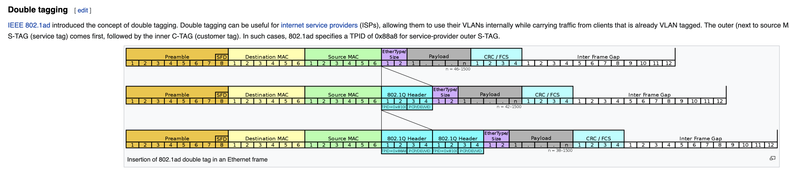

kern

```c
/* Copyright (c) 2016 PLUMgrid
 *
 * This program is free software; you can redistribute it and/or
 * modify it under the terms of version 2 of the GNU General Public
 * License as published by the Free Software Foundation.
 */
#define KBUILD_MODNAME "foo"
#include <uapi/linux/bpf.h>
#include <linux/in.h>
#include <linux/if_ether.h>
#include <linux/if_packet.h>
#include <linux/if_vlan.h>
#include <linux/ip.h>
#include <linux/ipv6.h>
#include <bpf/bpf_helpers.h>

struct {
	__uint(type, BPF_MAP_TYPE_PERCPU_ARRAY);//每个cpu上有一个key对应的value，但是根据key搜索到的是一个具有nr_cpus个value元素的数组
	__type(key, u32);//这个例子中表示的四层头协议号
	__type(value, long);//根据key搜索到的是一个数组，大小是cpu个数，数组的每个元素，就是value
	__uint(max_entries, 256);// key：0～255，总共256个
} rxcnt SEC(".maps");

static int parse_ipv4(void *data, u64 nh_off, void *data_end)
{
	struct iphdr *iph = data + nh_off;

	if (iph + 1 > data_end)
		return 0;
	return iph->protocol;
}

static int parse_ipv6(void *data, u64 nh_off, void *data_end)
{
	struct ipv6hdr *ip6h = data + nh_off;

	if (ip6h + 1 > data_end)
		return 0;
	return ip6h->nexthdr;
}

SEC("xdp1")
int xdp_prog1(struct xdp_md *ctx)
{
	void *data_end = (void *)(long)ctx->data_end;
	void *data = (void *)(long)ctx->data;
	struct ethhdr *eth = data;
	int rc = XDP_DROP;
	long *value;
	u16 h_proto;
	u64 nh_off;
	u32 ipproto;

	nh_off = sizeof(*eth);// 不是8021Q，也不是8021AD，那么nh_off就是这个值了，不再变化
	if (data + nh_off > data_end)
		return rc;

	h_proto = eth->h_proto;

	if (h_proto == htons(ETH_P_8021Q) || h_proto == htons(ETH_P_8021AD)) {//8021Q需要剥一次，注意nh_off增加
		struct vlan_hdr *vhdr;

		vhdr = data + nh_off;
		nh_off += sizeof(struct vlan_hdr);
		if (data + nh_off > data_end)
			return rc;
		h_proto = vhdr->h_vlan_encapsulated_proto;
	}
	if (h_proto == htons(ETH_P_8021Q) || h_proto == htons(ETH_P_8021AD)) {//8021AD还需要剥一次，注意nh_off继续增加
		struct vlan_hdr *vhdr;

		vhdr = data + nh_off;
		nh_off += sizeof(struct vlan_hdr);
		if (data + nh_off > data_end)
			return rc;
		h_proto = vhdr->h_vlan_encapsulated_proto;
	}

	if (h_proto == htons(ETH_P_IP))//h_proto这里就是ip协议了，nh_off也是从数据包开头到ip首部的偏移量了
		ipproto = parse_ipv4(data, nh_off, data_end);
	else if (h_proto == htons(ETH_P_IPV6))
		ipproto = parse_ipv6(data, nh_off, data_end);
	else
		ipproto = 0;

	value = bpf_map_lookup_elem(&rxcnt, &ipproto);// key是四层头协议号
	if (value)
		*value += 1;

	return rc;
}

char _license[] SEC("license") = "GPL";


```

```c
//对比dcube的实现，for循环
//d-cube/src/dataplane/include/lib/pkt_parse.h
static __always_inline __s32 parse_eth_type(struct __ctx_buf *ctx, __u16 *eth_type, __u64 *l3_off)
{
    int i; 
    void *data = (void *)(long)ctx->data;
    void *data_end = (void *)(long)ctx->data_end;
    struct ethhdr *ehdr = (struct ethhdr *)data;  // 数据包一开始就是二层头，对mac来说，14字节

    struct vlan_hdr *vhdr = NULL;

    *l3_off = ETH_HLEN; 
    if (data + *l3_off > data_end) {
        return BPFM_ERR;  
    }
    
    *eth_type = ehdr->h_proto;
    if (__constant_ntohs(*eth_type) < ETH_P_802_3_MIN) {
        return BPFM_UNSUPORRTED;  // only Ethernet-II supported
    }


    #pragma unroll
    for (i = 0; i < 2; i++) {// 这里对应上面的两次if (h_proto == htons(ETH_P_8021Q) || h_proto == htons(ETH_P_8021AD)) 
        if (*eth_type != __constant_htons(ETH_P_8021Q) && *eth_type  != __constant_htons(ETH_P_8021AD)) {
            break;
        }
        vhdr = (struct vlan_hdr *)(data + ETH_HLEN);
        *l3_off += VLAN_HLEN;
        if (data + *l3_off > data_end) {
            TRACE_LOG(TRACE_LOG_ERROR, PARSE_LOG_PREFIX"vhdr data invalid\n");
            return BPFM_ERR;
        }
        *eth_type = vhdr->h_vlan_encapsulated_proto;
    } 
    return BPFM_OK;
}
```




user

```c
// SPDX-License-Identifier: GPL-2.0-only
/* Copyright (c) 2016 PLUMgrid
 */
#include <linux/bpf.h>
#include <linux/if_link.h>
#include <assert.h>
#include <errno.h>
#include <signal.h>
#include <stdio.h>
#include <stdlib.h>
#include <string.h>
#include <unistd.h>
#include <libgen.h>
#include <sys/resource.h>
#include <net/if.h>

#include "bpf_util.h"
#include <bpf/bpf.h>
#include <bpf/libbpf.h>

static int ifindex;
static __u32 xdp_flags = XDP_FLAGS_UPDATE_IF_NOEXIST;
static __u32 prog_id;

static void int_exit(int sig)//退出
{
	__u32 curr_prog_id = 0;

	if (bpf_get_link_xdp_id(ifindex, &curr_prog_id, xdp_flags)) {// 获取当前attach的xdp prog id，不是prog fd
		printf("bpf_get_link_xdp_id failed\n");
		exit(1);
	}
	if (prog_id == curr_prog_id)
		bpf_set_link_xdp_fd(ifindex, -1, xdp_flags);// @@@ fd是-1，就卸载prog
	else if (!curr_prog_id)
		printf("couldn't find a prog id on a given interface\n");
	else
		printf("program on interface changed, not removing\n");
	exit(0);
}

/* simple per-protocol drop counter
使用 bpf_map_lookup_elem(map_fd, &key, values) 获取的 values 是个数组，大小就是运行环境的cpu个数，数组的元素类型就是map定义时的value

例子中，key是协议类型，values是个数组，每个元素是各个cpu的丢包数，也就是value。

所以协议对应的values中每个元素的和，就是这种协议类型在所有cpu上的丢包总和。
 */
static void poll_stats(int map_fd, int interval)
{
	unsigned int nr_cpus = bpf_num_possible_cpus();
	__u64 values[nr_cpus], prev[UINT8_MAX] = { 0 };
	int i;

	while (1) {
		__u32 key = UINT32_MAX;

		sleep(interval);

		while (bpf_map_get_next_key(map_fd, &key, &key) != -1) {//key是四层头的协议号
			__u64 sum = 0;

			assert(bpf_map_lookup_elem(map_fd, &key, values) == 0);//values 是个数组，大小是cpu个数，数组元素就是map定义时的value
			for (i = 0; i < nr_cpus; i++)
				sum += values[i];//数组大小就是运行环境的cpu个数
			if (sum > prev[key])
				printf("proto %u: %10llu pkt/s\n",
				       key, (sum - prev[key]) / interval);
			prev[key] = sum;
		}
	}
}

static void usage(const char *prog)
{
	fprintf(stderr,
		"usage: %s [OPTS] IFACE\n\n"
		"OPTS:\n"
		"    -S    use skb-mode\n"
		"    -N    enforce native mode\n"
		"    -F    force loading prog\n",
		prog);
}

int main(int argc, char **argv)
{
	struct bpf_prog_load_attr prog_load_attr = {
		.prog_type	= BPF_PROG_TYPE_XDP,
	};
	struct bpf_prog_info info = {};
	__u32 info_len = sizeof(info);
	const char *optstr = "FSN";
	int prog_fd, map_fd, opt;
	struct bpf_object *obj;
	struct bpf_map *map;
	char filename[256];
	int err;

	while ((opt = getopt(argc, argv, optstr)) != -1) {
		switch (opt) {
		case 'S':
			xdp_flags |= XDP_FLAGS_SKB_MODE;
			break;
		case 'N':
			/* default, set below */
			break;
		case 'F':
			xdp_flags &= ~XDP_FLAGS_UPDATE_IF_NOEXIST;
			break;
		default:
			usage(basename(argv[0]));
			return 1;
		}
	}

	if (!(xdp_flags & XDP_FLAGS_SKB_MODE))
		xdp_flags |= XDP_FLAGS_DRV_MODE;

	if (optind == argc) {
		usage(basename(argv[0]));
		return 1;
	}

	ifindex = if_nametoindex(argv[optind]);
	if (!ifindex) {
		perror("if_nametoindex");
		return 1;
	}

	snprintf(filename, sizeof(filename), "%s_kern.o", argv[0]);
	prog_load_attr.file = filename;

	if (bpf_prog_load_xattr(&prog_load_attr, &obj, &prog_fd))
		return 1;

	map = bpf_map__next(NULL, obj);
	if (!map) {
		printf("finding a map in obj file failed\n");
		return 1;
	}
	map_fd = bpf_map__fd(map);

	if (!prog_fd) {
		printf("bpf_prog_load_xattr: %s\n", strerror(errno));
		return 1;
	}

	signal(SIGINT, int_exit);
	signal(SIGTERM, int_exit);

	if (bpf_set_link_xdp_fd(ifindex, prog_fd, xdp_flags) < 0) {//通过netlink，进行xdp prog attach
		printf("link set xdp fd failed\n");
		return 1;
	}

	err = bpf_obj_get_info_by_fd(prog_fd, &info, &info_len);
	if (err) {
		printf("can't get prog info - %s\n", strerror(errno));
		return err;
	}
	prog_id = info.id;

	poll_stats(map_fd, 2);

	return 0;
}

```

```c
// tools/lib/bpf/netlink.c
int bpf_set_link_xdp_fd(int ifindex, int fd, __u32 flags)
{
	int ret;

	ret = __bpf_set_link_xdp_fd_replace(ifindex, fd, 0, flags);// fd是-1，就卸载prog
	return libbpf_err(ret);
}

int bpf_set_link_xdp_fd_opts(int ifindex, int fd, __u32 flags,
			     const struct bpf_xdp_set_link_opts *opts)
{
	int old_fd = -1, ret;

	if (!OPTS_VALID(opts, bpf_xdp_set_link_opts))
		return libbpf_err(-EINVAL);

	if (OPTS_HAS(opts, old_fd)) {
		old_fd = OPTS_GET(opts, old_fd, -1);
		flags |= XDP_FLAGS_REPLACE;
	}

	ret = __bpf_set_link_xdp_fd_replace(ifindex, fd, old_fd, flags);// 这个是可以替换旧的prog
	return libbpf_err(ret);
}
```

