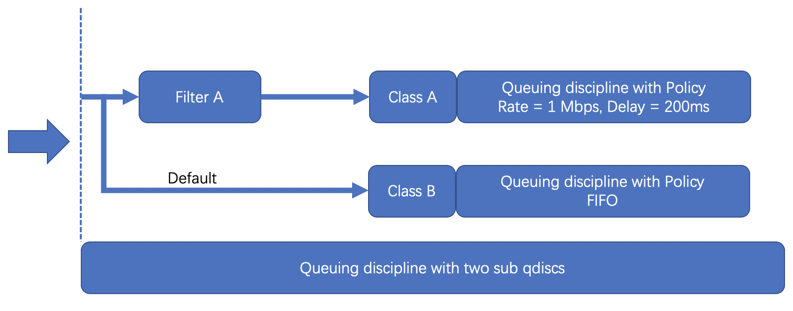

# tc-1

## [你的第一个TC BPF 程序](https://davidlovezoe.club/wordpress/archives/952)



TC有4大组件：

- **Queuing disciplines**，简称为**qdisc**，直译是「队列规则」，它的本质是一个带有算法的队列，默认的算法是**FIFO**，形成了一个最简单的流量调度器。
- **Class**，直译是「种类」，它的本质是为上面的qdisc进行分类。因为现实情况下会有很多qdisc存在，每种qdisc有它特殊的职责，根据职责的不同，可以对qdisc进行分类。
- **Filters**，直译是「过滤器」，它是用来过滤传入的网络包，使它们进入到对应class的qdisc中去。
- **Policers**，直译是「规则器」，它其实是filter的跟班，通常会紧跟着filter出现，定义命中filter后网络包的后继操作，如丢弃、延迟或限速。


【Q】那么TC是怎么和BPF联系在一起的呢？

从内核4.1版本起，引入了一个特殊的**qdisc**，叫做**clsact**，它为TC提供了一个可以加载BPF程序的入口，使TC和XDP一样，成为一个可以加载BPF程序的网络钩子。

【Q】clsact这个对应的上述四个组件都是什么？


【Q】这几个的n-m对应关系是怎样的？


bpf程序attach到tc上，就是多了一个qdisc这样的概念，bpf程序就是一种算法，决定了数据包的处理方式

用来加载BPF程序是个特殊的**qdisc** 叫**clsact**


```shell
# 最开始的状态
> tc qdisc show dev veth09e1d2e
qdisc noqueue 0: root refcnt 2

# 创建clsact
> tc qdisc add dev veth09e1d2e clsact

# 再次查看，观察有什么不同
> tc qdisc show dev veth09e1d2e
qdisc noqueue 0: root refcnt 2
qdisc clsact ffff: parent ffff:fff1

# 加载TC BPF程序到容器的veth网卡上
> tc filter add dev veth09e1d2e egress bpf da obj tc-xdp-drop-tcp.o sec tc

# 再次查看，观察有什么不同
> tc qdisc show dev veth09e1d2e
qdisc noqueue 0: root refcnt 2
qdisc clsact ffff: parent ffff:fff1

> tc filter show dev veth09e1d2e egress
filter protocol all pref 49152 bpf chain 0
filter protocol all pref 49152 bpf chain 0 handle 0x1 tc-xdp-drop-tcp.o:[tc] direct-action not_in_hw id 24 tag 9c60324798bac8be jited
```

参数**da**，它的全称是「direct action」告诉TC请使用BPF程序提供的返回值，无需再手动指定action了

不使用bpf程序时，需要手动指定action

```shell
# 一个没有使用bpf的tc filter
tc filter add dev eth0 protocol ip parent 1:0 prio 1 u32 match ip src 1.2.3.4 action drop
```

这其实就是我们所说的 direct-action，虽然 classifier 与 action 是分离的，但是 cls_bpf 在逻辑上是 fully self-contained 的，其可以把 classifier 和 action 的功能在一个 cls_bpf 中执行，这允许通过避免 actions linear iteration 在网络数据路径中实现可扩展，可编程的数据包处理过程。
所以到底 direct-action 干了什么呢，我们不难发现 classifier 和 action 的返回值是有一定区别的：

classifier 能对包进行匹配，但返回值为 classid；它只能告诉系统接下来把这个包送到那个 class， 但无法让系统对这个包执行动作（drop、allow、mirror 等）。
action 返回的是动作，告诉系统接下来要对这个包做什么（drop、allow、mirror 等），action 附加在 classifer 上，所以没法完成两个动作。

所以，如果要实现”匹配+执行动作“的目的 —— 例如，如果源 IP 是 10.1.1.1，则 drop 这 个包 —— 就需要两个步骤：一个 classifier 和一个 action，即 classfifier+action 模式。

但是 eBPF classifier 是 fully self-contained的 ，很多场景无需再 attach 额外的 qdisc 或 class 了，对于 tc 层的数据包过滤（pass/drop/etc）场景尤其如此，所以引入了 direct-action，==这个 flag 告诉系统 classifier 的返回值(tc ebpf prog返回值)应当被解读为 action 类型的返回值==，这样做的好处如下：

​	避免因套用 tc 原有流程而引入一个功能单薄的 action
​	简化那些 classfier 独自就能完成所有工作的场景
​	提升性能


------

## 命令行

[tc ebpf 实践](https://blog.csdn.net/u013743253/article/details/120707979)

### 1.用 tc 加载 BPF 程序

给定一个为 tc 编译的 BPF 对象文件 prog.o， 可以通过 tc 命令将其加载到一个网 络设备（netdevice）。但与 XDP 不同，设备是否支持 attach tc BPF 程序并不依赖驱动 （即任何网络设备都支持 tc BPF）。下面的命令可以将程序 attach 到 em1 的ingress 网络：

```shell
$ tc qdisc add dev em1 clsact

$ tc filter add dev em1 ingress bpf da obj prog.o
```

第一步创建了一个 clsact qdisc (Linux 排队规则，Linux queueing discipline)。

clsact 是一个 dummy qdisc，和 ingress qdisc 类似，可以持有（hold）分类器和 动作（classifier and actions），但不执行真正的排队（queueing）。后面 attach bpf 分类器需要用到它。clsact qdisc 提供了两个特殊的 hook：ingress and egress，分类器可以 attach 到这两个 hook 点。这两个 hook 都位于 datapath 的 关键收发路径上，设备 em1 的每个包都会经过这两个点。这两个 hook 分别会被下面的内 核函数调用：

```c
ingress hook：__netif_receive_skb_core() -> sch_handle_ingress()
egress hook：__dev_queue_xmit() -> sch_handle_egress()
```

 类似地，将程序 attach 到 egress hook：

```shell
$ tc filter add dev em1 egress bpf da obj prog.o 
```


第二条命令，tc filter 选择了在 ==da（direct-action）==模式中使用 bpf。da 是 推荐的模式，并且应该永远指定这个参数。粗略地说，da 模式表示 bpf 分类器不需 要调用外部的 tc action 模块。事实上 bpf 分类器也完全不需要调用外部模块，因为所有的 packet mangling、转发或其他类型的 action 都可以在这单个 BPF 程序内完成 ，因此执行会明显更快。

配置了这两条命令之后，程序就 attach 完成了，接下来只要有包经过这个设备，就会触发 这个程序执行。和 XDP 类似，如果没有使用默认 section 名字，那可以在加载时指定，例 如指定 section 为 foobar：

```shell
$ tc filter add dev em1 egress bpf da obj prog.o sec foobar
```

查看已经 attach 的程序：

```shell
$ tc filter show dev em1 ingress

filter protocol all pref 49152 bpf

filter protocol all pref 49152 bpf handle 0x1 prog.o:[ingress] direct-action id 1 tag c5f7825e5dac396f

$ tc filter show dev em1 egress

filter protocol all pref 49152 bpf

filter protocol all pref 49152 bpf handle 0x1 prog.o:[egress] direct-action id 2 tag b2fd5adc0f262714
```

输出中的 prog.o:[ingress] 表示 section ingress 中的程序是从 文件 prog.o 加 载的，而且 bpf 工作在 direct-action 模式。上面还打印了程序的 id 和 tag， 其中 tag 是指令流（instruction stream）的哈希，可以关联到对应的对象文件或用perf 查看调用栈信息。id 是一个操作系统层唯一的 BPF 程序标识符，可以用 bpftool 进一步查看或 dump 相关的程序信息。

程序优先级（pref）和句柄（handle）

在上面的 show 命令中，tc 还打印出了 pref 49152 和 handle 0x1。如果之前没有 通过命令行显式指定，这两个数据就会自动生成。pref 表示优先级，如果指定了多个分 类器，它们会按照优先级从高到低依次执行；handle 是一个标识符，在加载了同一分类器的多 个实例并且它们的优先级（pref）都一样的情况下会用到这个标识符。因为 在 BPF 的场景下，单个程序就足够了，因此 pref 和 handle 通常情况下都可以忽略。

除非打算后面原子地==替换== attached BPF 程序，否则不建议在加载时显式指定 pref 和 handle。显式指定这两个参数的好处是，后面执行 replace 操作时，就不需要再去动 态地查询这两个值。显式指定 pref 和 handle 时的加载命令：

```shell
$ tc filter add dev em1 ingress pref 1 handle 1 bpf da obj prog.o sec foobar
 
$ tc filter show dev em1 ingress
filter protocol all pref 1 bpf
filter protocol all pref 1 bpf handle 0x1 prog.o:[foobar] direct-action id 1 tag c5f7825e5dac396f
```

 对应的原子 replace 命令：将 ingress hook 处的已有程序替换为 prog.o 文件中 foobar section 中的新 BPF 程序

注意pref、handle

```shell
$ tc filter replace dev em1 ingress pref 1 handle 1 bpf da obj prog.o sec foobar
```


### 2.用 tc 删除 BPF 程序

要分别从 ingress 和 egress 删除所有 attach 的程序

```shell
$ tc filter del dev em1 ingress
$ tc filter del dev em1 egress
```

要从 netdevice 删除整个 clsact qdisc（会隐式地删除 attach 到 ingress 和 egress hook 上面的所有程序），执行


```shell
$ tc qdisc del dev em1 clsact
```


### 3.offload 到网卡

如果网卡驱动支持 tc BPF 程序，那也可以将它们 offload 到网卡 。`Netronome` 的 `nfp` 网卡对 XDP 和 tc BPF 程序都支持 offload。

```shell
$ tc qdisc add dev em1 clsact
$ tc filter replace dev em1 ingress pref 1 handle 1 bpf skip_sw da obj prog.o
Error: TC offload is disabled on net device.
We have an error talking to the kernel
```

如果显式以上错误，那需要先启用网卡的 `hw-tc-offload` 功能：

```shell
$ ethtool -K em1 hw-tc-offload on
 
$ tc qdisc add dev em1 clsact
$ tc filter replace dev em1 ingress pref 1 handle 1 bpf skip_sw da obj prog.o
$ tc filter show dev em1 ingress
filter protocol all pref 1 bpf
filter protocol all pref 1 bpf handle 0x1 prog.o:[classifier] direct-action skip_sw in_hw id 19 tag 57cd311f2e27366b
```

其中的 in_hw 标志表示这个程序已经被 offload 到网卡了。

注意，tc 和 XDP offload 无法同时加载，因此必须要指明是 tc 还是 XDP offload 选项 。
