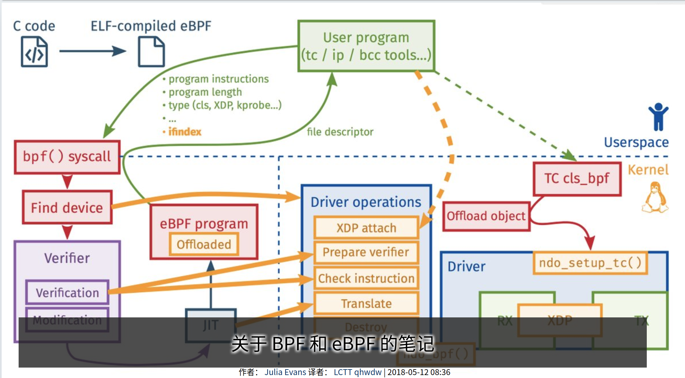

#### ebpf

| ebpf                                                         |                                                              |
| ------------------------------------------------------------ | ------------------------------------------------------------ |
| [深入浅出 eBPF](https://www.ebpf.top/)                       | 专注于 Linux 内核技术eBPF (Linux/Kernel/XDP/BCC/BPFTrace/Cillium) |
| https://davidlovezoe.club/wordpress/archives/tag/bpf https://davidlovezoe.club/wordpress/archives/862 | ==先看这个系列，跟着做实验==                                 |
| https://blog.csdn.net/sinat_38816924/category_10953548.html  | 《Linux内核观测技术BPF》阅读笔记                             |
|                                                              |                                                              |
|                                                              |                                                              |
|                                                              |                                                              |
|                                                              |                                                              |
|                                                              |                                                              |
|                                                              |                                                              |

#### xdp

| xdp                           |      |
| ----------------------------- | ---- |
| https://gitee.com/hecg/xdp-fw |      |
|                               |      |
|                               |      |
|                               |      |
|                               |      |
|                               |      |
|                               |      |
|                               |      |
|                               |      |

https://linux.cn/article-9630-1.html

