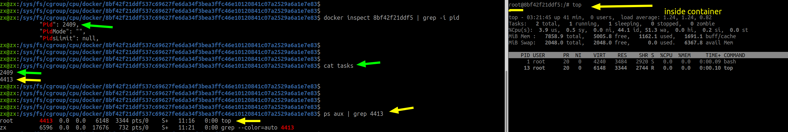
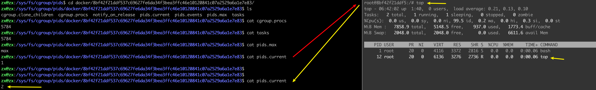

# docker_cgroup

------


```shell
zx@zx-docker:~$ docker ps -a
CONTAINER ID   IMAGE        COMMAND       CREATED        STATUS                      PORTS     NAMES
`b518627b0da2`   ubuntu-net   "/bin/bash"   46 hours ago   Exited (0) 22 hours ago               c3
zx@zx-docker:~$ docker start b518627b0da2
b518627b0da2
zx@zx-docker:~$ docker inspect b518627b0da2 | grep -i pid
            "Pid": `2744`,
zx@zx-docker:~$ cd /sys/fs/cgroup/cpu/docker
zx@zx-docker:/sys/fs/cgroup/cpu/docker$ ls
`b518627b0da25ab...` 
......
zx@zx-docker:/sys/fs/cgroup/cpu/docker$ cd b518627b0da25ab.../
zx@zx-docker:/sys/fs/cgroup/cpu/docker/b518627b0da25ab...$ ls
cgroup.clone_children  cpuacct.usage_all          cpuacct.usage_sys   cpu.shares      notify_on_release
cgroup.procs           cpuacct.usage_percpu       cpuacct.usage_user  cpu.stat        tasks
cpuacct.stat           cpuacct.usage_percpu_sys   cpu.cfs_period_us   cpu.uclamp.max
cpuacct.usage          cpuacct.usage_percpu_user  cpu.cfs_quota_us    cpu.uclamp.min
zx@zx-docker:/sys/fs/cgroup/cpu/docker/b518627b0da25ab...$
zx@zx-docker:/sys/fs/cgroup/cpu/docker/b518627b0da25ab...$ cat cpu.cfs_period_us
100000
zx@zx-docker:/sys/fs/cgroup/cpu/docker/b518627b0da25ab...$ cat cpu.cfs_quota_us
-1
zx@zx-docker:/sys/fs/cgroup/cpu/docker/b518627b0da25ab...$ cat tasks
`2744`
zx@zx-docker:/sys/fs/cgroup/cpu/docker/b518627b0da25ab...$ cat `/proc/2744/cgroup`
12:pids:/docker/b518627b0da25ab...
11:freezer:/docker/b518627b0da25ab...
10:rdma:/
9:hugetlb:/docker/b518627b0da25ab...
8:memory:/docker/b518627b0da25ab...
7:devices:/docker/b518627b0da25ab...
6:cpuset:/docker/b518627b0da25ab...
5:perf_event:/docker/b518627b0da25ab...
4:cpu,cpuacct:/docker/b518627b0da25ab...
3:net_cls,net_prio:/docker/b518627b0da25ab...
2:blkio:/docker/b518627b0da25ab...
1:name=systemd:/docker/b518627b0da25ab...
0::/system.slice/containerd.service

#好像只有这个路径下执行才有效
zx@zx-docker:/sys/fs/cgroup/cpu$ `cgget -a docker/b518627b0da25ab...`
docker/b518627b0da25ab... :
blkio.throttle.read_iops_device:
......
net_cls.classid: 0
net_prio.prioidx: 3
net_prio.ifpriomap: lo 0
        enp0s3 0
        br-4a44e5fb02c2 0
        br-63ec0e397c57 0
        docker0 0
        veth4224a1d 0
cpu.cfs_period_us: 100000
cpu.stat: nr_periods 0
        nr_throttled 0
        throttled_time 0
cpu.shares: 1024
cpu.cfs_quota_us: -1
...
pids.current: 1
pids.events: max 0
pids.max: max

zx@zx-docker:/sys/fs/cgroup/cpu$ `cgget -r cpu.cfs_quota_us   docker/b518627b0da25ab...`
docker/b518627b0da25ab... :
cpu.cfs_quota_us: -1
```




容器在宿主机的进程号，会写入该docker的cgroup：tasks文件中；

在容器中执行top，这个docker的cgroup：tasks 会出现另一个进程，就是宿主机中看到的这个top进程。

容器取消top的执行，docker的cgroup：tasks 中这个进程号消失。

容器内部的所有进程，包括容器自身的进程，==宿主机都能够感知到，也都会在对应的cgroup中监控==。

上面的两个进程，2409是docker的pid，也就是这个bash的pid；4413是docker执行的top命令的pid


类似上面的，在cgroup/pids下，监控的进程，也会随着docker内部的命令而变化




`tasks`文件中是线程ID，`cgroup.procs`文件中是进程ID。

zx@zx:/sys/fs/cgroup/cpu/docker/8bf42f21ddf537c69627fe6da34f3bea3ffc46e10120841c07a2529a6a1e7e83$ cat cgroup.procs
5784
6035
zx@zx:/sys/fs/cgroup/cpu/docker/8bf42f21ddf537c69627fe6da34f3bea3ffc46e10120841c07a2529a6a1e7e83$ cat tasks
5784
6035


```shell
zx@zx:/sys/fs/cgroup$ cat /proc/cgroups
#controller名称  挂载位置ID   使用该controller的cgroup数量   是否启用
#subsys_name	hierarchy	num_cgroups		enabled
cpuset			10			3				1
cpu				3			107				1
cpuacct			3			107				1
blkio			9			107				1
memory			2			160				1
devices			4			107				1
freezer			8			3				1
net_cls			5			3				1
perf_event		7			3				1
net_prio		5			3				1
hugetlb			6			3				1
pids			12			115				1
rdma			11			1				1
zx@zx:/sys/fs/cgroup$
zx@zx:/sys/fs/cgroup$
zx@zx:/sys/fs/cgroup$
zx@zx:/sys/fs/cgroup$ cat /proc/5784/cgroup
#第一列hierarchy-ID与/proc/cgroups的第二列对应；第二列是controller名称；第三列是cgroup目录路径。
12:pids:/docker/8bf42f21ddf537c69627fe6da34f3bea3ffc46e10120841c07a2529a6a1e7e83
11:rdma:/
10:cpuset:/docker/8bf42f21ddf537c69627fe6da34f3bea3ffc46e10120841c07a2529a6a1e7e83
9:blkio:/docker/8bf42f21ddf537c69627fe6da34f3bea3ffc46e10120841c07a2529a6a1e7e83
8:freezer:/docker/8bf42f21ddf537c69627fe6da34f3bea3ffc46e10120841c07a2529a6a1e7e83
7:perf_event:/docker/8bf42f21ddf537c69627fe6da34f3bea3ffc46e10120841c07a2529a6a1e7e83
6:hugetlb:/docker/8bf42f21ddf537c69627fe6da34f3bea3ffc46e10120841c07a2529a6a1e7e83
5:net_cls,net_prio:/docker/8bf42f21ddf537c69627fe6da34f3bea3ffc46e10120841c07a2529a6a1e7e83
4:devices:/docker/8bf42f21ddf537c69627fe6da34f3bea3ffc46e10120841c07a2529a6a1e7e83
3:cpu,cpuacct:/docker/8bf42f21ddf537c69627fe6da34f3bea3ffc46e10120841c07a2529a6a1e7e83
2:memory:/docker/8bf42f21ddf537c69627fe6da34f3bea3ffc46e10120841c07a2529a6a1e7e83
1:name=systemd:/docker/8bf42f21ddf537c69627fe6da34f3bea3ffc46e10120841c07a2529a6a1e7e83
0::/system.slice/containerd.service

#比如，3:cpu,cpuacct:/docker/8bf...   
#    {/sys/fs/cgroup} + {3:cpu,cpuacct 对应的相对路径：cpu,cpuacct} + {自身目录：/docker/8bf... }
#  = /sys/fs/cgroup/cpu,cpuacct/docker/8bf...  这个就是挂载目录

zx@zx:/sys/fs/cgroup$ ps aux | grep docker
root         948  0.0  0.9 1383656 79068 ?       Ssl  13:02   0:02 /usr/bin/dockerd -H fd:// --containerd=/run/containerd/containerd.sock
zx          5918  0.0  0.5 1276496 46816 pts/4   Sl+  14:38   0:00 docker attach 8bf42f21ddf5

zx@zx:/sys/fs/cgroup$ cat /proc/948/cgroup
12:pids:/system.slice/docker.service
11:rdma:/
10:cpuset:/
9:blkio:/system.slice/docker.service
8:freezer:/
7:perf_event:/
6:hugetlb:/
5:net_cls,net_prio:/
4:devices:/system.slice/docker.service
3:cpu,cpuacct:/system.slice/docker.service
2:memory:/system.slice/docker.service
1:name=systemd:/system.slice/docker.service
0::/system.slice/docker.service

zx@zx:/sys/fs/cgroup$ cat /proc/5918/cgroup
12:pids:/user.slice/user-1000.slice/session-8.scope
11:rdma:/
10:cpuset:/
9:blkio:/user.slice
8:freezer:/
7:perf_event:/
6:hugetlb:/
5:net_cls,net_prio:/
4:devices:/user.slice
3:cpu,cpuacct:/user.slice
2:memory:/user.slice/user-1000.slice/session-8.scope
1:name=systemd:/user.slice/user-1000.slice/session-8.scope
0::/user.slice/user-1000.slice/session-8.scope
```


cgroup是以目录的形式呈现的，`/`是cgroup的根目录，注意cgroup的根目录和挂载目录不是一回事，cgroup可能挂载在/sys/fs/cgroup或者/tmp/cgroup等任意目录，无论挂载在哪里，cgroup的根目录都是“`/`”。

假设cgroup的cpu controller的挂载点是/sys/fs/cgroup/cpu，那么目录`/sys/fs/cgroup/cpu/cg1`对应的cgroup的目录是`/cg1`。

为什么要强调这个，因为在调查一个kubelet的问题的时候，不确定`--runtime-cgroups`参数值中要不要包含挂载点路径，直到[用cadvisor查出所有cgroup](https://www.lijiaocn.com/问题/2019/01/25/kubernetes-failed-to-get-cgroup-stats.html#直接用cadvisor查询所有cgroup)后，才确定不应该带有挂载路径。现在从Linux手册中找到支持了：

```shell
A cgroup filesystem initially contains a single root cgroup, '/',
which all processes belong to.  A new cgroup is created by creating a
directory in the cgroup filesystem:

      mkdir /sys/fs/cgroup/cpu/cg1
```
