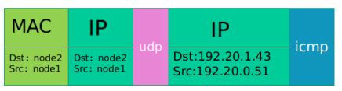
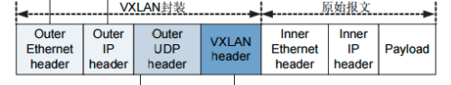
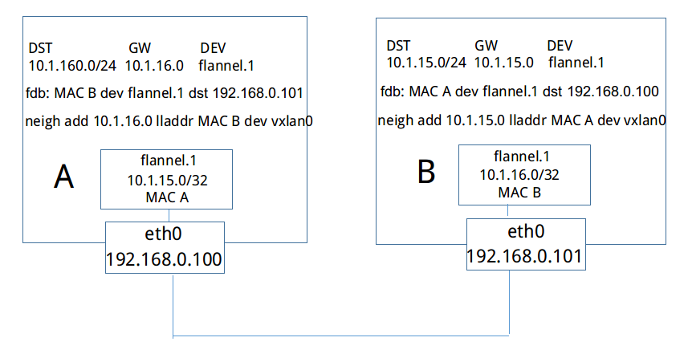
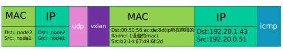
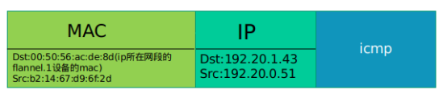

# 资料收集

## 不同后端的封装

Flannel可以指定不同的转发后端网络，常用的有hostgw，udp，vxlan等。

### Hostgw

hostgw是最简单的backend，它的原理非常简单，直接添加路由，将目的主机当做网关，直接路由原始封包。

例如，我们从etcd中监听到一个EventAdded事件subnet为10.1.15.0/24被分配给主机Public IP 192.168.0.100，hostgw要做的工作就是在本主机上添加一条目的地址为10.1.15.0/24，网关地址为192.168.0.100，输出设备为上文中选择的集群间交互的网卡即可。

优点：简单，直接，效率高

缺点：要求所有的pod都在一个子网中，如果跨网段就无法通信。

### UDP

当容器10.1.15.2/24要和容器10.1.20.2/24通信时，

1.因为该封包的目的地不在本主机subnet内，因此封包会首先通过网桥转发到主机中。

2.在主机上经过路由匹配，进入网卡flannel.1。(需要注意的是flannel.1是一个tun设备，它是一种工作在三层的虚拟网络设备，而flanneld是一个proxy，它会==监听flannel.1并转发流量==。)

3.当封包进入flannel.1时，==flanneld就可以从flanne.1中将封包读出==，由于flanne.1是三层设备，所以读出的封包仅仅包含IP层的报头及其负载。

4.最后==flanneld==会将获取的封包作为==负载数据==，通过==udp socket==发往目的主机。

5.在目的主机的==flanneld==会监听Public IP所在的设备，从中读取udp封包的负载，并将其放入flannel.1设备内。

6.容器网络封包到达目的主机，之后就可以通过网桥转发到目的容器了。

【Q】上图中，为何两个flannel的ip地址都是 10.1.0.0/16，为何是16

### vxlan

vxlan和上文提到的udp backend的封包结构是非常类似的，不同之处是多了一个vxlan header，以及原始报文中多了个二层的报头。

【猜测】

**为何udp在内层没有mac部分？**而为何vxlan有mac部分？

感觉vxlan的mac部分是为了区分flannel虚拟网卡用的，*如果有多个flannel虚拟网卡*：

UDP：flanneld会将获取的封包（udp图中第二个ip部分和icmp部分）作为负载数据，通过udp socket发往目的主机。udp肯定指明了端口，目的主机的协议栈，会根据端口号将数据发给flanneld进程，然后转给flannel虚拟网卡。

vxlan：当目的主机收到数据后，在内核协议栈通过逐层剥离，可以发现是vxlan协议数据，就根据mac中标明的目的flannel将数据传入对应的flannel中

> 事实上，flannel只使用了vxlan的部分功能，由于VNI被固定为1，本质上工作方式和udp backend是类似的，区别无非是将udp的proxy换成了内核中的vxlan处理模块。而原始负载由三层扩展到了二层，但是这对三层网络方案flannel是没有意义的，这么做也仅仅只是为了适配vxlan的模型。
>
> https://www.cnblogs.com/goldsunshine/p/10740928.html

步骤一、

当初始化集群里，vxlan网络的初始化工作：

主机B加入flannel网络时,它会将自己的三个信息写入etcd中，分别是：

subnet 10.1.16.0/24（容器采用的subnet）

Public IP 192.168.0.101（主机B的ip地址）

vtep设备flannel.1的mac地址 MAC B

主机B上容器采用的subnet                --------------|

（ 还有vtep设备flannel.1的ip地址，是 .0 ）       |-------> 内层封装，隧道发送

flannel.1的mac地址                        ---------------|                     |

​                                                                                        |

​                                                                                        |

主机B的ip地址（arp获取对应的mac地址）-------------------外层封装，物理链路发送---------------->  主机A

步骤二、

之后，主机A会得到EventAdded事件，并从中获取上文中B添加至etcd的各种信息。这个时候，主机A会在本机上添加三条信息：

（1）路由信息：指明了一条**隧道信息**，即所有通往目的地址10.1.16.0/24的封包都通过vtep设备flannel.1设备发出，发往的网关地址为10.1.16.0，即主机B中的flannel.1设备，即两个主机的vtep设备flannel.1设备进行逻辑上的对接。

**这条路由信息是逻辑上的隧道路由信息**，并不能真正转发数据，就像有个隧道可以将数据直接从主机A的flannel.1设备就可以发送到主机B的flannel.1设备上。但是事实并不可以，必须都要通过真正的物理网卡才行。

（2）fdb信息：MAC地址为MAC B（主机B隧道端flannel.1设备）的封包，都将通过vxlan发往目的地址192.168.0.101，即主机B

**这个fdb是真实的发送方式，指明的是使用物理网卡的发送，这是对隧道的承载。**

即主机A通过路由表查找，发现目的地址10.1.16.0/24的封包都可以使用隧道进行发送，隧道对端的mac地址是macB，那么**逻辑上**就可以直接封装二层包，填入macB（如下图），就可以发送了，就像这两端是连接在一起的一样；但是物理上不能发送，需要进一步查找转发表，以找到一条物理链路进行发送。

然后查找转发表，转发表上有一条是MAC地址为MAC B为目的地址的，通过vxlan发往主机B的Public IP 地址，以及arp得到的Public IP对应的mac地址，那么就可以使用主机B的ip、mac，封装外层包，然后通过指明的物理if口发出。

（3）arp信息：网关地址10.1.16.0的地址为MAC B，即vtep设备flannel.1的mac地址

步骤三、

主机A的eth0网卡接收到vxlan设备包，内核协议栈将识别出这是一个vxlan包，将包拆开之后转给节点上的flannel.1设备。这样数据包就从发送节点到达目的节点，flannel.1设备将接收到一个如下的数据包：

flannel.1查找自己的路由表，根据路由表转发到cni0上去。

当cni0拿到数据包之后，通过veth pair，将数据包发送给pod。

【Q】nodeA 与 nodeB连接，还与nodeC连接，那么nodeA需要几个flannel.1设备？一个还是两个？

【Q】一个节点上可以有几个cni0这样的设备？subnet能否使用mask再次分成更小的网段？这样的话如何与flannel.1设备连接