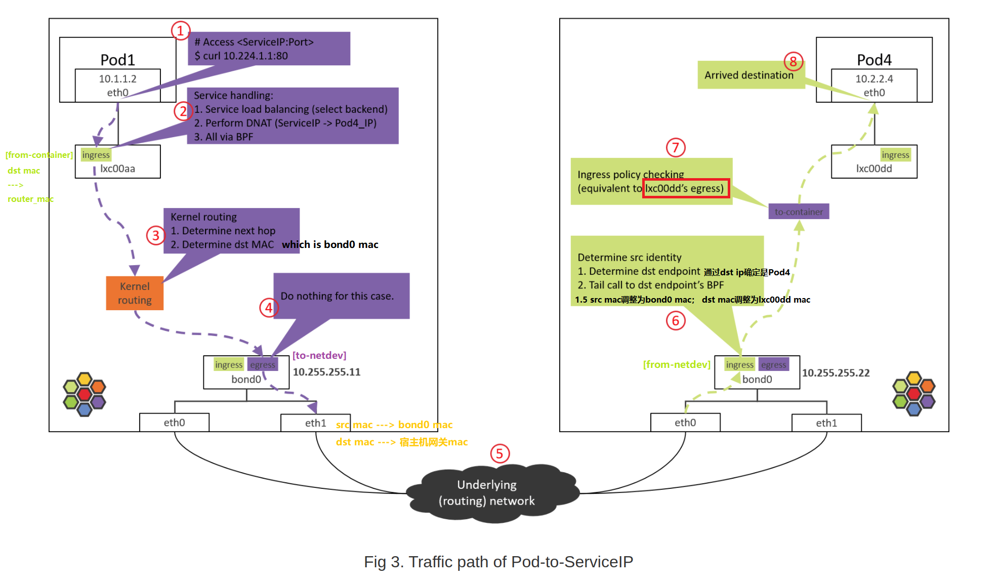
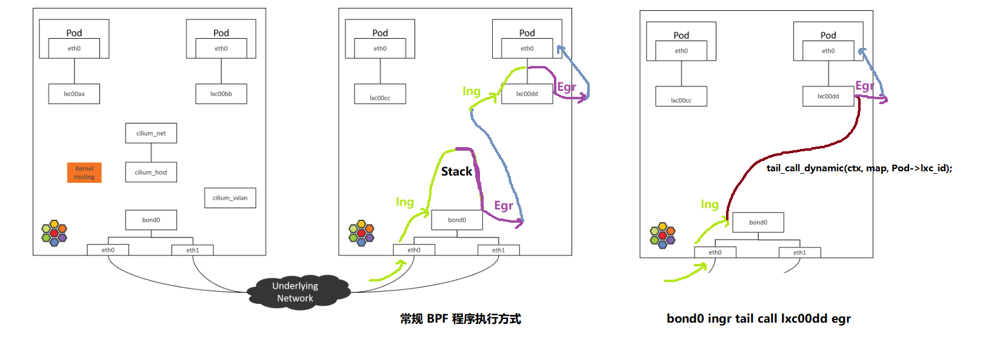

[Life of a Packet in Cilium：实地探索 Pod-to-Service 转发路径及 BPF 处理逻辑](http://arthurchiao.art/blog/cilium-life-of-a-packet-pod-to-service-zh/)



## Step 1: POD1 eth0 发送

本来查到的dst_mac是cilium_host的mac地址，但是Cilium 通过 ==hardcode ARP 表==，将dst_mac分配给`lxc00aa`，从而强制将 Pod 流量的下一跳劫持到 veth pair 的主机端`lxc00aa`。

```bash
# Step 1: POD1 eth0 发送

(NODE1) $ nsenter-ctn POD1 -n curl 10.224.1.1:80

# 确定目的 MAC 地址
(NODE1) $ nsenter-ctn POD1 -n route -n
Kernel IP routing table
Destination     Gateway         Genmask         Flags Metric Ref    Use Iface
0.0.0.0         10.1.1.1        0.0.0.0         UG    0      0        0 eth0
10.1.1.1        0.0.0.0         255.255.255.255 UH    0      0        0 eth0                 # 默认路由

(NODE1) $ nsenter-ctn POD1 -n arp -n
Address               HWtype  HWaddress           Flags Mask            Iface
10.1.1.1              ether   3e:74:f2:60:ab:9b   C                     eth0                 # dst_mac

# NODE1 上查看，会发现这个 MAC 其实并不是网关 cilium_host/cilium_net
# cilium_host的ip是10.1.1.1，但是mac却不是3e:74:f2:60:ab:9b，Cilium改动了arp表  @@@@@@@@@@@@@
(NODE1) $ ifconfig cilium_host
cilium_host: flags=4291<UP,BROADCAST,RUNNING,NOARP,MULTICAST>  mtu 1500
        inet 10.1.1.1  netmask 255.255.255.255  broadcast 0.0.0.0
        ether 3e:7d:6b:32:44:8e  txqueuelen 1000  (Ethernet)
        ...

(NODE1) $ ip link | grep 3e:74:f2:60:ab:9b -B 1
699: lxc00aa@if698: <BROADCAST,MULTICAST,UP,LOWER_UP> mtu 1500 qdisc noqueue
    link/ether 3e:74:f2:60:ab:9b brd ff:ff:ff:ff:ff:ff link-netnsid 4               # dst_mac属于 lxc00aa 设备，index是699

# 这个 MAC 属于 lxc00aa 设备，并且从 @ 符号判断，它属于某个 veth pair 的一端，另一端的 interface index 是 698
(NODE1) $ nsenter-ctn POD1 -n ip link
698: eth0@if699: <BROADCAST,MULTICAST,UP,LOWER_UP> mtu 1500 qdisc noqueue           # 698、699是一对veth pair
    link/ether 5e:d9:e5:0d:a1:ed brd ff:ff:ff:ff:ff:ff link-netnsid 0

# 容器的 eth0 index 就是 698，对端是 699
# Cilium 通过 hardcode ARP 表，强制将 Pod 流量的下一跳劫持到 veth pair 的主机端。这里不过多讨论设计，只说一点：这并不是 Cilium 独有的设计，其他 方案也有这么做的。
```

## Step 2: POD1 eth0 对端设备（lxcxx）BPF 处理

```bash
#查看lxc00aa加载的 BPF 程序
(NODE1) $ tc filter show dev lxc00aa ingress
filter protocol all pref 1 bpf
filter protocol all pref 1 bpf handle 0x1 bpf_lxc.o:[from-container] direct-action not_in_hw tag 3855f578c6616972

代码是：
```

```c
// bpf\bpf_lxc.c

/* Attachment/entry point is ingress for veth.
 * It corresponds to packets leaving the container.
 */
__section("from-container")
int cil_from_container(struct __ctx_buff *ctx)
  |-validate_ethertype(skb, &proto)
  |-switch (proto) {
      case ETH_P_IP:
          tail_handle_ipv4                                                     // bpf/bpf_lxc.c
            |-handle_ipv4_from_lxc                                             // bpf/bpf_lxc.c
                |-if dst is k8s Service
                |    lb4_local()
                |      |-ct_create4
                |      |-lb4_lookup_backend
                |      |-lb4_xlate
                |
                |-policy_can_egress4()
                |
                |-if tunnel
                |     encap vxlan
                | else // direct routing, pass to kernel stack (continue normal routing)
                |     ipv4_l3( , , NULL, &router_mac.addr, ); // dec TTL, set src/dst MAC，此时smac不需要更改，dmac是bond mac
                |     asm_set_seclabel_identity(skb); // set identity to skb
                |-return TC_ACT_OK;    

          
          lb、ct、dnat、l3封装、路由
```

## Step 3: NODE1：内核路由判断

经过 Step 2 的 `from-container` BPF 程序处理之后，**包的 `dst_ip` 已经是真实 Pod IP（`POD4_IP`）了**。

接下来就进入内核协议栈进行路由（kernel routing）。

此时内核就**相当于一台路由 器（router），查询内核路由表**，根据包的 `dst_ip` 进行路由判断，确定下一跳。

```bash
(NODE1) $ route -n
Kernel IP routing table
Destination     Gateway         Genmask         Flags Metric Ref    Use Iface
0.0.0.0         10.255.255.1    0.0.0.0         UG    0      0        0 bond0
10.1.1.0        10.1.1.1        255.255.255.0   UG    0      0        0 cilium_host
10.1.1.1        0.0.0.0         255.255.255.255 UH    0      0        0 cilium_host
```

根据以上路由规则，只要目的 IP 不是本机 PodCIDR 网段的，都会命中默认路由（第一条） ，走 `bond0` 设备。

因此包接下来会到达 `bond0` 设备。

> 本文的 node 都是两个物理网卡做了 bond，如果没有 bond，例如只有一个 eth0 物理网卡，宿主机 IP 配置在 eth0，那接下来包到达的就是 eth0 物理网卡。这种主机上配置 了 IP 地址的设备（这里是指**bond**吧？？？），在 Cilium 里叫 ==native device==。文档或代码中经常会看到。

## Step 4: NODE1 bond/物理网卡：egress BPF 处理

查看 bond 设备上的出向（egress）BPF，==这是包出宿主机之前最后的 tc BPF hook 点：==

```bash
(NODE1) $ tc filter show dev bond0 egress
filter protocol all pref 1 bpf
filter protocol all pref 1 bpf handle 0x1 bpf_netdev_bond0.o:[to-netdev] direct-action not_in_hw tag b536a7e2744a4cdb
```

```c
__section("to-netdev")
int to_netdev(struct __ctx_buff *ctx __maybe_unused)
  |-policy_clear_mark
  |-src_id = resolve_srcid_ipv4
  |   |-lookup_ip4_remote_endpoint
  |       |-ipcache_lookup4
  |-ipv4_host_policy_egress(src_id)
      |-policy_can_egress4
      |-ret = ct_lookup4()
      |-switch (ret) {
          case CT_NEW        : ct_create4(); break;
          case CT_ESTABLISHED:
          case CT_RELATED    :
          case CT_REPLY      :               break;
          default            : ret = DROP;   break;
        }
        return ret;
```

粗略地说，对于我们这个 case，这段 BPF 其实并不会做什么实际的事情，程序最后返回 `TC_ACK_OK` 放行。

> **Native device 上的 BPF 主要处理南北向流量**，即，容器和集群外交互的流量 [3]。这包括，
>
> - LoadBalancer Service 流量
> - 带 externalIPs 的 Service 流量
> - NodePort Service 流量

接下来**根据内核路由表和 ARP 表封装 L2 头**。

```bash
$ route -n
Kernel IP routing table
Destination     Gateway         Genmask         Flags Metric Ref    Use Iface
0.0.0.0         10.255.255.1    0.0.0.0         UG    0      0        0 bond0
10.1.1.0        10.1.1.1        255.255.255.0   UG    0      0        0 cilium_host
10.1.1.1        0.0.0.0         255.255.255.255 UH    0      0        0 cilium_host

$ arp -n      # 宿主机网关
Address                  HWtype  HWaddress           Flags Mask            Iface
10.255.255.1             ether   00:00:5e:00:01:0c   C                     bond0
```

命中宿主机默认路由，因此会

- **将 `bond0` 的 MAC 作为 `src_mac`**：MAC 地址只在二层网络内有效，宿主机和 Pod 属于不同二层网络（Cilium 自己管理了一个 CIDR），宿主机做转发时会将 `src_mac` 换成自己的 MAC。
- **将宿主机网关对应的 MAC 作为 `dst_mac`**：下一跳是宿主机网关。

然后包就经过 bond0 和物理网卡发送到数据中心网络了。

> 可以在 `bond0` 及物理网卡上抓包验证，指定 `-e` 打印 MAC 地址。

> 同一个二层网络传输时，只改动dst mac，但是跨越不同二层网络时，需要src mac、dst mac都要改变
>

那么数据包在跨越routers时，src mac、dst mac都要改变吗==？==  参考下面


## Step 5: 数据中心网络：路由转发

数据中心网络根据 `dst_ip` 对包进行路由。

由于 NODE2 之前已经通过 BGP 宣告自己管理了 `PodCIDR2` 网段，而 `POD4_IP` 属于 `PodCIDR2`，因此交换机（路由器）会将包转发给 NODE2。

> 网络虚拟化：跨主机网络方案。
>
> 从网络层次来说，有两种典型的跨主机网络方式：
>
> 1. 二层、大二层组网：每个 node 内部运行一个**软件交换机或软件网桥**，代表：OpenStack Neutron+OVS 方式 [1]。
> 2. 三层组网：每个 node 内部运行一个**软件路由器**（其实就是内核本身，它自带路由功能），每个 node 都是一个三层节点，代表：Cilium+BGP 方式 [4]。
>
> 排障时的一个区别：
>
> 1. 在二层/大二层网络中，对于同一个包，**发送方和接收方看到的 src_mac 是一样的**，因为二层转发只修改 dst_mac，不会修改 src_mac。
> 2. 三层组网中，src_mac 和 dst_mac 都会变。
>
> 抓包时要理解这一点。

## Step 6: NODE2 物理网卡/bond：ingress BPF 处理

查看 ingress 方向加载的 BPF：

```bash
$ tc filter show dev bond0 ingress
filter protocol all pref 1 bpf
filter protocol all pref 1 bpf handle 0x1 bpf_netdev_bond0.o:[from-netdev] direct-action not_in_hw tag 75f509de02b2dfaf
```

这段 BPF 程序会对**从物理网卡进入 bond0 的包**进行处理。

调用栈：

```c
__section("from-netdev")
from_netdev
  |-handle_netdev
      |-validate_ethertype
      |-do_netdev
          |-identity = resolve_srcid_ipv4()                // 从 ctx 中提取 src identity
          |-ctx_store_meta(CB_SRC_IDENTITY, identity)      // 将 identity 存储到 ctx->cb[CB_SRC_IDENTITY]
          |-ep_tail_call(ctx, CILIUM_CALL_IPV4_FROM_NETDEV)   // 尾调用到 endpoint BPF
                               |
 |------------------------------
 |
\|/
    
__section_tail(CILIUM_MAP_CALLS, CILIUM_CALL_IPV4_FROM_NETDEV)
tail_handle_ipv4_from_netdev
  |-tail_handle_ipv4
      |-handle_ipv4
          |-ep = lookup_ip4_endpoint()                        // 此时ep就是 POD4
          |-ipv4_local_delivery(ctx, ep)
    		  |-ipv4_l3(ctx, l3_off, (__u8 *) &router_mac, (__u8 *) &lxc_mac, ip4);   // bond0将数据包src、dst mac进行调整
              |-tail_call_dynamic(ctx, &POLICY_CALL_MAP, ep->lxc_id);

```

主要逻辑：

1. 调用 `handle_netdev()` 处理**将从宿主机进入 Cilium 管理的网络**的流量，具体事情：

    1. 解析这个包所属的 identity

        （Cilium 依赖 identity 做安全策略），并存储到包的结构体中。

        - 对于 direct routing 模式，从 ipcache 中根据 IP 查询 identity。
        - 对于 tunnel 模式，直接从 VxLAN 头中携带过来了。

    2. 尾调用到 `tail_handle_ipv4_from_netdev()`。

2. `tail_handle_ipv4_from_netdev()` 进一步调用 `tail_handle_ipv4()`，后者再调用 `handle_ipv4()`。

    `handle_ipv4()` 做的事情：

    1. **查找 `dst_ip` 对应的 endpoint**（即 **POD4**）。
    2. 调用 `ipv4_local_delivery()` 执行处理，这个函数会**根据 endpoint id 直接尾调用到 endpoint (POD4) 的 BPF 程序**。

```c
/* Performs IPv4 L2/L3 handling and delivers the packet to the destination pod
 * on the same node, either via the stack or via a redirect call.
 * Depending on the configuration, it may also enforce ingress policies for the
 * destination pod via a tail call.
 */
static __always_inline int ipv4_local_delivery(struct __ctx_buff *ctx, int l3_off,
					       __u32 seclabel, struct iphdr *ip4,
					       const struct endpoint_info *ep,
					       __u8 direction __maybe_unused,
					       bool from_host __maybe_unused)
{
	mac_t router_mac = ep->node_mac;   // 此时ep就是 POD4
	mac_t lxc_mac = ep->mac;

	// bond0将数据包src mac调整为bond0 mac； dst mac调整为POD4 mac（还是POD4 veth pair对端lxc00dd 的 mac ？？？ ）
	ret = ipv4_l3(ctx, l3_off, (__u8 *) &router_mac, (__u8 *) &lxc_mac, ip4);
    
    tail_call_dynamic(ctx, &POLICY_CALL_MAP, ep->lxc_id);// lxc_id 是POD4 veth pair对端lxc00dd 的 egress ebpf prog ID
```

lxc_id 是POD4 veth pair对端`lxc00dd` 的 **egress** ebpf prog ID，数据包通过ipv4_l3将dmac调整为lxc00dd 的 mac，

然后通过==尾调用==将数据包从`bond0` **ingress** 直接导入 `lxc00dd` 的 **egress**

## Step 7: Pod4 eth0 对端设备（lxcxx）的 BPF 处理

跟前面一样，来查看 lxc 设备加载的 BPF 程序：

```bash
(NODE2) $ tc filter show dev lxc00dd egress
```

**没有加载任何 BPF 程序，为什么**？

因为设计中，这段代码并不是在包经过 egress 点触发执行的（常规 BPF 程序执行方式） ，而是**直接从 `bond0` 的 BPF 程序尾调用过来继续的**，即上一节最后的一行代码：

```c
    tail_call_dynamic(ctx, &POLICY_CALL_MAP, ep->lxc_id);
```

因此不需要通过 tc 加载到 lxc 设备，这也回答了 2.1 节中提出的问题。这使得从 bond0 （或物理网卡）到容器的路径大大缩短，可以显著提升性能。



这次尾调用到达的是 `to-container` BPF 程序，位于**lxc00dd egress**。调用栈：

```c
/* Attached to the lxc device on the way to the container, only if endpoint
 * routes are enabled.
 */
__section("to-container")
handle_to_container                                            //    bpf/bpf_lxc.c
  |-inherit_identity_from_host(skb, &identity)                 // -> bpf/lib/identity.h
  |-tail_ipv4_to_endpoint                                      //    bpf/bpf_lxc.c
      |-ipv4_policy                                            //    bpf/bpf_lxc.c
          |-policy_can_access_ingress                          //    bpf/lib/policy.h
              |-__policy_can_access                            //    bpf/lib/policy.h
                  |-if p = map_lookup_elem(l3l4_key); p     // L3+L4 policy
                  |    return TC_ACK_OK
                  |-if p = map_lookup_elem(l4only_key); p   // L4-Only policy
                  |    return TC_ACK_OK
                  |-if p = map_lookup_elem(l3only_key); p   // L3-Only policy
                  |    return TC_ACK_OK
                  |-if p = map_lookup_elem(allowall_key); p // Allow-all policy
                  |    return TC_ACK_OK
                  |-return DROP_POLICY;                     // DROP
```

所做的事情也很清楚：

1. 提取包的 src identity 信息，这个信息此时已经在包的元数据里面了。
2. 调用 `tail_ipv4_to_endpoint()`，这个函数会进一步调用 `ipv4_policy()` 执行 容器入向（ingress）安全策略检查。

如果包没有被策略拒绝，就会被转发到 `lxc00dd` 的对端，即 POD4 的虚拟网卡 `eth0`。

## Step 8: 到达 POD4 容器

包到达容器的虚拟网卡，接下来就会被更上层读取了。