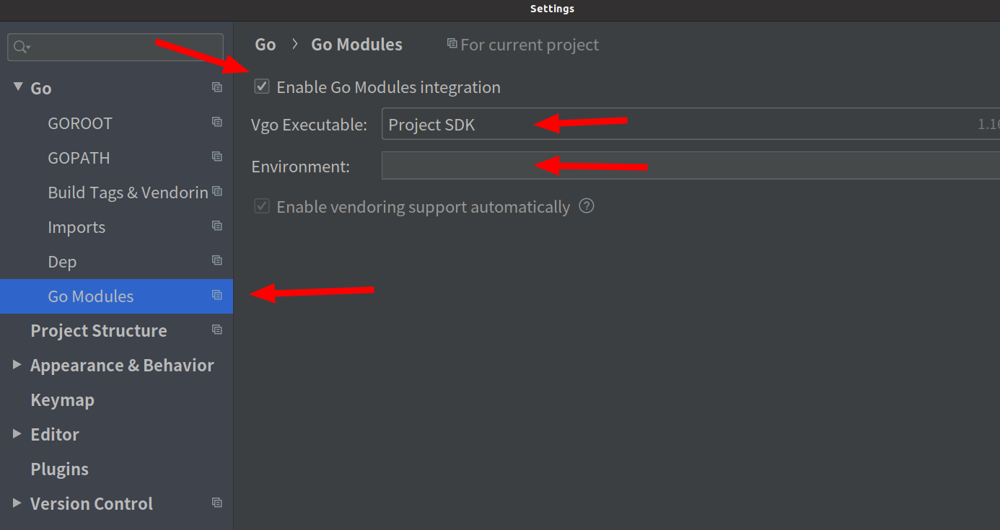
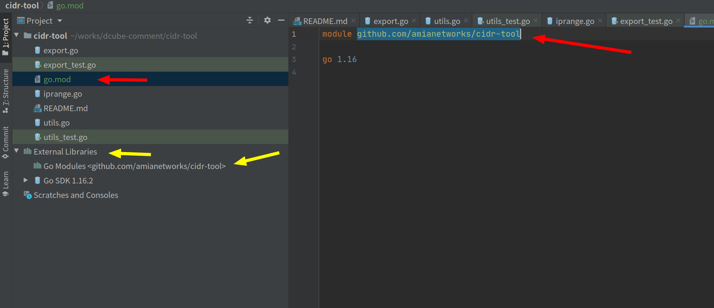

## 1. proxy

```Go
go env -w GOPROXY=https://goproxy.cn
```


https://blog.csdn.net/Xiao_W_u/article/details/120197992

Go Module 私有仓库：fatal: could not read Username for ‘https://xxx.com‘: terminal prompts disabled

https替换成ssh

需要在仓库绑定SSH公钥

```shell
git config --global url."git@xxx.com:".insteadOf "https://xxx.com/"
```

配置仓库的全局选项将https替代成ssh
设置 GOPRIVATE

通过GOPRIVATE来指定你的仓库

```shell
go env -w GOPRIVATE=xxx.com/xxx
```


```shell
asn@Attacker1:~/zx/dcube_test/d-cube/scripts/release$ go env -w GOPRIVATE=github.com/amianetworks

asn@Attacker1:~/zx/dcube_test/d-cube/scripts/release$ ./release.sh deb
go: downloading google.golang.org/grpc v1.38.0
go: downloading golang.org/x/net v0.0.0-20210405180319-a5a99cb37ef4
go: downloading google.golang.org/protobuf v1.26.0
go: downloading github.com/spf13/cobra v1.2.1
go: downloading github.com/amianetworks/cubeutils v0.1.3
go: downloading github.com/amianetworks/go2ebpf v0.1.6
go: downloading github.com/golang/protobuf v1.5.2
go: downloading github.com/vishvananda/netlink v1.1.1-0.20200218174631-5f2fc868c2d0
go: downloading golang.org/x/sys v0.0.0-20210809222454-d867a43fc93e
go: downloading github.com/shirou/gopsutil v3.21.7+incompatible
go: downloading github.com/spf13/pflag v1.0.5
go: downloading github.com/vishvananda/netns v0.0.0-20191106174202-0a2b9b5464df
go: downloading github.com/tklauser/go-sysconf v0.3.7
go: downloading google.golang.org/genproto v0.0.0-20210602131652-f16073e35f0c
go: downloading github.com/tklauser/numcpus v0.2.3
go: downloading golang.org/x/text v0.3.5
go: downloading github.com/google/gopacket v1.1.19
go: downloading github.com/cloudflare/cbpfc v0.0.0-20201119110315-98c3c3392325
go: downloading github.com/gogf/gf v1.14.5
go: downloading github.com/pkg/errors v0.9.1
go: downloading github.com/cilium/ebpf v0.1.0
go: downloading github.com/json-iterator/go v1.1.11
go: downloading github.com/modern-go/reflect2 v1.0.1
go: downloading github.com/modern-go/concurrent v0.0.0-20180306012644-bacd9c7ef1dd
Info: start to build debian package
Info: succeed to build package

asn@Attacker1:~/zx/dcube_test/d-cube/scripts/release$ cp ../../release/dcube.deb ./
asn@Attacker1:~/zx/dcube_test/d-cube/scripts/release$ ./install.sh 
 Info : OS : Ubuntu  KERNAL VERSION : 5-4 
Reading package lists... Done
Building dependency tree       
Reading state information... Done
libpcap-dev is already the newest version (1.8.1-6ubuntu1.18.04.2).
libpcap-dev set to manually installed.
The following packages were automatically installed and are no longer required:
  dcube libegl1-mesa libfwup1 libllvm9 libwayland-egl1-mesa linux-headers-5.3.0-59 linux-headers-5.3.0-59-generic linux-image-5.3.0-59-generic linux-image-5.3.0-62-generic
  linux-modules-5.3.0-59-generic linux-modules-5.3.0-62-generic linux-modules-extra-5.3.0-59-generic linux-modules-extra-5.3.0-62-generic nethogs shim telegraf
Use 'sudo apt autoremove' to remove them.
0 upgraded, 0 newly installed, 0 to remove and 169 not upgraded.
(Reading database ... 292352 files and directories currently installed.)
Preparing to unpack dcube.deb ...
Unpacking dcube (2020-11-07) over (0.4.0) ...
Setting up dcube (2020-11-07) ...
● cubed.service - cubed service
   Loaded: loaded (/etc/systemd/system/cubed.service; enabled; vendor preset: enabled)
   Active: active (running) since Fri 2022-05-06 11:31:36 CST; 11ms ago
 Main PID: 11628 (start_service.s)
    Tasks: 7 (limit: 6143)
   CGroup: /system.slice/cubed.service
           ├─11628 /bin/bash /usr/local/dcube/start_service.sh
           └─11635 /usr/local/dcube/cubed

May 06 11:31:36 Attacker1 systemd[1]: Started cubed service.
 Info : Succeed to install dCube :) 
asn@Attacker1:~/zx/dcube_test/d-cube/scripts/release$ 

```


## 2. cidr-tool单元测试运行设置

zhouxu@zhouxu:~/ go get github.com/amianetworks/cidr-tool
zhouxu@zhouxu:~/works/dcube-comment/cidr-tool$ go mod init cidr-tool
zhouxu@zhouxu:~/works/dcube-comment/cidr-tool$ go mod tidy

修改go mod文件

module github.com/amianetworks/cidr-tool

go 1.16

然后根据
https://www.cnblogs.com/bbllw/p/12377155.html
settings        Go          GoModules   第一个打勾，env空着就行了

ok后，proj的external lib会出现： Go Modules有cird-tool，

当然，首先需要go get github.com/amianetworks/cidr-tool





