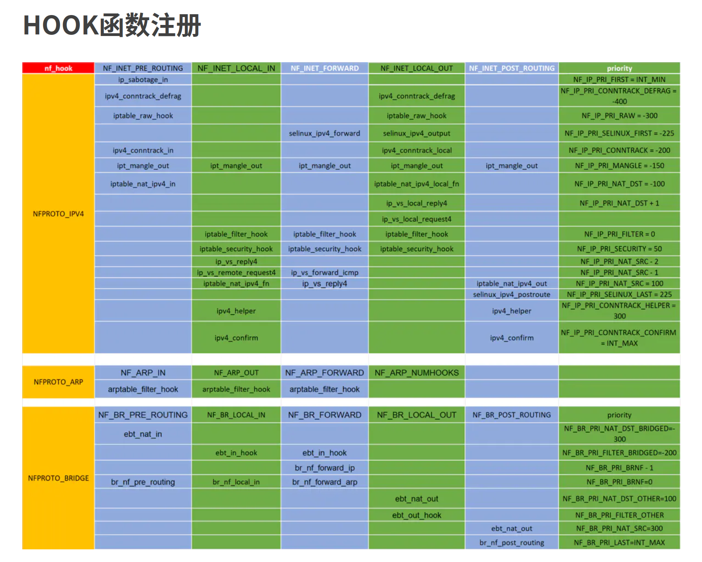
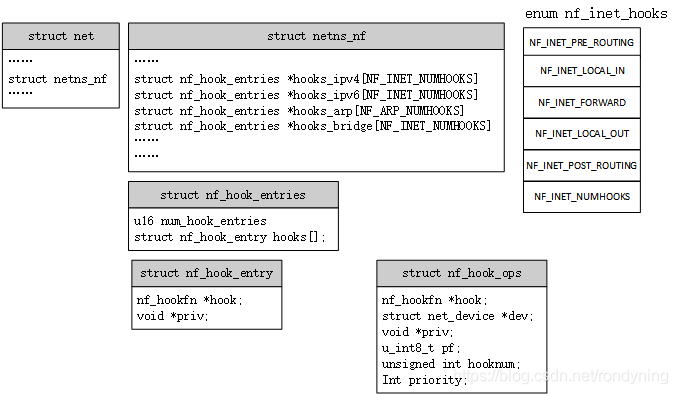
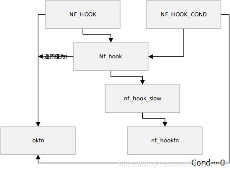
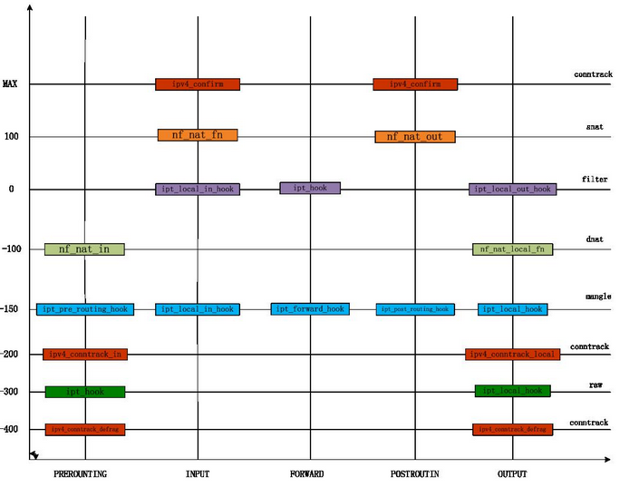
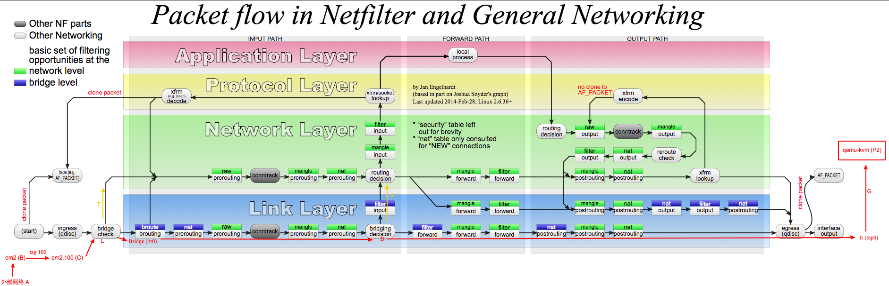

## 所有nf的hooks顺序图

[netfilter hook函数](https://www.jianshu.com/p/8c6342998cfa)



上图是netfilter中注册的部分hook函数。这些hook函数是通过 ==nf_register_hook==注册到二维数组nf_hooks中的。

```c
enum {					// 协议
    NFPROTO_UNSPEC =  0,
    NFPROTO_INET   =  1,
    NFPROTO_IPV4   =  2,		// NF_INET_NUMHOOKS
    NFPROTO_ARP    =  3,		// NF_ARP_NUMHOOKS
    NFPROTO_BRIDGE =  7,		// NF_INET_NUMHOOKS
    NFPROTO_IPV6   = 10,		// NF_INET_NUMHOOKS
    NFPROTO_DECNET = 12,		// NF_DN_NUMHOOKS
    NFPROTO_NUMPROTO,
};

enum nf_inet_hooks {	// 当第一维选择NFPROTO_IPV4时，第二维的描述；第一维选择其他NFPROTO_时，这里要换成对应的枚举
    NF_INET_PRE_ROUTING,	// 该种协议下的第一个hook点，可以挂多个钩子函数
    NF_INET_LOCAL_IN,
    NF_INET_FORWARD,
    NF_INET_LOCAL_OUT,
    NF_INET_POST_ROUTING,
    NF_INET_NUMHOOKS
};

extern struct list_head nf_hooks[NFPROTO_NUMPROTO][NF_MAX_HOOKS];
```

数组==nf_hooks==的第一维即上图的第一列，表示不同的地址族，上图只画出了 IPV4，ARP和BRIDGE相关的。
数组的第二维即上图的第一排，表示不同模块的hook点，对应的竖列表示该hook点挂载的钩子函数。对于不同的地址族，使用的宏定义不同，比如NFPROTO_IPV4使用的是nf_inet_hooks这组枚举值，但都是从0开始，每种协议的hook枚举值不能超过NF_MAX_HOOKS。
拿最常见的IPV4地址族来说，五个hook函数安置在数据包的必经之路，不管数据是到本机的，还是需要本机转发的，还是从本机发出去的，都会覆盖到。

```c
nf_hooks[pf][hook]	表示某种协议在某个hook点的链表头，后面挂接一组钩子函数。如上图每列（除了第一列）
```

NF_INET_PRE_ROUTING和NF_INET_LOCAL_OUT相当于netfilter的**入口点**，即不管哪种情况，数据包肯定会从这俩hook点之一进入。
NF_INET_LOCAL_IN和NF_INET_POST_ROUTING相当于netfilter的**出口点**，即不管哪种情况，数据包肯定会从这俩hook点之一出去。

hook函数的执行顺序: 同一个hook点上的从优先级值最小的开始执行，即上图从==上==往==下==执行，不同的hook点互不影响。

对于IPV4地址族来说，包含了多个模块的hook函数：

```shell
filter,raw,mangle,security: 这四个模块相对独立，不依赖其他模块。
conntrack: 连接跟踪模块是状态防火墙和nat的基础。
nat: 基于conntrack对于数据包的跟踪，对数据流的收包查找nat规则进行nat转换，此流的后续数据包直接查找conntrack的ct信息做nat转换。
ipvs: 四层负载均衡模块
```


## [old]HOOK函数执行

hook函数的执行是通过调用函数NF_HOOK来实现的，
其第一个参数pf指定了地址族，第二个参数指定了在哪个hook点，第三个参数skb是数据包，

第六个参数是数据包通过hook点上hook函数的检查后，如果结果是accept而执行的函数。

```c
static inline int
NF_HOOK(uint8_t pf, unsigned int hook, struct sk_buff *skb,
    struct net_device *in, struct net_device *out,
    int (*okfn)(struct sk_buff *))
{
    return NF_HOOK_THRESH(pf, hook, skb, in, out, okfn, INT_MIN);
}

static inline int
NF_HOOK_THRESH(uint8_t pf, unsigned int hook, struct sk_buff *skb,
           struct net_device *in, struct net_device *out,
           int (*okfn)(struct sk_buff *), int thresh)
{
    int ret = nf_hook_thresh(pf, hook, skb, in, out, okfn, thresh);
    //执行完hook函数后，返回值为1才会执行okfn。
    if (ret == 1)
        ret = okfn(skb);
    return ret;
}

static inline int nf_hook_thresh(u_int8_t pf, unsigned int hook,
                 struct sk_buff *skb,
                 struct net_device *indev,
                 struct net_device *outdev,
                 int (*okfn)(struct sk_buff *), int thresh)
{
    //地址族pf对应的hook点上注册了hook函数，如果没注册直接返回1
    if (nf_hooks_active(pf, hook))
        return nf_hook_slow(pf, hook, skb, indev, outdev, okfn, thresh);
    return 1;
}

/* Returns 1 if okfn() needs to be executed by the caller,
 * -EPERM for NF_DROP, 0 otherwise. */
int nf_hook_slow(u_int8_t pf, unsigned int hook, struct sk_buff *skb,
         struct net_device *indev,
         struct net_device *outdev,
         int (*okfn)(struct sk_buff *),
         int hook_thresh)
{
    struct nf_hook_ops *elem;
    unsigned int verdict;
    int ret = 0;

    /* We may already have this, but read-locks nest anyway */
    rcu_read_lock();
    //取出hook点的hook函数的链表头
    elem = list_entry_rcu(&nf_hooks[pf][hook], struct nf_hook_ops, list);
next_hook:
    //遍历执行此hook点上所有的hook函数
    verdict = nf_iterate(&nf_hooks[pf][hook], skb, hook, indev,
                 outdev, &elem, okfn, hook_thresh);
    //如果返回NF_ACCEPT或者NF_STOP说明通过hook函数的检查，则返回1
    //如果返回NF_DROP，说明数据包在此hook点丢了，返回0
    if (verdict == NF_ACCEPT || verdict == NF_STOP) {
        ret = 1;
    } else if ((verdict & NF_VERDICT_MASK) == NF_DROP) {
        kfree_skb(skb);
        ret = NF_DROP_GETERR(verdict);
        if (ret == 0)
            ret = -EPERM;
    } else if ((verdict & NF_VERDICT_MASK) == NF_QUEUE) {
        int err = nf_queue(skb, elem, pf, hook, indev, outdev, okfn,
                        verdict >> NF_VERDICT_QBITS);
        if (err < 0) {
            if (err == -ECANCELED)
                goto next_hook;
            if (err == -ESRCH &&
               (verdict & NF_VERDICT_FLAG_QUEUE_BYPASS))
                goto next_hook;
            kfree_skb(skb);
        }
    }
    rcu_read_unlock();
    return ret;
}
```

遍历执行hook点上所有的hook函数。

```c
unsigned int nf_iterate(struct list_head *head,
            struct sk_buff *skb,
            unsigned int hook,
            const struct net_device *indev,
            const struct net_device *outdev,
            struct nf_hook_ops **elemp,// 这个才是钩子函数
            int (*okfn)(struct sk_buff *),
            int hook_thresh)
{
    unsigned int verdict;

    /*
     * The caller must not block between calls to this
     * function because of risk of continuing from deleted element.
     */
    list_for_each_entry_continue_rcu((*elemp), head, list) {
        //只执行优先级比hook_thresh大的hook函数
        if (hook_thresh > (*elemp)->priority)
            continue;

        /* Optimization: we don't need to hold module
           reference here, since function can't sleep. --RR */
repeat:
        verdict = (*elemp)->hook(*elemp, skb, indev, outdev, okfn);
        //hook函数的返回值不为accept，并且不为repeat才返回
        if (verdict != NF_ACCEPT) {
            if (verdict != NF_REPEAT)
                return verdict;
            goto repeat;
        }
    }
    //走到这里说明所有的hook函数都返回accept
    return NF_ACCEPT;
}
```

[traffic control 之 egress 队列](https://www.jianshu.com/p/d2371b6b76f7)

[traffic control 之 INGRESS 队列](https://www.jianshu.com/p/c374b1fbcc3d)

[veth虚拟网卡](https://www.jianshu.com/p/9d1f10e9c3f6)

[kernel网络之协议栈入口](https://www.jianshu.com/p/660a5e9c04af)


## [new]HOOK函数执行

netfilter的钩子函数的存储结构图：




[netfilter框架概述](https://blog.csdn.net/rondyning/article/details/117261716)

```c
struct list_head nf_hooks[NFPROTO_NUMPROTO][NF_MAX_HOOKS];//每一个list_head代表一个协议某一hook点的所有钩子函数（）

struct netns_nf {// .nf_hook_entries[hook点的index]->hooks   表示该协议某一hook点的所有钩子函数（nf_hook_entry）

	const struct nf_queue_handler __rcu *queue_handler;
	const struct nf_logger __rcu *nf_loggers[NFPROTO_NUMPROTO];

	struct nf_hook_entries __rcu *hooks_ipv4[NF_INET_NUMHOOKS];
	struct nf_hook_entries __rcu *hooks_ipv6[NF_INET_NUMHOOKS];
	struct nf_hook_entries __rcu *hooks_arp[NF_ARP_NUMHOOKS];
	struct nf_hook_entries __rcu *hooks_bridge[NF_INET_NUMHOOKS];
	struct nf_hook_entries __rcu *hooks_decnet[NF_DN_NUMHOOKS];

};

struct nf_hook_ops { // 钩子函数封装在结构体nf_hook_ops里
	/* User fills in from here down. */
	nf_hookfn		*hook;        //钩子函数，各模块自定义
	struct net_device	*dev;
	void			*priv;        
	u_int8_t		pf;//Protocol families
	unsigned int		hooknum;       //钩子点，即NF_INET_PRE_ROUTING、等，即每个协议的第一行，钩子点可以挂多个钩子函数
	/* Hooks are ordered in ascending priority. */
	int			priority;              //钩子函数执行优先级
};

typedef unsigned int nf_hookfn(void *priv,struct sk_buff *skb,const struct nf_hook_state *state); // 钩子函数

/*
注册钩子函数实际就是把每个nf_hook_ops变量的成员hook和priv赋值给每个nf_hook_entry变量，
并且根据priority把nf_hook_entry变量按从小到大的顺序存储在nf_hook_entries的hooks[]数组里。
并且为了能按priority存储在数组里需要知道已注册所有钩子函数的priority，因此在hooks[]的末尾按priority存储指向每个nf_hook_ops变量的指针。
*/
struct nf_hook_entry {			// 简易版nf_hook_ops
	nf_hookfn			*hook;
	void				*priv;
};
struct nf_hook_entries {		// 钩子点，即每个协议的竖列（除第一列），表示这个钩子点挂载的所有钩子函数
	u16				num_hook_entries;
	/* padding */
	struct nf_hook_entry		hooks[];// nf_hook_ops.hooknum如果与这个nf_hook_entries对应，
										// 那么就把nf_hook_ops对应的nf_hook_entry加入到这个nf_hook_entries中
    
	/* trailer: pointers to original orig_ops of each hook,
	 * followed by rcu_head and scratch space used for freeing
	 * the structure via call_rcu.
	 *
	 *   This is not part of struct nf_hook_entry since its only
	 *   needed in slow path (hook register/unregister):
	 * const struct nf_hook_ops     *orig_ops[]
	 *
	 *   For the same reason, we store this at end -- its
	 *   only needed when a hook is deleted, not during
	 *   packet path processing:
	 * struct nf_hook_entries_rcu_head     head
	 */
};
```

### 钩子函数的注册和注销

注册和注销多个钩子函数：

```c
int nf_register_net_hooks(struct net*net,struct nf_hook_ops *reg,unsigned int n);
void nf_unregister_net_hooks(struct net*net,struct nf_hook_ops *reg,unsigned int n);
```

注册和注销单个钩子函数：

```c
int nf_register_net_hook(struct net*net,struct nf_hook_ops *reg);
void nf_unregister_net_hook(struct net*net,struct nf_hook_ops *reg);
```

nf_register_net_hook核心函数分析：

```c
static int __nf_register_net_hook(struct net *net, int pf,const struct nf_hook_ops *reg)
{                                                                                                                                                                       
        struct nf_hook_entries *p, *new_hooks;
        struct nf_hook_entries __rcu **pp;

        if (pf == NFPROTO_NETDEV) {
#ifndef CONFIG_NETFILTER_INGRESS
                if (reg->hooknum == NF_NETDEV_INGRESS)
                        return -EOPNOTSUPP;
#endif
                if (reg->hooknum != NF_NETDEV_INGRESS ||
                    !reg->dev || dev_net(reg->dev) != net)
                        return -EINVAL;
        }
	
    	//根据待注册的钩子函数结构体里的pf和hooknum找出存储同类钩子函数的结构体数组指针
        pp = nf_hook_entry_head(net, pf, reg->hooknum, reg->dev);
        if (!pp)
                return -EINVAL;

        mutex_lock(&nf_hook_mutex);

        p = nf_entry_dereference(*pp);
    //申请新的内存按优先级从小到大的顺序存储原有的结构体数组成员和待注册的新成员
        new_hooks = nf_hook_entries_grow(p, reg);

        if (!IS_ERR(new_hooks))
                rcu_assign_pointer(*pp, new_hooks);

        mutex_unlock(&nf_hook_mutex);
        if (IS_ERR(new_hooks))
                return PTR_ERR(new_hooks);

        hooks_validate(new_hooks);
#ifdef CONFIG_NETFILTER_INGRESS
        if (pf == NFPROTO_NETDEV && reg->hooknum == NF_NETDEV_INGRESS)
                net_inc_ingress_queue();
#endif
#ifdef CONFIG_JUMP_LABEL
        static_key_slow_inc(&nf_hooks_needed[pf][reg->hooknum]);
#endif
        BUG_ON(p == new_hooks);
    //释放原有的钩子函数结构体数组nf_hook_entrie[]的内存，包括存储钩子函数原有的结构体nf_hook_ops地址的内存
        nf_hook_entries_free(p);
        return 0;                                                                                                                                                       
}


static struct nf_hook_entries *
nf_hook_entries_grow(const struct nf_hook_entries *old,                                                                                                                 
                     const struct nf_hook_ops *reg)
{
        unsigned int i, alloc_entries, nhooks, old_entries;
        struct nf_hook_ops **orig_ops = NULL;
        struct nf_hook_ops **new_ops;
        struct nf_hook_entries *new;
        bool inserted = false;

        alloc_entries = 1;
        old_entries = old ? old->num_hook_entries : 0;

        if (old) {
            	//获取已注册的所有钩子函数原有的结构体nf_hook_ops地址列表
            	//位于钩子函数结构体数组nf_hook_entrie[]的后面
                orig_ops = nf_hook_entries_get_hook_ops(old);

                for (i = 0; i < old_entries; i++) {
                        if (orig_ops[i] != &dummy_ops)
                                alloc_entries++;
                }
        }

        if (alloc_entries > MAX_HOOK_COUNT)
                return ERR_PTR(-E2BIG);

        new = allocate_hook_entries_size(alloc_entries);
        if (!new)
                return ERR_PTR(-ENOMEM);

    	//new_ops用来存储所有已注册以及待注册的钩子函数原有的结构体nf_hook_ops地址
        new_ops = nf_hook_entries_get_hook_ops(new);

        i = 0;
        nhooks = 0;
        while (i < old_entries) {
                if (orig_ops[i] == &dummy_ops) {
                        ++i;
                        continue;
                }
				//优先级比新成员小的原有成员赋值到新申请的内存
                if (inserted || reg->priority > orig_ops[i]->priority) {
                        new_ops[nhooks] = (void *)orig_ops[i];
                        new->hooks[nhooks] = old->hooks[i];
                        i++;
                } else {
                        new_ops[nhooks] = (void *)reg;
                        new->hooks[nhooks].hook = reg->hook;
                        new->hooks[nhooks].priv = reg->priv;
                        inserted = true;
                }
                nhooks++;
        }
		//如果新成员优先级最大或者是第一个钩子函数
        if (!inserted) {
                new_ops[nhooks] = (void *)reg;
                new->hooks[nhooks].hook = reg->hook;
                new->hooks[nhooks].priv = reg->priv;
        }

        return new;
}
```


### 钩子函数的执行--- nf_hook_slow

netfilter在各个钩子点执行NF_HOOK函数，一旦报文经过这些钩子点，触发注册在这些钩子点的钩子函数的执行

NF_HOOK_COND同NF_HOOK，区别在于其有条件执行。

NF_HOOK的调用关系图：




NF_HOOK的核心函数nf_hook_slow分析：

```c
/* Responses from hook functions. 钩子函数执行结果的返回值字段的含义 */
#define NF_DROP 0 /* 丢包，不再传输 */
#define NF_ACCEPT 1 /* 接受数据包，继续正常传输 */
#define NF_STOLEN 2 /* 数据包已经被接管，回调函数处理该包，NF不再处理 */
#define NF_QUEUE 3 /* 将数据包交给用户空间的进程处理 */
#define NF_REPEAT 4 /* 再次调用钩子函数 */
#define NF_STOP 5    /* Deprecated, for userspace nf_queue compatibility. */
#define NF_MAX_VERDICT NF_STOP

/* Returns 1 if okfn() needs to be executed by the caller,
 * -EPERM for NF_DROP, 0 otherwise.  Caller must hold rcu_read_lock. */
int nf_hook_slow(struct sk_buff *skb, struct nf_hook_state *state,                         
                 const struct nf_hook_entries *e, unsigned int s)
{
        unsigned int verdict;
        int ret;
		//从优先级为s的钩子函数开始执行
        for (; s < e->num_hook_entries; s++) {
                verdict = nf_hook_entry_hookfn(&e->hooks[s], skb, state);
                switch (verdict & NF_VERDICT_MASK) {
                case NF_ACCEPT:// 获取并继续执行下一个钩子函数
                        break;
                case NF_DROP://报文释放，其后的钩子函数不再执行
                        kfree_skb(skb);
                        ret = NF_DROP_GETERR(verdict);
                        if (ret == 0)
                                ret = -EPERM;
                        return ret;
                case NF_QUEUE://把报文入队，交给用户程序
                        ret = nf_queue(skb, state, e, s, verdict);
                        if (ret == 1)
                                continue;
                        return ret;
                default://NF_STOLEN、NF_REPEAT、NF_STOP等其他返回值状态，其后的钩子函数都不再执行，NF_STOP在4.4返回1
                        /* Implicit handling for NF_STOLEN, as well as any other
                         * non conventional verdicts.
                         */
                        return 0;
                }
        }

        return 1;                                                                                                                                                       
}

static inline int
nf_hook_entry_hookfn(const struct nf_hook_entry *entry, struct sk_buff *skb,
             struct nf_hook_state *state)
{
    return entry->hook(entry->priv, skb, state);
}
```

[连接跟踪实现框架](https://blog.csdn.net/rondyning/article/details/117365336)

[连接跟踪之扩展](https://blog.csdn.net/rondyning/article/details/121283083)

[连接跟踪之期望连接](https://blog.csdn.net/rondyning/article/details/121283237)






[linux  nf_conntrack 连接跟踪机制](https://www.cnblogs.com/codestack/p/10850669.html)


------

## 钩子的入口函数

| PREROUTING | INPUT            | FORWARD    | OUTPUT         | POSTROUTING |
| ---------- | ---------------- | ---------- | -------------- | ----------- |
| ip_rcv     | ip_local_deliver | ip_forward | __ip_local_out | ip_output   |


### PREROUTING

[IP输入 之 ip_rcv && ip_rcv_finish](https://www.cnblogs.com/wanpengcoder/p/7577398.html)

ip层收包流程概述：

(1) 在inet_init中注册了类型为ETH_P_IP协议的数据包的回调ip_rcv， dev_add_pack(&==ip_packet_type==);

(2) 当==二层==数据包接收完毕，会调用netif_receive_skb根据协议进行向上层分发

(3) 类型为ETH_P_IP类型的数据包，被传递到==三层==，调用ip_rcv函数

(4) ip_rcv完成基本的校验和处理工作后，经过PRE_ROUTING钩子点

(5) 经过PRE_ROUTING钩子点之后，调用ip_rcv_finish完成数据包接收，包括选项处理，路由查询，并且根据路由决定数据包是***发往本机***还是***转发***

当二层收包结束后，会根据注册的协议和回调函数分发数据包，其中ipv4的数据包会分发到ip_rcv函数进行三层协议栈处理，该函数对数据包的合法性进行检查，并且设置一些必要字段之后，经过PRE_ROUTING钩子点；

```c
// net/core/dev.c	链接packet_type类型
struct list_head ptype_base[PTYPE_HASH_SIZE] __read_mostly;
struct list_head ptype_all __read_mostly;	/* Taps */

// include/linux/netdevice.h
struct packet_type {
    // 标识以太网帧或其他链路层报文承载网络层报文的协议号, 协议标识符，func会使用，保存了三层协议类型，ETH_P_IP、ETH_P_ARP等等
	__be16			type;/* This is really htons(ether_type). */
    
	bool			ignore_outgoing;
    
    // NULL is wildcarded here 接收从指定网络设备输入的数据包，
    // 如果为NULL表示接收来自全部网络设备的数据包,该处理程序对系统中所有网络设备都有效
	struct net_device	*dev; 
    
    // 协议入口接收处理函数。
    // 第一个参数为待输入的报文，第二个参数为当前处理该报文的网络设备，第三个参数为报文类型，第四个参数为报文的原始输入网络设备。
    // 指向网络层函数的指针，如果分组的类型适当，将其传递给该函数。其中可能的处理程序就是三层的ip报文接收函数，ip_rcv
	int			(*func) (struct sk_buff *, 
					 struct net_device *,	// 当前处理该报文的网络设备
					 struct packet_type *,
					 struct net_device *);  // 报文的原始输入网络设备
    
	void			(*list_func) (struct list_head *,
					      struct packet_type *,
					      struct net_device *);
	bool			(*id_match)(struct packet_type *ptype,
					    struct sock *sk);
	void			*af_packet_priv; // 用来存储各协议族的私有数据
	struct list_head	list; // 连接不同协议族报文接收例程的链表
};


// net/ipv4/af_inet.c
static struct packet_type ip_packet_type __read_mostly = {
	.type = cpu_to_be16(ETH_P_IP),//#define ETH_P_IP	0x0800		/* Internet Protocol packet	*/
	.func = ip_rcv,
	.list_func = ip_list_rcv,
};
// net/ipv4/ip_input.c
/*
 * IP receive entry point
 */
int ip_rcv(struct sk_buff *skb, struct net_device *dev, struct packet_type *pt,
	   struct net_device *orig_dev)
{
	struct net *net = dev_net(dev);

	skb = ip_rcv_core(skb, net);
	if (skb == NULL)
		return NET_RX_DROP;

	return NF_HOOK(NFPROTO_IPV4, NF_INET_PRE_ROUTING,// 【NF_INET_PRE_ROUTING】
		       net, NULL, skb, dev, NULL,
		       ip_rcv_finish);// ip_rcv_finish最后会调用路由项的input函数，可能为ip_local_deliver或者ip_forward
}

static int __init inet_init(void)
{
    rc = proto_register(&tcp_prot, 1);
	rc = proto_register(&udp_prot, 1);
	rc = proto_register(&raw_prot, 1);
	rc = proto_register(&ping_prot, 1);

	if (inet_add_protocol(&icmp_protocol, IPPROTO_ICMP) < 0)//Add all the base protocols.
	if (inet_add_protocol(&udp_protocol, IPPROTO_UDP) < 0)
	if (inet_add_protocol(&tcp_protocol, IPPROTO_TCP) < 0)

	(void)sock_register(&inet_family_ops);//Tell SOCKET that we are alive...

	arp_init();//Set the ARP module up
	ip_init();//Set the IP module up
	tcp_init();/* Setup TCP slab cache for open requests. */
	udp_init();/* Setup UDP memory threshold */
	udplite4_register();/* Add UDP-Lite (RFC 3828) */
	raw_init();
	ping_init();
	icmp_init()
    
	ipv4_proc_init();
	ipfrag_init();

	dev_add_pack(&ip_packet_type);
    
}

// net/core/dev.c
struct list_head ptype_base[PTYPE_HASH_SIZE] __read_mostly; // 包括了 ip_packet_type
struct list_head ptype_all __read_mostly;	/* Taps */	// 抓包
/*
 *	Add a protocol ID to the list. Now that the input handler is
 *	smarter we can dispense with all the messy stuff that used to be
 *	here.
 *
 *	BEWARE!!! Protocol handlers, mangling input packets,
 *	MUST BE last in hash buckets and checking protocol handlers
 *	MUST start from promiscuous ptype_all chain in net_bh.
 *	It is true now, do not change it.
 *	Explanation follows: if protocol handler, mangling packet, will
 *	be the first on list, it is not able to sense, that packet
 *	is cloned and should be copied-on-write, so that it will
 *	change it and subsequent readers will get broken packet.
 *							--ANK (980803)
 */
static inline struct list_head *ptype_head(const struct packet_type *pt)
{
	if (pt->type == htons(ETH_P_ALL))//#define ETH_P_ALL	0x0003		/* Every packet (be careful!!!) */
		return pt->dev ? &pt->dev->ptype_all : &ptype_all;
	else
		return pt->dev ? &pt->dev->ptype_specific :
				 &ptype_base[ntohs(pt->type) & PTYPE_HASH_MASK];
}

/**
 *	dev_add_pack - add packet handler
 *	@pt: packet type declaration
 *
 *	Add a protocol handler to the networking stack. The passed &packet_type
 *	is linked into kernel lists and may not be freed until it has been
 *	removed from the kernel lists.
 *
 *	This call does not sleep therefore it can not
 *	guarantee all CPU's that are in middle of receiving packets
 *	will see the new packet type (until the next received packet).
 */

void dev_add_pack(struct packet_type *pt)
{
	struct list_head *head = ptype_head(pt);

	spin_lock(&ptype_lock);
	list_add_rcu(&pt->list, head);
	spin_unlock(&ptype_lock);
}


// net/core/dev.c
static int __netif_receive_skb_core(struct sk_buff **pskb, bool pfmemalloc,
				    struct packet_type **ppt_prev)
{
    do_xdp_generic();// xdp generic

	// 遍历ptype_all、skb->dev->ptype_all，往注册的TAP上发包
    list_for_each_entry_rcu(ptype, &ptype_all, list) {// 抓包
			ret = deliver_skb(skb, pt_prev, orig_dev);

	list_for_each_entry_rcu(ptype, &skb->dev->ptype_all, list) {// 抓包
			ret = deliver_skb(skb, pt_prev, orig_dev);

	sch_handle_ingress();// tc ingress
        
    nf_ingress(); // ???
    
    // 遍历ptype_base、dev->ptype_specific，The list of packet types we will receive，16种
	type = skb->protocol;
	/* deliver only exact match when indicated */
	if (likely(!deliver_exact)) {
		deliver_ptype_list_skb(skb, &pt_prev, orig_dev, type,
				       &ptype_base[ntohs(type) &
						   PTYPE_HASH_MASK]);//上层传递，其中之一会触发ip_packet_type的回调函数，ip_rcv，此时才会涉及【netfilter】
	}

	deliver_ptype_list_skb(skb, &pt_prev, orig_dev, type,
			       &orig_dev->ptype_specific);
}
        
static inline void deliver_ptype_list_skb(struct sk_buff *skb,
					  struct packet_type **pt,
					  struct net_device *orig_dev,
					  __be16 type,
					  struct list_head *ptype_list)
{
	struct packet_type *ptype, *pt_prev = *pt;

	list_for_each_entry_rcu(ptype, ptype_list, list) {
		if (ptype->type != type)
			continue;
		if (pt_prev)
			deliver_skb(skb, pt_prev, orig_dev);
		pt_prev = ptype;
	}
	*pt = pt_prev;
}
static inline int deliver_skb(struct sk_buff *skb,
			      struct packet_type *pt_prev,
			      struct net_device *orig_dev)
{

	return pt_prev->func(skb, skb->dev, pt_prev, orig_dev);
}
```


#### to INPUT or FORWARD ？

PREROUTING成立完成后，需要进一步处理，是继续上送协议栈，还是转发，还是别的处理方式？

```c
CONFIG_RETPOLINE=y
CONFIG_IPV6=y
CONFIG_INET=y

/* Input packet from network to transport.  */
static inline int dst_input(struct sk_buff *skb)
{
	return INDIRECT_CALL_INET(skb_dst(skb)->input,
				  ip6_input, ip_local_deliver, skb);
    
/*
---->

	likely(skb_dst(skb)->input == ip6_input) ? ip6_input(skb) :
			  {likely(skb_dst(skb)->input == ip_local_deliver) ? ip_local_deliver(skb) : skb_dst(skb)->input(skb);}

*/
}

// 全局搜索 dst.input  就能看到所有的可能函数
```

也就是不同类型的数据包，设置的input回调函数不同，所以处理方式也不同：

ip6、ip_local_deliver、ip_forward等等

```c
#define SKB_DST_NOREF	1UL
#define SKB_DST_PTRMASK	~(SKB_DST_NOREF)	

static inline struct dst_entry *skb_dst(const struct sk_buff *skb)
{

	return (struct dst_entry *)(skb->_skb_refdst & SKB_DST_PTRMASK);
}

struct dst_entry {
	struct net_device       *dev;

	int			(*input)(struct sk_buff *);
	int			(*output)(struct net *net, struct sock *sk, struct sk_buff *skb);
}

// include/linux/skbuff.h
static inline void skb_dst_set(struct sk_buff *skb, struct dst_entry *dst)
{
	skb->_skb_refdst = (unsigned long)dst;
}	

// net/ipv4/route.c
struct rtable *rt_dst_alloc(struct net_device *dev,
			    unsigned int flags, u16 type,
			    bool nopolicy, bool noxfrm)
{
	struct rtable *rt;

	rt = dst_alloc(&ipv4_dst_ops, dev, 1, DST_OBSOLETE_FORCE_CHK,
		       (nopolicy ? DST_NOPOLICY : 0) |
		       (noxfrm ? DST_NOXFRM : 0));

	if (rt) {

		rt->dst.output = ip_output;
		if (flags & RTCF_LOCAL)
			rt->dst.input = ip_local_deliver;
	}

	return rt;
}


ip_rcv_finish				// 当前是【PREROUTING】
    ip_rcv_finish_core
        ip_route_input_noref
            ip_route_input_rcu
                ip_route_input_slow
                    rt_dst_alloc(flags | RTCF_LOCAL)
                        rt->dst.input = ip_local_deliver;	// 决定走向【INPUT】
						rt->dst.output = ip_output;			// 还注册了output函数
                    skb_dst_set(skb, &rth->dst);

                    ip_mkroute_input	
                        __mkroute_input        
                            rth->dst.input = ip_forward;	// 决定走向【FORWARD】
                            skb_dst_set(skb, &rth->dst);

    dst_input(skb)              							// 根据包的设置，最终走向。。。。       

	            
	
```


### INPUT

[IP输入 之 ip_local_deliver && ip_local_deliver_finish](https://www.cnblogs.com/wanpengcoder/p/7603702.html)

[IP 层收发报文简要剖析2--ip报文的输入ip_local_deliver](https://www.cnblogs.com/codestack/p/9194808.html)

上面的ip_rcv函数在经过了PRE_ROUTING钩子点之后，会调用ip_rcv_finish函数，该函数的主要功能是查路由，决定数据包是输入到本地还是转发，并调用dst_input函数；当数据包输入本地时，dst_input函数实际调用了ip_local_deliver函数，函数首先对分片进行检查，如果是分片则需要进行重组，然后经过NF_INET_LOCAL_IN钩子点，之后调用ip_local_deliver_finish继续进行输入本地的其他工作；

```c
// net/ipv4/ip_input.c
/*
 * IP receive entry point
 */
int ip_rcv(struct sk_buff *skb, struct net_device *dev, struct packet_type *pt,
	   struct net_device *orig_dev)
{

	return NF_HOOK(NFPROTO_IPV4, NF_INET_PRE_ROUTING,
		       net, NULL, skb, dev, NULL,
		       ip_rcv_finish);// ip_rcv_finish最后会调用路由项的input函数，可能为ip_local_deliver或者ip_forward
}

static int ip_rcv_finish(struct net *net, struct sock *sk, struct sk_buff *skb)
{

		ret = dst_input(skb);

}
static inline int dst_input(struct sk_buff *skb)
{
	return INDIRECT_CALL_INET(skb_dst(skb)->input,
				  ip6_input, ip_local_deliver, skb);
}

// net/ipv4/ip_input.c
/*
 * 	Deliver IP Packets to the higher protocol layers.
 */
int ip_local_deliver(struct sk_buff *skb)
{
	/*
	 *	Reassemble IP fragments.
	 */
	struct net *net = dev_net(skb->dev);

	if (ip_is_fragment(ip_hdr(skb))) {
		if (ip_defrag(net, skb, IP_DEFRAG_LOCAL_DELIVER))
			return 0;
	}

	return NF_HOOK(NFPROTO_IPV4, NF_INET_LOCAL_IN,// 【NF_INET_LOCAL_IN】
		       net, NULL, skb, skb->dev, NULL,
		       ip_local_deliver_finish);
}

static int ip_local_deliver_finish(struct net *net, struct sock *sk, struct sk_buff *skb)
{
    /* 去掉ip头 */
    __skb_pull(skb, skb_network_header_len(skb));

    rcu_read_lock();
    {
        /* 获取协议 */
        int protocol = ip_hdr(skb)->protocol;
        const struct net_protocol *ipprot;
        int raw;

    resubmit:
        /* 原始套接口，复制一个副本，输出到该套接口 */
        raw = raw_local_deliver(skb, protocol);

        /* 获取协议处理结构 */
        ipprot = rcu_dereference(inet_protos[protocol]);
        if (ipprot) {
            int ret;

            /*
            * 通过查找inet_portos数组，确定是否注册了与IP首部中传输层协议号一致的传输层协议。
            * 若查找命中，则执行对应的传输层协议例程。
            */
            if (!ipprot->no_policy) {
                if (!xfrm4_policy_check(NULL, XFRM_POLICY_IN, skb)) {
                    kfree_skb(skb);
                    goto out;
                }
                nf_reset(skb);
            }

            /* 协议上层收包处理函数 */
            ret = ipprot->handler(skb);//这里面会进入udp tcp传输层
            if (ret < 0) {
                protocol = -ret;
                goto resubmit;
            }
            __IP_INC_STATS(net, IPSTATS_MIB_INDELIVERS);
        }
        /* 没有协议接收该数据包 */
        else {
            /* 原始套接口未接收或接收异常 */
            if (!raw) {
                if (xfrm4_policy_check(NULL, XFRM_POLICY_IN, skb)) {
                    __IP_INC_STATS(net, IPSTATS_MIB_INUNKNOWNPROTOS);
                    /* 发送icmp */
                    icmp_send(skb, ICMP_DEST_UNREACH,
                          ICMP_PROT_UNREACH, 0);
                }
                /* 丢包 */
                kfree_skb(skb);
            }
            /* 原始套接口接收 */
            else {
                __IP_INC_STATS(net, IPSTATS_MIB_INDELIVERS);
                /* 释放包 */
                consume_skb(skb);
            }
        }
    }
 out:
    rcu_read_unlock();

    return 0;
}

/*
ipprot = rcu_dereference(inet_protos[protocol]);
  if (ipprot){.........}

它首先查找 inet_protos 数组，看有没有相关的注册的协议，如果有，则执行它的处理例程
在 inet_init()的时候，系统会注册几个常用的 L4 层协议：

if (inet_add_protocol(&icmp_protocol, IPPROTO_ICMP) < 0)
    printk(KERN_CRIT "inet_init: Cannot add ICMP protocol\n");
if (inet_add_protocol(&udp_protocol, IPPROTO_UDP) < 0)
    printk(KERN_CRIT "inet_init: Cannot add UDP protocol\n");
if (inet_add_protocol(&tcp_protocol, IPPROTO_TCP) < 0);
    printk(KERN_CRIT "inet_init: Cannot add TCP protocol\n");
其中，协议的结构如下：
*/
/* This is used to register protocols. */
struct net_protocol {
    void            (*early_demux)(struct sk_buff *skb);
      /* 分组将传递到该函数进行进一步处理*/
    /*
     * 传输层协议数据包接收处理函数指针，当网络层接收IP数据包
     * 之后，根据IP数据包所指示传输层协议，调用对应传输层
     * net_protocol结构的该例程接收报文。
     * TCP协议的接收函数为tcp_v4_rcv()，UDP协议的接收函数为
     * udp_rcv()，IGMP协议为igmp_rcv()，ICMP协议为icmp_rcv()。
     */
    int            (*handler)(struct sk_buff *skb);
       /* 
        * 在接收到ICMP错误信息并需要传递到更高层时，
        * 调用该函数
        */
    /*
     * 在ICMP模块中接收到差错报文后，会解析差错报文，并根据
     * 差错报文中原始的IP首部，调用对应传输层的异常处理
     * 函数err_handler。TCP协议为tcp_v4_err()，UDP为
     * udp_err()，IGMP则无。
     */
    void            (*err_handler)(struct sk_buff *skb, u32 info);
       /*
     * no_policy标识在路由时是否进行策略路由。TCP和UDP默认不进行
     * 策略路由。
     */
    unsigned int        no_policy:1,
                netns_ok:1,
                /* does the protocol do more stringent
                 * icmp tag validation than simple
                 * socket lookup?
                 */
                icmp_strict_tag_validation:1;
};

// 关键之处在于 handler 域，它用于将数据包上传给 L4 层处理。以tcp协议为为例：
/*
ipv4_specific是TCP传输层到网络层数据发送以及TCP建立过程的真正OPS，
在tcp_prot->init中被赋值给inet_connection_sock->icsk_af_ops
这里面有每种协议传输层的接收函数，后面的inetsw_array那几行是套接口层的相关函数
 在函数中执行handler,见函数ip_local_deliver_finish
family协议族通过sock_register注册  传输层接口tcp_prot udp_prot netlink_prot等通过proto_register注册   
IP层接口通过inet_add_protocol(&icmp_protocol等注册 ，这些组成过程参考inet_init函数
IP层处理完后(包括ip_local_deliver_finish和icmp_unreach)，走到这里，
这是IP层和传输层的邻借口，然后在由这里走到tcp_prot udp_prot raw_prot
这些是传输层的接收处理过程，传输层和套接口层的处理过程需
要使用udp_prot tcp_prot raw_prot过渡到socket层，处理过程参考inetsw_array
*/
static const struct net_protocol tcp_protocol = {
    .early_demux    =    tcp_v4_early_demux,
    .handler    =    tcp_v4_rcv,/*当接收到报文后，ip层处理完后
    在ip_local_deliver_finish 函数中ret = ipprot->handler(skb);走到这里          
    从这里面跳转到tcp_prot*/
    .err_handler    =    tcp_v4_err,/*icmp_unreach当收到ICMP差错报文后，
    如果引起差错的是TCP包就走到该函数*/
    .no_policy    =    1,
    .netns_ok    =    1,
    .icmp_strict_tag_validation = 1,
};
```


### FORWARD

[IP 层收发报文简要剖析6--ip_forward 报文转发](https://www.cnblogs.com/codestack/p/9266122.html)

上面的ip_rcv函数在经过了PRE_ROUTING钩子点之后，会调用ip_rcv_finish函数，该函数的主要功能是查路由，决定数据包是输入到本地还是转发，并调用dst_input函数；当数据包输入本地时，dst_input函数实际调用了ip_forward函数，函数数据包进行合法性检查，然后经过NF_INET_FORWARD钩子点，之后调用ip_forward_finish继续进行转发的其他工作，ip_forward_finish在输出数据包的时候，实际上又调用dst_output，实际上就是ip_output函数；

```c
// net/ipv4/ip_forward.c
//在函数ip_route_input_slow->ip_mkroute_input注册，
/*
 * IP数据包的转发是由ip_forward()处理，该函数在ip_rcv_finish()通过输入路由缓存被调用。
 */
int ip_forward(struct sk_buff *skb)
{
	u32 mtu;
	struct iphdr *iph;	/* Our header */
	struct rtable *rt;	/* Route we use */
	struct ip_options *opt	= &(IPCB(skb)->opt);
	struct net *net;

	skb_forward_csum(skb);
	net = dev_net(skb->dev);

	rt = skb_rtable(skb);

	IPCB(skb)->flags |= IPSKB_FORWARDED;

	/* We are about to mangle packet. Copy it! */
	if (skb_cow(skb, LL_RESERVED_SPACE(rt->dst.dev)+rt->dst.header_len))
		goto drop;
	iph = ip_hdr(skb);

	/*
	 *	We now generate an ICMP HOST REDIRECT giving the route
	 *	we calculated.
	 */
	if (IPCB(skb)->flags & IPSKB_DOREDIRECT && !opt->srr &&
	    !skb_sec_path(skb))
		ip_rt_send_redirect(skb);

	if (net->ipv4.sysctl_ip_fwd_update_priority)
		skb->priority = rt_tos2priority(iph->tos);

	return NF_HOOK(NFPROTO_IPV4, NF_INET_FORWARD,		// 【NF_INET_FORWARD】
		       net, NULL, skb, skb->dev, rt->dst.dev,
		       ip_forward_finish);

sr_failed:
too_many_hops:
drop:
    return NET_RX_DROP;
}

static int ip_forward_finish(struct net *net, struct sock *sk, struct sk_buff *skb)
{
	
	return dst_output(net, sk, skb);//指向ip_output、 ip_mc_output 等
}

// 全局搜索 dst.output  就能看到所有的可能函数
static inline int dst_output(struct net *net, struct sock *sk, struct sk_buff *skb)
{
	return INDIRECT_CALL_INET(skb_dst(skb)->output,
				  ip6_output, ip_output,
				  net, sk, skb);// 这里如果是 ip_output，则会进入【NF_INET_POST_ROUTING】

/*
--->
likely(skb_dst(skb)->output == ip6_output) ? ip6_output(net, sk, skb) :
				  likely(skb_dst(skb)->output == ip_output) ? ip_output(net, sk, skb) : skb_dst(skb)->output(net, sk, skb);
*/
}

```


### OUTPUT

[IP输出 之 ip_local_out](https://www.cnblogs.com/wanpengcoder/p/11755355.html)

[TCP->IP输出 之 ip_queue_xmit、ip_build_and_send_pkt、ip_send_unicast_reply](https://www.cnblogs.com/wanpengcoder/p/11755349.html)

从本机发出的数据包，在查询路由成功之后，会调用__ip_local_out函数，函数首先进行必要字段设置和校验和计算，然后经过NF_INET_LOCAL_OUT钩子点，之后会调用dst_output继续完成数据包输出的其他工作，ipv4的路由输出函数实际上就是ip_output函数；

```c
// ip_queue_xmit是ip层提供给tcp层的发送回调，大多数tcp发送都会使用这个回调，
// tcp层使用tcp_transmit_skb封装了tcp头之后，调用该函数，该函数提供了路由查找校验、封装ip头和ip选项的功能，
// 封装完成之后调用ip_local_out发送数据包；
tcp_transmit_skb
    __tcp_transmit_skb
    	ip_queue_xmit
    		__ip_queue_xmit
    			ip_local_out
    				__ip_local_out
    					dst_output
	    					ip_output


// net/ipv4/ip_output.c
// 将要从本地发出的数据包，会在构造了ip头之后，调用ip_local_out函数，
// 该函数设置数据包的总长度和校验和，然后经过netfilter的LOCAL_OUT钩子点进行检查过滤，
// 如果通过，则调用dst_output函数（该函数分析就在上面），实际上调用的是ip数据包输出函数ip_output；
int ip_local_out(struct net *net, struct sock *sk, struct sk_buff *skb)
{
    int err;

    /* 设置几个必要字段，经过NF的LOCAL_OUT钩子点 */
    err = __ip_local_out(net, sk, skb);

    /* NF允许包通过，但需要显示调用回调函数 */
    if (likely(err == 1))
        err = dst_output(net, sk, skb);// 这里如果是 ip_output，则会进入【NF_INET_POST_ROUTING】

    return err;
}
int __ip_local_out(struct net *net, struct sock *sk, struct sk_buff *skb)
{
	struct iphdr *iph = ip_hdr(skb);

	iph->tot_len = htons(skb->len);/* 设置总长度 */
	ip_send_check(iph);/* 计算校验和 */

	/* if egress device is enslaved to an L3 master device pass the
	 * skb to its handler for processing
	 */
	skb = l3mdev_ip_out(sk, skb);
	if (unlikely(!skb))
		return 0;

	skb->protocol = htons(ETH_P_IP);/* 设置ip协议  设置skb->protocol协议为IP，注意这里不是设置IP头部的protocol字段 */

	return nf_hook(NFPROTO_IPV4, NF_INET_LOCAL_OUT,		// 【NF_INET_LOCAL_OUT】
		       net, sk, skb, NULL, skb_dst(skb)->dev,
		       dst_output);
}

// 全局搜索 dst.output  就能看到所有的可能函数
static inline int dst_output(struct net *net, struct sock *sk, struct sk_buff *skb)
{
	return INDIRECT_CALL_INET(skb_dst(skb)->output,
				  ip6_output, ip_output,
				  net, sk, skb);// 这里如果是 ip_output，则会进入【NF_INET_POST_ROUTING】

/*
--->
likely(skb_dst(skb)->output == ip6_output) ? ip6_output(net, sk, skb) :
				  likely(skb_dst(skb)->output == ip_output) ? ip_output(net, sk, skb) : skb_dst(skb)->output(net, sk, skb);
*/
}
```


### POSTROUTING

[IP输出 之 ip_output、ip_finish_output、ip_finish_output2](https://www.cnblogs.com/wanpengcoder/p/11755363.html)

[ip分组输出函数ip_output()小结](https://blog.csdn.net/cycuest/article/details/1604817)

[Linux内核数据包L3层转发处理流程](https://blog.csdn.net/hhhhhyyyyy8/article/details/102024487)

转发的数据包或者是本地输出的数据包，最后都会经过ip_output进行输出，函数设置设备和协议之后，经过NF_INET_POST_ROUTING钩子点，之后调用ip_finish_output进行后续输出操作，其中包括了分片等；

```c
// net/ipv4/ip_output.c
// 设置输出设备和协议
int ip_output(struct net *net, struct sock *sk, struct sk_buff *skb)
{
	struct net_device *dev = skb_dst(skb)->dev, *indev = skb->dev;

	IP_UPD_PO_STATS(net, IPSTATS_MIB_OUT, skb->len);
	
    /* 设置输出设备和协议 */
	skb->dev = dev;
	skb->protocol = htons(ETH_P_IP);	//设置skb->protocol协议为IP，注意这里不是设置IP头部的protocol字段

	return NF_HOOK_COND(NFPROTO_IPV4, NF_INET_POST_ROUTING,	// 【NF_INET_POST_ROUTING】
			    net, sk, skb, indev, dev,
			    ip_finish_output,
			    !(IPCB(skb)->flags & IPSKB_REROUTED));
}

static int ip_finish_output(struct net *net, struct sock *sk, struct sk_buff *skb)
{
	int ret;

	ret = BPF_CGROUP_RUN_PROG_INET_EGRESS(sk, skb);// ???
	switch (ret) {
	case NET_XMIT_SUCCESS:
		return __ip_finish_output(net, sk, skb);
	case NET_XMIT_CN:
		return __ip_finish_output(net, sk, skb) ? : ret;
	default:
		kfree_skb(skb);
		return ret;
	}
}

// include/linux/bpf-cgroup.h
#define BPF_CGROUP_RUN_PROG_INET_EGRESS(sk, skb)			       \
({									       \
	int __ret = 0;							       \
	if (cgroup_bpf_enabled(BPF_CGROUP_INET_EGRESS) && sk && sk == skb->sk) { \
		typeof(sk) __sk = sk_to_full_sk(sk);			       \
		if (sk_fullsock(__sk))					       \
			__ret = __cgroup_bpf_run_filter_skb(__sk, skb,	       \
						      BPF_CGROUP_INET_EGRESS); \
	}								       \
	__ret;								       \
})

static int __ip_finish_output(struct net *net, struct sock *sk, struct sk_buff *skb)
{
	unsigned int mtu;

#if defined(CONFIG_NETFILTER) && defined(CONFIG_XFRM)
	/* Policy lookup after SNAT yielded a new policy */
	if (skb_dst(skb)->xfrm) {
		IPCB(skb)->flags |= IPSKB_REROUTED;
		return dst_output(net, sk, skb);
	}
#endif
    
	mtu = ip_skb_dst_mtu(sk, skb);/* 获取mtu */
	if (skb_is_gso(skb))/* 是gso，则调用gso输出 */
		return ip_finish_output_gso(net, sk, skb, mtu);
	
    /*GSO:网卡在支持GSO功能时，对于超大数据包（大于MTU值），内核会将分段的工作延迟到交给驱动的前一刻。
    如果网卡不支持此功能，则内核用软件的方式对数据包进行分片。
	如果报文长度大于MTU，并且网卡不支持GSO，则进行报文分片*/
	if (skb->len > mtu || IPCB(skb)->frag_max_size)/* 长度>mtu或者设置了IPSKB_FRAG_PMTU标记，则分片 */
		return ip_fragment(net, sk, skb, mtu, ip_finish_output2);

	return ip_finish_output2(net, sk, skb);/* 输出数据包 */
}
//通过邻居子系统将数据报输出到网络设备。
static int ip_finish_output2(struct net *net, struct sock *sk, struct sk_buff *skb)
{
	struct dst_entry *dst = skb_dst(skb);
	struct rtable *rt = (struct rtable *)dst;
	struct net_device *dev = dst->dev;
	unsigned int hh_len = LL_RESERVED_SPACE(dev);
	struct neighbour *neigh;
	bool is_v6gw = false;
	
    //组播
	if (rt->rt_type == RTN_MULTICAST) {
		IP_UPD_PO_STATS(net, IPSTATS_MIB_OUTMCAST, skb->len);
	} else if (rt->rt_type == RTN_BROADCAST)
		IP_UPD_PO_STATS(net, IPSTATS_MIB_OUTBCAST, skb->len);

	/* Be paranoid, rather than too clever. */
	/*检测skb的前部空间是否还能够存储链路层首部，如果不够，则重新分配更大存储区的skb，并释放原skb.*/
	if (unlikely(skb_headroom(skb) < hh_len && dev->header_ops)) {
		struct sk_buff *skb2;

		skb2 = skb_realloc_headroom(skb, LL_RESERVED_SPACE(dev));
		if (!skb2) {
			kfree_skb(skb);
			return -ENOMEM;
		}
		if (skb->sk)
			skb_set_owner_w(skb2, skb->sk);
		consume_skb(skb);
		skb = skb2;
	}

	if (lwtunnel_xmit_redirect(dst->lwtstate)) {
		int res = lwtunnel_xmit(skb);

		if (res < 0 || res == LWTUNNEL_XMIT_DONE)
			return res;
	}

	rcu_read_lock_bh();
	neigh = ip_neigh_for_gw(rt, skb, &is_v6gw);
	if (!IS_ERR(neigh)) {
		int res;

		sock_confirm_neigh(skb, neigh);
		/* if crossing protocols, can not use the cached header */
        /*
        调用neigh_output输出报文，在这个函数中，进行判断：
			如果缓存了链路层首部，则调用neigh_hh_output输出报文；
			若存在对应的邻居项，则通过邻居项的输出方法输出数据报
		*/
		res = neigh_output(neigh, skb, is_v6gw);
		rcu_read_unlock_bh();
		return res;
	}
	rcu_read_unlock_bh();

	net_dbg_ratelimited("%s: No header cache and no neighbour!\n",
			    __func__);
	kfree_skb(skb);
	return -EINVAL;
}

static inline int neigh_output(struct neighbour *n, struct sk_buff *skb,
			       bool skip_cache)
{
	const struct hh_cache *hh = &n->hh;

	if ((n->nud_state & NUD_CONNECTED) && hh->hh_len && !skip_cache)
		return neigh_hh_output(hh, skb);
	else
		return n->output(n, skb);
}

static inline int neigh_hh_output(const struct hh_cache *hh, struct sk_buff *skb)
{
	unsigned int hh_alen = 0;
	unsigned int seq;
	unsigned int hh_len;

	do {
		seq = read_seqbegin(&hh->hh_lock);
		hh_len = READ_ONCE(hh->hh_len);
		if (likely(hh_len <= HH_DATA_MOD)) {
			hh_alen = HH_DATA_MOD;

			/* skb_push() would proceed silently if we have room for
			 * the unaligned size but not for the aligned size:
			 * check headroom explicitly.
			 */
			if (likely(skb_headroom(skb) >= HH_DATA_MOD)) {
				/* this is inlined by gcc */
				memcpy(skb->data - HH_DATA_MOD, hh->hh_data,
				       HH_DATA_MOD);
			}
		} else {
			hh_alen = HH_DATA_ALIGN(hh_len);

			if (likely(skb_headroom(skb) >= hh_alen)) {
				memcpy(skb->data - hh_alen, hh->hh_data,
				       hh_alen);
			}
		}
	} while (read_seqretry(&hh->hh_lock, seq));

	if (WARN_ON_ONCE(skb_headroom(skb) < hh_alen)) {
		kfree_skb(skb);
		return NET_XMIT_DROP;
	}

	__skb_push(skb, hh_len);
	return dev_queue_xmit(skb);
}
```


### <font style="background-color:#0000ff">*nf_hook*</font>

[Netfilter 之 钩子函数调用](https://www.cnblogs.com/wanpengcoder/p/11755587.html)

```c
// include/linux/netfilter.h

/**
 *	nf_hook - call a netfilter hook
 *
 *	Returns 1 if the hook has allowed the packet to pass.  The function
 *	okfn must be invoked by the caller in this case.  Any other return
 *	value indicates the packet has been consumed by the hook.
 *  nf_hook函数首先找到钩子点函数入口，如果有钩子函数，则进一步初始化nf_hook_state结构，然后调用nf_hook_slow进入钩子函数调用流程；
 */
static inline int nf_hook(u_int8_t pf, unsigned int hook, struct net *net,
			  struct sock *sk, struct sk_buff *skb,
			  struct net_device *indev, struct net_device *outdev,
			  int (*okfn)(struct net *, struct sock *, struct sk_buff *))
{
	struct nf_hook_entries *hook_head = NULL;
	int ret = 1;

	rcu_read_lock();
	switch (pf) {
	case NFPROTO_IPV4:
		hook_head = rcu_dereference(net->nf.hooks_ipv4[hook]); /* 找到钩子点 */
		break;
	case NFPROTO_IPV6:

	}

	if (hook_head) {
		struct nf_hook_state state;
		/* 初始化nf_hook_state结构 */
		nf_hook_state_init(&state, hook, pf, indev, outdev,
				   sk, net, okfn);

		ret = nf_hook_slow(skb, &state, hook_head, 0);/* 执行钩子函数 */
	}
	rcu_read_unlock();

	return ret;
}

static inline int
NF_HOOK(uint8_t pf, unsigned int hook, struct net *net, struct sock *sk, struct sk_buff *skb,
	struct net_device *in, struct net_device *out,
	int (*okfn)(struct net *, struct sock *, struct sk_buff *))
{
	int ret = nf_hook(pf, hook, net, sk, skb, in, out, okfn);
	if (ret == 1)
		ret = okfn(net, sk, skb);
	return ret;
}

static inline int
NF_HOOK_COND(uint8_t pf, unsigned int hook, struct net *net, struct sock *sk, struct sk_buff *skb, 
         struct net_device *in, struct net_device *out,
	     int (*okfn)(struct net *, struct sock *, struct sk_buff *),
	     bool cond)
{
	int ret;
	// 【注意这里的逻辑】NF_HOOK_COND增加了一个输入条件cond，
    // 当不满足条件的时候，直接调用okfn，不调用nf_hook；
    // 满足条件的时候，才会继续调用nf_hook进行后续的钩子函数调用流程，如果nf_hook返回1，则调用okfn
	if (!cond ||
	    ((ret = nf_hook(pf, hook, net, sk, skb, in, out, okfn)) == 1))
		ret = okfn(net, sk, skb);
	return ret;
}
```


#### 收包NF hooks链

```c
// 路径
ip_rcv_finish				// 当前是【PREROUTING】
    ip_rcv_finish_core
        ip_route_input_noref
            ip_route_input_rcu
                ip_route_input_slow
                    rt_dst_alloc(flags | RTCF_LOCAL)
                        rt->dst.input = ip_local_deliver;	// 决定走向【INPUT】
						rt->dst.output = ip_output;			// 还注册了output函数
                    skb_dst_set(skb, &rth->dst);

                    ip_mkroute_input	
                        __mkroute_input        
                            rth->dst.input = ip_forward;	// 决定走向【FORWARD】
                            skb_dst_set(skb, &rth->dst);

    dst_input(skb)              							// 根据包的设置，最终走向。。。。       


// 调用链
__netif_receive_skb_core
    deliver_ptype_list_skb
        deliver_skb
            ip_rcv
                NF_HOOK(NFPROTO_IPV4, NF_INET_PRE_ROUTING, , ip_rcv_finish     // NF_INET_PRE_ROUTING
                    nf_hook
                        nf_hook_slow
                    ip_rcv_finish
						ip_rcv_finish_core
                        dst_input		// 收到的数据如何处理，ip6_input、ip_local_deliver、ip_forward.......
                            ip_local_deliver		// 决定走向【INPUT】
                                NF_HOOK(NFPROTO_IPV4, NF_INET_LOCAL_IN, , ip_local_deliver_finish // NF_INET_LOCAL_IN
                                    nf_hook
                                        nf_hook_slow
                                    ip_local_deliver_finish
							ip_forward				// 决定走向【FORWARD】
							    NF_HOOK(NFPROTO_IPV4, NF_INET_FORWARD, , ip_forward_finish  // NF_INET_FORWARD
                                    nf_hook
                                        nf_hook_slow
                                    ip_forward_finish
                                        dst_output	// 即将发送的数据如何处理，ip6_output、ip_output.......
                                            ip_output
                                                NF_HOOK_COND(NFPROTO_IPV4, NF_INET_POST_ROUTING, , ip_finish_output	
                                                    nf_hook
                                                    ip_finish_output
                                                        BPF_CGROUP_RUN_PROG_INET_EGRESS  // ？？？
                                                        __ip_finish_output
                                                            ip_finish_output2
                                                                neigh_output
```

#### 发包NF hooks链

```c
// 路径
tcp_transmit_skb
    __tcp_transmit_skb
    	ip_queue_xmit
    		__ip_queue_xmit
    			ip_local_out
    				__ip_local_out				// NF_INET_LOCAL_OUT
                    dst_output
                    	ip_output			// NF_INET_POST_ROUTING


// 调用链
ip_local_out
    __ip_local_out
        nf_hook(NFPROTO_IPV4, NF_INET_LOCAL_OUT,			// NF_INET_LOCAL_OUT
            nf_hook_slow    
    dst_output
        ip_output
            NF_HOOK_COND(NFPROTO_IPV4, NF_INET_POST_ROUTING, , ip_finish_output		// NF_INET_POST_ROUTING
                nf_hook
                ip_finish_output
                    BPF_CGROUP_RUN_PROG_INET_EGRESS  //  ？？？
                    __ip_finish_output
                        ip_finish_output2
                            neigh_output
                         		neigh_hh_output
                         			dev_queue_xmit
                         				__dev_queue_xmit
                                            sch_handle_egress                     // 【tc egress】
                                                tcf_classify                       // 执行tc egress 钩子函数
                                            __dev_xmit_skb
                                                sch_direct_xmit
                                                    dev_hard_start_xmit
                                                        xmit_one
                                                            dev_queue_xmit_nit    // 【tcpdump】
                                                                skb2 = skb_clone
                                                                pt_prev->func(skb2
```

