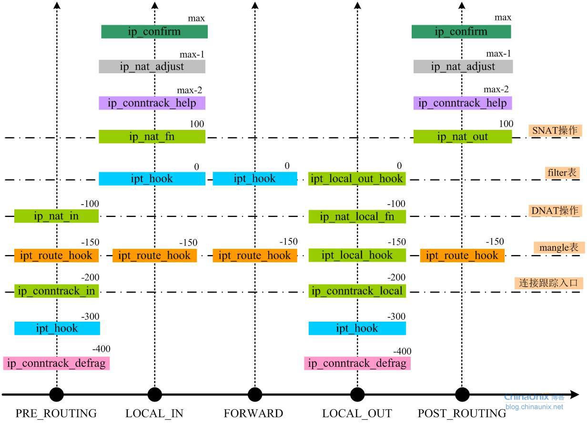

[(九)洞悉linux下的Netfilter&iptables：网络地址转换原理之DNAT](https://blog.csdn.net/qq_39642794/article/details/103179331)

还要考虑用户的配置，在这个netfilter上对于某个流量是配置了snat，还是dnat，还是都配置了（此时是指源目==同时==更改）

对于dcube lb，会有对snat和dnat同时进行的情况，也就是源目同时都改变了。此时，对比到netfilter上，pre-routing、post-routing都进行了nat操作。

#define HOOK2MANIP(hooknum) ((hooknum) != NF_IP_POST_ROUTING && (hooknum) != NF_IP_LOCAL_IN)

- pre-routing		local-in

    从高到底 conntrack_defrag、ipt_hook、ip_conntrack_in、ip_nat_in、ip_nat_fn、ip_nat_adjust、ip_confirm
    conntrack_defrag		重组分片
    ipt_hook						untracked
    ip_conntrack_in			生成ip_conntrack结构体，根据orig tuple计算reply tuple
    ip_nat_in						dnat   依据配置的dnat规则修改ip_conntrack结构体和skb，如果没有则不执行
    ip_nat_fn						snat   依据配置的snat规则修改ip_conntrack结构体和skb，如果没有则不执行
    ip_nat_adjust
    ip_confirm

- pre-routing        forward    post-routing

    conntrack_defrag		重组分片
    ipt_hook						untracked
    ip_conntrack_in			生成ip_conntrack结构体，根据orig tuple计算reply tuple
    ip_nat_in					  dnat   依据配置的dnat规则修改ip_conntrack结构体和skb，如果没有则不执行
    ip_nat_out					snat   依据配置的snat规则修改ip_conntrack结构体和skb，如果没有则不执行
    ip_nat_adjust
    ip_confirm

- local-out		   post-routing

    从高到底 conntrack_defrag、ipt_hook、ip_conntrack_local、ip_nat_local_fn、ip_nat_out、ip_nat_adjust、ip_confirm
    conntrack_defrag			重组分片
    ipt_hook							untracked
    ip_conntrack_local			生成ip_conntrack结构体，根据orig tuple计算reply tuple
    ip_nat_local_fn				dnat   依据配置的dnat规则修改ip_conntrack结构体和skb，如果没有则不执行
    ip_nat_out						snat   依据配置的snat规则修改ip_conntrack结构体和skb，如果没有则不执行
    ip_nat_adjust
    ip_confirm

