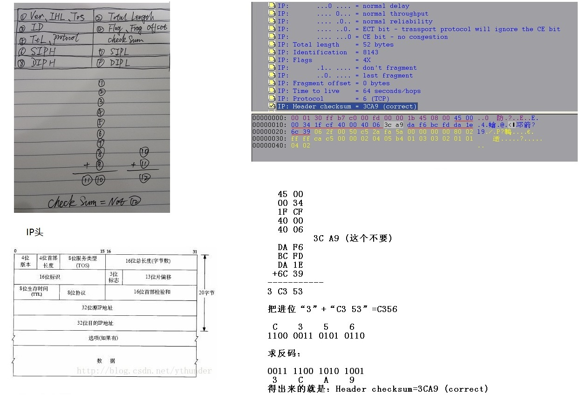
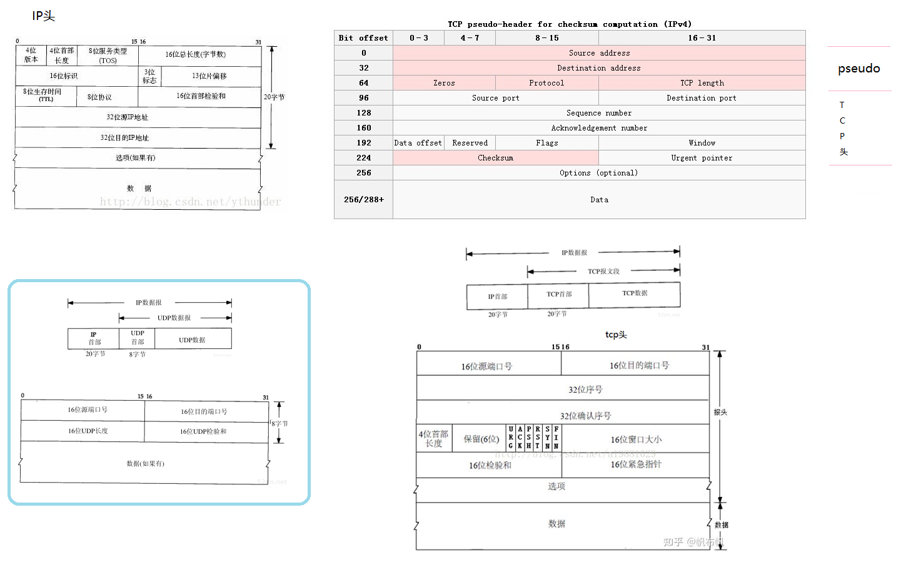
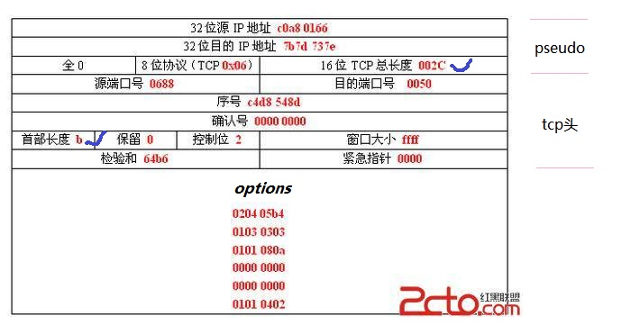
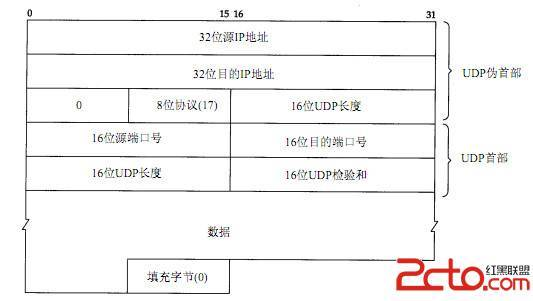
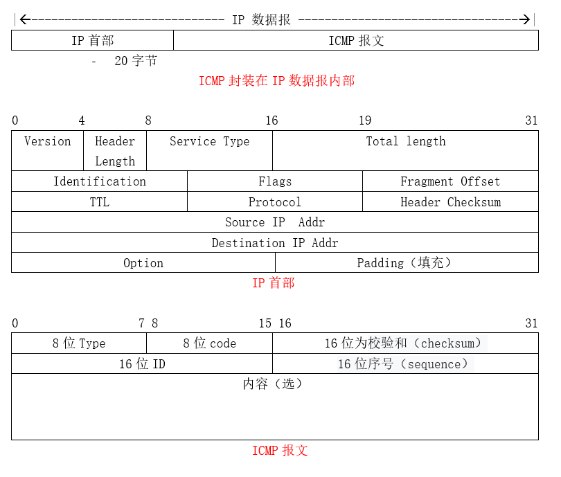

[数据包校验和相关知识](https://blog.csdn.net/hhhhhyyyyy8/article/details/102531155)

[原创                   Linux内核分析 - 网络[十三\]：校验和                       ](https://blog.csdn.net/qy532846454/article/details/7010852)

[IP/TCP/UDP checsum](https://www.cnblogs.com/codestack/p/13633566.html)


**校检和**:

**ip**:  ip报文仅检查ip报文头自己 

**tcp / udp**:   伪头 + tcp / udp 头 + 数据载荷  

**icmp**:  icmp头 +  数据载荷

https://www.cnblogs.com/hpyu/p/14254250.html    Kernel调试追踪技术之 eBPF on ARM64
https://ddeevv.com/question/how-xdp-ebpf-change-checksum-tcphdr-after-update-dest-port-qa580f.html
https://stackoverflow.com/questions/62066427/how-xdp-ebpf-change-checksum-tcphdr-after-update-dest-port
https://blog.gmem.cc/ebpf
https://www.cxymm.net/article/qq_17045267/103764320 eBPF技术概述_仙人掌开叉的博客-程序员秘密_ebpf技术
https://man7.org/linux/man-pages/man7/bpf-helpers.7.html
https://blogs.oracle.com/linux/post/bpf-in-depth-bpf-helper-functions


## IP checksum

[常见的二层协议和三层协议结构以及IP头checksum计算方法](https://blog.csdn.net/denglin12315/article/details/115974066)

[IP协议Header部分的Checksum计算方法](https://www.cnblogs.com/adamite/p/3317376.html)

如果修改了IP头某个字段，需要重新计算IP头checksum，具体操作流程如下
(1)修改IP头某个字段
(2)将IP头chksum字段清零
(3)计算IP头的checksum，方法参见博文：
   https://www.cnblogs.com/adamite/p/3317376.html
(4)将计算好的IP头的checksum写回IP头chksum字段



------


## tcp checksum

[IP头，TCP头，UDP头，MAC帧头定义](https://www.cnblogs.com/li-hao/archive/2011/12/07/2279912.html)

[TCP/IP校验和](https://www.cnblogs.com/sunnypoem/p/12491036.html)

TCP头前加一个伪首部，其它步骤和IP类似




[TCP校验和（Checksum）的原理和实现](https://blog.csdn.net/qq_15437629/article/details/79183076)

TCP校验和（Checksum）是一个端到端的校验和，由发送端计算，然后由接收端验证。其目的是为了发现TCP首部和数据在发送端到接收端之间发生的任何改动。如果接收方检测到校验和有差错，则TCP段会被直接丢弃。

TCP校验和覆盖TCP首部和TCP数据，而IP首部中的校验和只覆盖IP的首部，不覆盖IP数据报中的任何数据。TCP校验和、IP校验和的计算方法是基本一致的，除了计算的范围不同。

TCP的校验和是必需的，而UDP的校验和是可选的。TCP和UDP计算校验和时，都要加上一个12字节的==伪首部==。

伪首部的数据都是从IP数据报头获取的。其目的是让TCP检查数据是否已经正确到达目的地，只是单纯为了做校验用的。 

```c
struct 
{
    unsigned long saddr;  //源地址
    unsigned long daddr; //目的地址
    char mbz; //强制置空
    char ptcl; //协议类型
    unsigned short tcpl; //TCP长度
}psd_header;
```

伪首部共有12字节（前96Bits），包含如下信息：源IP地址、目的IP地址、保留字节(置0)、传输层协议号(TCP是6)、TCP报文长度(报头+数据)。

伪首部是为了增加TCP校验和的检错能力：如检查TCP报文是否收错了(目的IP地址)、传输层协议是否选对了(传输层协议号)等。

RFC 793的TCP校验和定义：
The checksum field is the 16 bit one’s complement of the one’s complement sum of all 16-bit words in the header and text. If a segment contains an odd number of header and text octets to be checksummed, the last octet is padded on the right with zeros to form a 16-bit word for checksum purposes. The pad is not transmitted as part of the segment. While computing the checksum, the checksum field itself is replaced with zeros.

上述的定义说得很明确：
首先，把伪首部、TCP报头、TCP数据分为16位的字，如果总长度为奇数个字节，则在最后增添一个位都为0的字节。
==把TCP报头中的校验和字段置为0==（计算时不包括这部分，是存放计算结果的，否则就陷入鸡生蛋还是蛋生鸡的问题）。
其次，用反码相加法累加所有的16位字（进位也要累加）。
最后，对计算结果取反，作为TCP的校验和。

举个例子来解释该校验方法，步骤：

1、首先将检验和置零；
2、然后将TCP伪首部部分，TCP首部部分，数据部分都划分成16位的一个个16进制数
3、将这些数逐个相加，记得溢出的部分加到最低位上，这是循环加法：
0xc0a8+ 0x0166+……+0x0402=0x9b49
4、最后将得到的结果取反，则可以得到检验和位0x64b6
校验和反码求和 的实现

发送方：原码相加 ，并将高位叠加到低位，取反 ，得到反码求和结果，放入校验和
接收方：将所有原码 相加，高位叠加， 如全为1，则正确

*抓包工具抓了一个TCP 的syn报文做研究*



还有一个概念十分==重要==，那就是16位TCP长度，请注意该长度不是整个报文的总长度，而只是TCP（包括TCP头和数据部分）的总长度。

首部长度b =11， 11*4=44=20（头部必须的20）+24，所以24不是数据部分的长度，而是头部的option，数据部分的长度是0；

002C=44 = 20（头） + 24（option）；

该报文没有携带数据。

按照上述步骤进行计算就可以得到检验和为==0x64B6==，试试看

下面为C实现较为原始的checksum算法，代码中对于算法做了比较详细的注释：

```c
unsigned short 
checksum(unsigned short * addr, int count)

{
long sum = 0;
/*
计算所有数据的16bit对之和
*/
    while( count > 1  )  {
        /*  This is the inner loop */
        sum += *(unsigned short*)addr++;

        count -= 2
    }   

/* 如果数据长度为奇数，在该字节之后补一个字节(0),然后将其转换为16bit整数，加到上面计算的校验和中。
 */
    if( count > 0 ) { 
        char left_over[2] = {0};
        left_over[0] = *addr;
        sum += * (unsigned short*) left_over;
    }   

/*  将32bit数据压缩成16bit数据，即将进位加大校验和的低字节上，直到没有进位为止。
 */
    while (sum>>16)
        sum = (sum & 0xffff) + (sum >> 16);
　　
  　/*返回校验和的反码*/
   return ~sum;
}
```


### 增量更新

如果在报文的转发路径中遇到需要修改ip、tcp中部分报文字段，那么校验和需要重新计算。

当修改只是一小部分时，可以用下列方法更新校验和。

[Internet协议校验和的增量更新](https://blog.csdn.net/qq_43395215/article/details/103414009)


------


## udp checksum

[如何计算UDP/TCP检验和checksum](https://cloud.tencent.com/developer/article/1498155)

[ip头、tcp头、udp头详解及定义，结合Wireshark抓包看实际情况](https://www.cnblogs.com/shenpengyan/p/5912567.html)

下面的图是一个UDP的检验和所需要用到的所有信息，包括三个部分：       

1.UDP伪首部
2.UDP首部
3.UDP的数据部分（切记不要遗漏该部分，否则就~吐血了~）

首先解释下伪首部的概念，伪首部包含IP首部一些字段。其目的是让UDP两次检查数据是否已经正确到达目的地，只是单纯为了做校验用的.

还有一个概念十分==重要==，那就是16位UDP长度，请注意该长度不是整个报文的总长度，而只是UDP（包括UDP头和数据部分）的总长度。



计算检验和（checksum）的过程很关键，主要分为以下几个步骤
1.把伪首部添加到UDP上；
2.计算初始时是需要将检验和字段添零的，即不能包括这个部分，这里是存放结果的（鸡生蛋还是蛋生鸡）
3.把所有位划分为16位（2字节）的字，如果数据长度为==奇数==，在该字节之后填充一个字节(0)，然后将其转换为16bit整数，加到上面计算的校验和中。
4.把所有16位的字相加，如果遇到进位，则将高于16字节的进位部分的值加到最低位上，举例，0xBB5E+0xFCED=0x1 B84B，则将1放到最低位，得到0xB84C
5.将所有字相加得到的结果应该为一个16位的数，将该数取反则可以得到检验和checksum。

------

## ICMP checksum





[原创                   Linux内核分析 - 网络[十一\]：ICMP模块](https://blog.csdn.net/qy532846454/article/details/6915835)

[深入理解ICMP协议](https://zhuanlan.zhihu.com/p/369623317)

[如何计算icmp校验和](https://blog.csdn.net/zhj082/article/details/80518322)

[How to Calculate IP Header Checksum (With an Example)](https://www.thegeekstuff.com/2012/05/ip-header-checksum/)		！！！！！

http://yaxin-cn.github.io/Python/icmp-packet-checksum-with-python.html

[计算IP、ICMP、TCP和UDP包的校验和    ](http://arondight.me/2016/03/22/%E8%AE%A1%E7%AE%97IP%E3%80%81ICMP%E3%80%81TCP%E5%92%8CUDP%E5%8C%85%E7%9A%84%E6%A0%A1%E9%AA%8C%E5%92%8C/)

 


http://www.metools.info/code/c128.html		累加和（CheckSum）校验在线计算

https://juejin.cn/post/6844904131031728141	Checksum 计算方式

https://blog.csdn.net/lisayh/article/details/81110287	checksum计算方法

https://hechao.li/2020/04/10/Checksum-or-fxxk-up/

https://blog.apnic.net/2020/09/02/journeying-into-xdp-part-0/

https://stackoverflow.com/questions/45986312/recalculating-tcp-checksum-in-linux-kernel-module

https://patchwork.ozlabs.org/project/netdev/patch/190fead2d6136865cb2c8f7e94bcf3fbf4eea23f.1455899111.git.daniel@iogearbox.net/