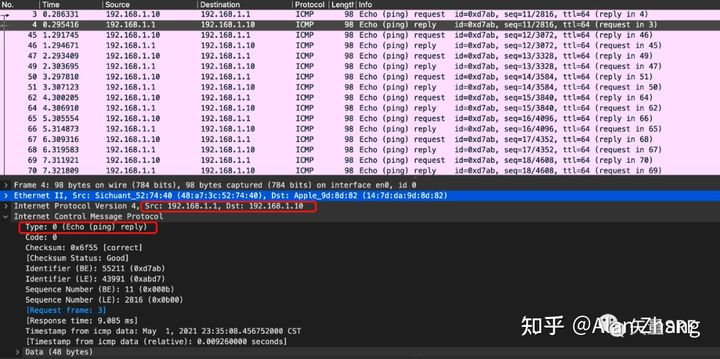

# ICMP

[原创                   Linux内核分析 - 网络[十一\]：ICMP模块](https://blog.csdn.net/qy532846454/article/details/6915835)

[icmp port unreachable](https://www.cnblogs.com/codestack/p/12863526.html)

## ICMP的报文格式

ICMP报文包含在IP数据报中，IP报头在ICMP报文的最前面。一个ICMP报文包括IP报头（至少20字节）、ICMP报头（至少八字节）和ICMP报文（属于ICMP报文的数据部分）。当IP报头中的协议字段值为1时，就说明这是一个ICMP报文。ICMP报头如下图所示

| 字段   | 说明                                                         |
| ------ | ------------------------------------------------------------ |
| 类型   | 占一字节，标识ICMP报文的类型，从类型值来看ICMP报文可以分为两大类。第一类是取值为1~127的差错报文，第2类是取值128以上的信息报文 |
| 代码   | 占一字节，标识对应ICMP报文的代码。它与类型字段一起共同标识了ICMP报文的详细类型 |
| 校验和 | 对包括ICMP报文数据部分在内的==整个ICMP数据报==的校验和       |

ICMP大概分为两类报文： 
 一类是通知出错原因 ；一类是用于诊断查询 
 类型及含义如下：

| 类型（十进制） | 内容       |
| -------------- | ---------- |
| 0              | 回送应答   |
| 3              | 目标不可达 |
| 8              | 回送请求   |
| 11             | 超时       |

（1）目标不可到达报文（类型值为3）在路由器或者主机不能传递数据时使用。
例如：我们要连接对方一个不存在的系统端口（端口号小于1024）时，将返回类型字段值3、代码字段值为3的ICMP报文，表示端口不可达。
常见的不可到达类型还有网络不可到达（代码字段值为0）、主机不可达到（代码字段值为1）、协议不可到达（代码字段值为2）等等。

（2）无连接方式网络的问题就是数据报会丢失，或者长时间在网络游荡而找不到目标，或者拥塞导致主机在规定的时间内无法重组数据报分段，这时就要触发ICMP超时报文的产生。 
 **超时报文（类型字段值为11）的代码域有两种取值：代码字段值为0表示传输超时，代码字段值为1表示分段重组超时。**

------

## ping

ICMP回应请求（echo-request）和应答消息（echo-reply）用于诊断两个系统（主机或路由器）之间是否能够进行通信，当其中一方发送回应请求消息给另一方时，接收到回应请求消息的主机或者路由器将以应答消息进行应答，常用的网络ping命令就是基于此消息类型的，

执行ping命令，主机会构建一个 ICMP 回显请求消息数据包（类型是**8**，代码是**0**），

| 字段                   | 内容                                 |
| ---------------------- | ------------------------------------ |
| 类型                   | 0x08                                 |
| 代码                   | 0x00                                 |
| 校验和                 | ....                                 |
| Identifier(ping进程号) | 43991(0xabd7)，ping进程的进程号43991 |
| Sequence Number        | 2816(0x0b00)                         |

响应ping命令，目的端构建回显应答（类型是**0**，代码是**0**），

这个 ICMP 回显应答数据包在 IP 层来看，与被送来的回显请求数据包基本上一样。不同的只有源、目标 IP 地址字段被交换了。

| 字段                   | 内容                                                         |
| ---------------------- | ------------------------------------------------------------ |
| 类型                   | 0x00                                                         |
| 代码                   | 0x00                                                         |
| 校验和                 | ....                                                         |
| Identifier(ping进程号) | 43991(0xabd7)，请求端ping进程的进程号43991，***与icmp请求报文值一样*** |
| Sequence Number        | 2816(0x0b00)，***与icmp请求报文值一样***                     |

------

## traceroute

traceroute 在类 Unix/Linux 系统中默认使用的是 ==UDP== 协议，也可以通过参数修改为使用 ICMP 协议；

原理就是利用 IP 包的 TTL 从 1 开始按照顺序递增的同时发送 UDP 包，强制接收 ICMP 超时消息的方法。

首先 traceroute 会将 IP 包的 TTL 设置 为 1，然后发送 UDP 包，他会填入一个端口号作为 UDP 目标端口号（默认是：33434-33534）。如下图：

收到回复报文后，可以知道是TTL=1的超时，那么就增加TTL，发送TTL=2的UDP 包，dest ip就是目的主机；然后收到TTL=2的超时；

一直继续增加TTL，发送，收到 ICMP 超时报文，直到UDP报文发送到目的主机。

目的主机收到 UDP 包后，因为UDP报文指定的端口号在目的主机上一般不会使用，所以端口不可达，于是返回 ICMP 差错报文消息（类型 3，代码 3）。

发起端收到回复报文后，发现回复报文类型是端口不可达，说明发送方发出的 UDP 包到达了目的主机。如下图：

这样的过程，traceroute 就可以拿到了所有的路由器 IP，这样子就可以看到从源主机到目的主机过程中的所有路由信息。

当然实际情况有的路由器禁用 ICMP ，那么他就根本不会返回这个 ICMP 差错报文，所以是看不到中间经过的路由IP的。

------

## ICMP差错报文

**（1）**ICMP的一个规则是：ICMP差错报文必须包括生成该差错报文的**数据报IP首部**（包含IP首部的选项部分），还必须至少包括跟在该IP首部后面的**前8个字节**。
**（2）**导致差错的数据报中的IP首部要被送回的原因是因为IP首部中包含了协议字段，使得ICMP可以知道如何解释后面的8个字节。TCP和UDP首部的前8个字节包括源端口和目的端口。

ip报文：ip首部（包括ip首部的选项部分）后面的8字节是tcp、udp的源目端口号，共计4字节，还有4字节其他信息。
所以差错报文的组成中，可以通过包含的ip首部，解析出协议，从而知道ip首部（包括ip首部的选项部分）后面的8字节如何进行解析，
如果是tcp、udp协议，就能解析出**源目端口号** 等等。

### ICMP端口不可达差错

类型3，代码3

端口不可达报文是一种ICMP差错报文，它是ICMP目的不可到达报文中的一种。ICMP不可达报文的一般格式如图

### TTL为0的报文

类型11，代码0

抓包分析traceroute

注意ttl超时回复的报文（类型11，代码）和最后一个回复报文（类型3，代码3）的类型和代码，看这种包的格式

