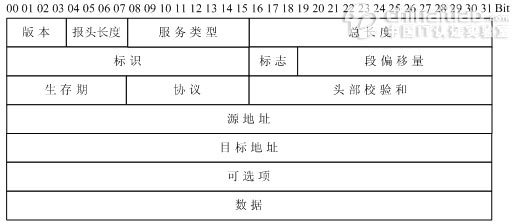
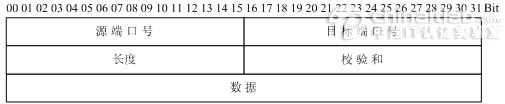

# 									协议头


## 报文封装整体结构


## mac帧头定义

```c
/*数据帧定义，头14个字节，尾4个字节*/
typedef struct _MAC_FRAME_HEADER
{
    char m_cDstMacAddress[6];    //目的mac地址
    char m_cSrcMacAddress[6];    //源mac地址
    short m_cType;       　　　　　//上一层协议类型，如0x0800代表上一层是IP协议，0x0806为arp
}__attribute__((packed))MAC_FRAME_HEADER,*PMAC_FRAME_HEADER;

// linux-5.14.14/include/uapi/linux/if_ether.h
struct ethhdr {
	unsigned char	h_dest[ETH_ALEN];	/* destination eth addr	*/
	unsigned char	h_source[ETH_ALEN];	/* source ether addr	*/
	__be16		h_proto;		/* packet type ID field	*/
} __attribute__((packed));
```


## ip头部定义



```c
/*IP头定义，共20个字节*/
typedef struct _IP_HEADER 
{
     char m_cVersionAndHeaderLen;     　　//版本信息(前4位)，头长度(后4位)
     char m_cTypeOfService;      　　　　　 // 服务类型8位
     short m_sTotalLenOfPacket;    　　　　//数据包长度
     short m_sPacketID;      　　　　　　　 //数据包标识
     short m_sSliceinfo;      　　　　　　　  //分片使用
     char m_cTTL;        　　　　　　　　　　//存活时间
     char m_cTypeOfProtocol;    　　　　　 //协议类型
     short m_sCheckSum;      　　　　　　 //校验和
     unsigned int m_uiSourIp;     　　　　　//源ip
     unsigned int m_uiDestIp;     　　　　　//目的ip
} __attribute__((packed))IP_HEADER, *PIP_HEADER ;


//linux-5.14.14/include/uapi/linux/ip.h
struct iphdr {
#if defined(__LITTLE_ENDIAN_BITFIELD)
	__u8	ihl:4,
		version:4;
#elif defined (__BIG_ENDIAN_BITFIELD)
	__u8	version:4,
  		ihl:4;
#else
#error	"Please fix <asm/byteorder.h>"
#endif
	__u8	tos;
	__be16	tot_len;
	__be16	id;
	__be16	frag_off;
	__u8	ttl;
	__u8	protocol;
	__sum16	check;
	__be32	saddr;
	__be32	daddr;
	/*The options start here. */
};
```

- 版本（Version）字段：占4比特。用来表明IP协议实现的版本号，当前一般为IPv4，即0100。
- **==报头长度==**（Internet Header Length，***==IHL==***）字段：占4比特。是头部占32比特的数字，包括可选项。普通IP数据报（没有任何选项），该字段的值是5，即160比特=20字节。此字段最大值为60字节。
- 服务类型（Type of Service  ，TOS）字段：占8比特。其中前3比特为优先权子字段（Precedence，现已被忽略）。第8比特保留未用。第4至第7比特分别代表延迟、吞吐量、可靠性和花费。当它们取值为1时分别代表要求最小时延、最大吞吐量、最高可靠性和最小费用。这4比特的服务类型中只能置其中1比特为1。可以全为0，若全为0则表示一般服务。服务类型字段声明了数据报被网络系统传输时可以被怎样处理。例如：TELNET协议可能要求有最小的延迟，FTP协议（数据）可能要求有最大吞吐量，SNMP协议可能要求有最高可靠性，NNTP（Network News Transfer  Protocol，网络新闻传输协议）可能要求最小费用，而ICMP协议可能无特殊要求（4比特全为0）。实际上，大部分主机会忽略这个字段，但一些动态路由协议如OSPF（Open Shortest Path First Protocol）、IS-IS（Intermediate System to Intermediate System Protocol）可以根据这些字段的值进行路由决策。
- 总长度字段：占16比特。指明整个数据报的长度（以字节为单位）。最大长度为65535字节。
- 标志字段：占16比特。用来唯一地标识主机发送的每一份数据报。通常每发一份报文，它的值会加1。
- 标志位字段：占3比特。标志一份数据报是否要求分段。
- 段偏移字段：占13比特。如果一份数据报要求分段的话，此字段指明该段偏移距原始数据报开始的位置。
- 生存期（TTL：Time to Live）字段：占8比特。用来设置数据报最多可以经过的路由器数。由发送数据的源主机设置，通常为32、64、128等。每经过一个路由器，其值减1，直到0时该数据报被丢弃。
- 协议字段：占8比特。指明IP层所封装的上层协议类型，如ICMP（1）、IGMP（2） 、TCP（6）、UDP（17）等。
- 头部校验和字段：占16比特。内容是根据IP头部计算得到的校验和码。计算方法是：对头部中每个16比特进行二进制反码求和。（和ICMP、IGMP、TCP、UDP不同，IP不对头部后的数据进行校验）。
- 源IP地址、目标IP地址字段：各占32比特。用来标明发送IP数据报文的源主机地址和接收IP报文的目标主机地址。
- 可选项字段：占32比特。用来定义一些任选项：如记录路径、时间戳等。这些选项很少被使用，同时并不是所有主机和路由器都支持这些选项。可选项字段的长度必须是32比特的整数倍，如果不足，必须填充0以达到此长度要求。

### parse


## icmp头部定义

```c
// linux-5.14.14/include/uapi/linux/icmp.h
struct icmphdr {
  __u8		type;
  __u8		code;
  __sum16	checksum;
  union {
	struct {
		__be16	id;
		__be16	sequence;
	} echo;
	__be32	gateway;
	struct {
		__be16	__unused;
		__be16	mtu;
	} frag;
	__u8	reserved[4];
  } un;
};
```


## tcp头部定义


```c


// linux-5.14.14/include/uapi/linux/tcp.h
struct tcphdr {
	__be16	source;
	__be16	dest;
	__be32	seq;
	__be32	ack_seq;
#if defined(__LITTLE_ENDIAN_BITFIELD)
	__u16	res1:4,
		doff:4,
		fin:1,
		syn:1,
		rst:1,
		psh:1,
		ack:1,
		urg:1,
		ece:1,
		cwr:1;
#elif defined(__BIG_ENDIAN_BITFIELD)
	__u16	doff:4,
		res1:4,
		cwr:1,
		ece:1,
		urg:1,
		ack:1,
		psh:1,
		rst:1,
		syn:1,
		fin:1;
#else
#error	"Adjust your <asm/byteorder.h> defines"
#endif
	__be16	window;
	__sum16	check;
	__be16	urg_ptr;
};
```

- 源、目标端口号字段：占16比特。TCP协议通过使用"端口"来标识源端和目标端的应用进程。端口号可以使用0到65535之间的任何数字。在收到服务请求时，操作系统动态地为客户端的应用程序分配端口号。在服务器端，每种服务在"众所周知的端口"（Well-Know Port）为用户提供服务。
- 顺序号字段：占32比特。用来标识从TCP源端向TCP目标端发送的数据字节流，它表示在这个报文段中的第一个数据字节。
- 确认号字段：占32比特。只有ACK标志为1时，确认号字段才有效。它包含目标端所期望收到源端的下一个数据字节。
- 头部长度字段：占4比特。给出头部占32比特的数目。没有任何选项字段的TCP头部长度为20字节；最多可以有60字节的TCP头部。
- 标志位字段（U、A、P、R、S、F）：占6比特。各比特的含义如下：
    - URG：紧急指针（urgent pointer）有效。
    - ACK：确认序号有效。
    - PSH：接收方应该尽快将这个报文段交给应用层。
    - RST：重建连接。
    - SYN：发起一个连接。
    - FIN：释放一个连接。
    - 窗口大小字段：占16比特。此字段用来进行流量控制。单位为字节数，这个值是本机期望一次接收的字节数。
    - TCP校验和字段：占16比特。对整个TCP报文段，即TCP头部和TCP数据进行校验和计算，并由目标端进行验证。
    - 紧急指针字段：占16比特。它是一个偏移量，和序号字段中的值相加表示紧急数据最后一个字节的序号。
    - 选项字段：占32比特。可能包括"窗口扩大因子"、"时间戳"等选项。

### parse


## udp头部定义



```c
/*UDP头定义，共8个字节*/

typedef struct _UDP_HEADER 
{
     unsigned short m_usSourPort;    　　　// 源端口号16bit
     unsigned short m_usDestPort;    　　　// 目的端口号16bit
     unsigned short m_usLength;    　　　　// 数据包长度16bit
     unsigned short m_usCheckSum;    　　// 校验和16bit
}__attribute__((packed))UDP_HEADER, *PUDP_HEADER;

// linux-5.14.14/include/uapi/linux/udp.h
struct udphdr {
	__be16	source;
	__be16	dest;
	__be16	len;
	__sum16	check;
};
```


### parse


