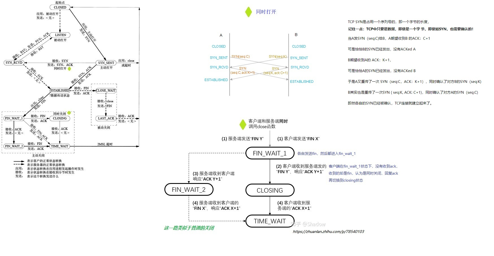

# TCP状态机转移

kernel：1.2.13


## 三次握手阶段


### 发送SYN

```c
//客户端发起连接
static int tcp_connect(struct sock *sk, struct sockaddr_in *usin, int addr_len)
{
	struct sk_buff *buff;
	struct device *dev=NULL;
	struct tcphdr *t1;
	
	if (sk->state != TCP_CLOSE) 
	{
		return(-EISCONN);
	}
	
	sk->inuse = 1;
	sk->daddr = usin->sin_addr.s_addr;

	buff = sk->prot->wmalloc(sk,MAX_SYN_SIZE,0, GFP_KERNEL);
	sk->inuse = 1;
	
	t1 = (struct tcphdr *) buff->data;

	tmp = sk->prot->build_header(buff, sk->saddr, sk->daddr, &dev,
					IPPROTO_TCP, NULL, MAX_SYN_SIZE,sk->ip_tos,sk->ip_ttl);

	buff->len += tmp;
	t1 = (struct tcphdr *)((char *)t1 +tmp);

	t1->ack = 0;
	t1->window = 2;
	t1->res1=0;
	t1->res2=0;
	t1->rst = 0;
	t1->urg = 0;
	t1->psh = 0;
	t1->syn = 1;// @@@
	t1->urg_ptr = 0;
	t1->doff = 6;

	/*
	 *	This must go first otherwise a really quick response will get reset. 
	 */

	tcp_set_state(sk,TCP_SYN_SENT);// @@@
	sk->rto = TCP_TIMEOUT_INIT;

	sk->retransmit_timer.function=&retransmit_timer;
	sk->retransmit_timer.data = (unsigned long)sk;
	reset_xmit_timer(sk, TIME_WRITE, sk->rto);	/* Timer for repeating the SYN until an answer */
	sk->retransmits = TCP_SYN_RETRIES;

	sk->prot->queue_xmit(sk, dev, buff, 0);  
	reset_xmit_timer(sk, TIME_WRITE, sk->rto);
  
	release_sock(sk);
	return(0);
}

```

### 接收SYN，发送SYN+ACK

```c
/*
 *	A TCP packet has arrived.	理解这个函数，需要脑袋分裂成双重人格，一会把自己当成s，一会当成c，才行，因为s、c运行的是这个同一套代码。
     而且要注意，get_sock的返回值，可能是监听，也可能是连接套接字，需要讨论
 */
// 服务端收到连接请求
int tcp_rcv(struct sk_buff *skb, struct device *dev, struct options *opt,
	unsigned long daddr, unsigned short len,
	unsigned long saddr, int redo, struct inet_protocol * protocol)
{
	struct tcphdr *th;
	struct sock *sk;
	int syn_ok=0;
	
	th = skb->h.th;

	sk = get_sock(&tcp_prot, th->dest, saddr, th->source, daddr);//内部机制能够保证：如果是握手连接的第一个报文，那么get的是监听套接字；否则根据最佳匹配，get的是连接套接字

	skb->sk=sk;

	if(sk->state!=TCP_ESTABLISHED)		/* Skip this lot for normal flow */
	{
	
		if(sk->state==TCP_LISTEN)//sk是监听套接字
		{		
			tcp_conn_request(sk, skb, daddr, saddr, opt, dev, tcp_init_seq());//收到的SYN报文，然后创建一个连接套接字，并用其回复SYNACK报文
			 
			release_sock(sk);
			return 0;
		}
        

/*
服务端收到报文，发现是连接报文，所以创建一个连接套接字newsk，用于和客户端后续的交互；
监听套接字的作用，到此为止。
连接套接字组装了连接答复报文SYNACK，回复给客户端，和监听套接字没有关系了，并设置自身状态为TCP_SYN_RECV
*/
// 这个sk是监听套接字，状态在关闭之前一直是TCP_LISTEN，不会变化的，变化的是创建出来的连接套接字newsk，随着连接状态一直变化 
static void tcp_conn_request(struct sock *sk, struct sk_buff *skb,
		 unsigned long daddr, unsigned long saddr,
		 struct options *opt, struct device *dev, unsigned long seq)
{
	struct sk_buff *buff;
	struct tcphdr *t1;
	unsigned char *ptr;
	struct sock *newsk;
	struct tcphdr *th;
	struct device *ndev=NULL;
	int tmp;
  
	th = skb->h.th;

	newsk = (struct sock *) kmalloc(sizeof(struct sock), GFP_ATOMIC);

	memcpy(newsk, sk, sizeof(*newsk));
	skb_queue_head_init(&newsk->write_queue);// newsk的发送队列，newsk是连接套接字，肯定会有报文的发送；但是监听套接字肯定不会有发送队列，仅仅是对客户端的连接监听
	skb_queue_head_init(&newsk->receive_queue);// newsk的接收队列，newsk是连接套接字，肯定会有报文的接收；监听套接字为了监听客户端的连接，肯定会有一个连接队列，为了缓存客户端的连接请求
    
    newsk->state = TCP_SYN_RECV;// @@@

	put_sock(newsk->num,newsk);//

	buff = newsk->prot->wmalloc(newsk, MAX_SYN_SIZE, 1, GFP_ATOMIC);//skb是收到的连接请求报文，buff是发送给客户端的答复报文
  
	buff->len = sizeof(struct tcphdr)+4;
	buff->sk = newsk;

	t1 =(struct tcphdr *) buff->data;

	tmp = sk->prot->build_header(buff, newsk->saddr, newsk->daddr, &ndev,
			       IPPROTO_TCP, NULL, MAX_SYN_SIZE,sk->ip_tos,sk->ip_ttl);

	buff->len += tmp;
	t1 =(struct tcphdr *)((char *)t1 +tmp);
  
	memcpy(t1, skb->h.th, sizeof(*t1));

	t1->ack = 1;//@@@

	t1->window = ntohs(newsk->window);
	t1->res1 = 0;
	t1->res2 = 0;
	t1->rst = 0;
	t1->urg = 0;
	t1->psh = 0;
	t1->syn = 1;//@@@

	t1->doff = sizeof(*t1)/4+1;

	tcp_send_check(t1, daddr, saddr, sizeof(*t1)+4, newsk);
	newsk->prot->queue_xmit(newsk, ndev, buff, 0);
	reset_xmit_timer(newsk, TIME_WRITE , TCP_TIMEOUT_INIT);
	skb->sk = newsk;
	
	skb_queue_tail(&sk->receive_queue,skb);
	release_sock(newsk);

}
```

### 接收SYN+ACK，发送ACK

```c
/*
 *	A TCP packet has arrived.	理解这个函数，需要脑袋分裂成双重人格，一会把自己当成s，一会当成c，才行，因为s、c运行的是这个同一套代码。而且要注意，get_sock的返回值，可能是监听，也可能是连接套接字，需要讨论
 */
 
int tcp_rcv(struct sk_buff *skb, struct device *dev, struct options *opt,
	unsigned long daddr, unsigned short len,
	unsigned long saddr, int redo, struct inet_protocol * protocol)
{
	if(sk->state!=TCP_ESTABLISHED)		/* Skip this lot for normal flow */
	{
		/*
		 *	SYN sent means we have to look for a suitable ack and either reset
		 *	for bad matches or go to connected 

		 （1）如果收到的是syn+ack，那么c完成连接
		 （2）如果收到的是syn，那么是同时连接，就需要等待下一次收到报文时，如果是（1），本端才能完成连接，所以会有两次（c和s）进入（1）
		 */
		if(sk->state==TCP_SYN_SENT)// 发送过SYN，当成c，等待s回复SYNACK。因为这是c，所以不存在什么监听、连接套接字的概念
		{
			/* Crossed SYN or previous junk segment */
			if(th->ack)// 有门
			{
				/* We got an ack, but it's not a good ack */
				if(!tcp_ack(sk,th,saddr,len))// 处理ack失败了，所以连接肯定无法继续建立了
				{
					
				}
				if(th->rst)// 发送SYN，收到了reset，所以是服务端拒绝连接，ECONNREFUSED
					return tcp_std_reset(sk,skb);
				if(!th->syn)// 竟然没有syn，那么也是无法继续
				{
					/* A valid ack from a different connection
					   start. Shouldn't happen but cover it */

				}
				/*  赞，ack处理成功，而且还有syn
				 *	Ok.. it's good. Set up sequence numbers and
				 *	move to established.
				 */
				syn_ok=1;	/* Don't reset this connection for the syn */
				tcp_send_ack(sk->sent_seq,sk->acked_seq,sk,th,sk->daddr);//  回复ACK给s
				tcp_set_state(sk, TCP_ESTABLISHED);// @@@ c认为握手连接已经完成，这里s在收到ACK报文之前，肯定还是TCP_SYN_RECV状态
				if(!sk->dead)
				{
					sk->state_change(sk);
					sock_wake_async(sk->socket, 0);// c应用层调用了connect系统调用发起连接，过程中进行三次握手，现在c收到了s的回复，建立完成，整个过程是阻塞的，现在通知应用层继续运行
				}
				
			}
        
        
```


### 接收ACK

```c
int tcp_rcv(struct sk_buff *skb, struct device *dev, struct options *opt,
	unsigned long daddr, unsigned short len,
	unsigned long saddr, int redo, struct inet_protocol * protocol)
{
    
    
    //除了握手的第一个报文，后续报文都包含有ack，普通数据发送时，也会有ack
	if(th->ack && !tcp_ack(sk,th,saddr,len))// 握手的第三个报文，ack报文，在这里处理，若成功，则s切换到establish
	{
		if(sk->state==TCP_SYN_RECV)// 握手的第三个报文failed
		{
			tcp_reset(daddr, saddr, th,sk->prot, opt, dev,sk->ip_tos,sk->ip_ttl);
		}
		kfree_skb(skb, FREE_READ);
		release_sock(sk);
		return 0;
	}
	
	release_sock(sk);
	return 0;
}

extern __inline__ int tcp_ack(struct sock *sk, struct tcphdr *th, unsigned long saddr, int len)
{

	
	/*
	 *	Final ack of a three way shake 		握手的第三个报文
	 */
	 
	if(sk->state==TCP_SYN_RECV)// s 建立连接成功
	{
		tcp_set_state(sk, TCP_ESTABLISHED);// @@@
		if(!sk->dead)
			sk->state_change(sk);
	}
	
}
```


## 同时连接

```c
int tcp_rcv(struct sk_buff *skb, struct device *dev, struct options *opt,
	unsigned long daddr, unsigned short len,
	unsigned long saddr, int redo, struct inet_protocol * protocol)
    
	if(sk->state!=TCP_ESTABLISHED)		/* Skip this lot for normal flow */
	{

		/*
		 *	SYN sent means we have to look for a suitable ack and either reset
		 *	for bad matches or go to connected 

		 （1）如果收到的是syn+ack，那么c完成连接
		 （2）如果收到的是syn，那么是同时连接，就需要等待下一次收到报文时，如果是（1），本端才能完成连接，所以会有两次（c和s）进入（1）
		 */
	   
		if(sk->state==TCP_SYN_SENT)// 发送过SYN，当成c，等待s回复SYNACK。因为这是c，所以不存在什么监听、连接套接字的概念
		{
            if(th->ack)...// （1）
                
            else// （2）
			{
				/* See if SYN's cross. Drop if boring */
				if(th->syn && !th->rst)// TCP_SYN_SENT状态下，期待的是对端的SYNACK，但是却收到了SYN，那么说明对端此时也发起了握手连接，就是同时连接
				{
					/* Crossed SYN's are fine - but talking to  不能自己和自己建立连接
					   yourself is right out... */
					if(sk->saddr==saddr && sk->daddr==daddr &&
						sk->dummy_th.source==th->source &&
						sk->dummy_th.dest==th->dest)
					{
						tcp_statistics.TcpAttemptFails++;
						return tcp_std_reset(sk,skb);// 不能自己和自己建立连接，拒绝连接，ECONNREFUSED
					}
					
					tcp_set_state(sk,TCP_SYN_RECV);// 所以切换成 TCP_SYN_RECV
					
					/*
					 *	FIXME:
					 *	Must send SYN|ACK here// 那么按理说，也需要回复SYNACK，这样对端才能完成连接
					 */
				}		
				/* Discard junk segment */
				kfree_skb(skb, FREE_READ);
				release_sock(sk);
				return 0;
			}
```


## 四次挥手


### 发送FIN

```c
// close系统调用最终会走到这儿
// c s 两边的关闭，都会走到这儿
static void tcp_close(struct sock *sk, int timeout)
{
	sk->inuse = 1;
	
	if(sk->state == TCP_LISTEN)// s 监听套接字，释放所有缓存的连接请求，然后直接关掉即可
	{
		/* Special case */
		tcp_set_state(sk, TCP_CLOSE);
		tcp_close_pending(sk);
		release_sock(sk);
		return;
	}
			
	if(timeout)
	{
		tcp_set_state(sk, TCP_CLOSE);	/* Dead */
	}
	else
	{
		if(tcp_close_state(sk,1)==1)// @@@ 切换状态 TCP_ESTABLISHED--->TCP_FIN_WAIT1
		{
			tcp_send_fin(sk);// 连接套接字，就需要走挥手流程
		}
	}
	release_sock(sk);
}

// Send a fin.
static void tcp_send_fin(struct sock *sk)
{
	struct proto *prot =(struct proto *)sk->prot;
	struct tcphdr *th =(struct tcphdr *)&sk->dummy_th;
	struct tcphdr *t1;
	struct sk_buff *buff;
	struct device *dev=NULL;
	int tmp;
		
	release_sock(sk); /* in case the malloc sleeps. */
	
	buff = prot->wmalloc(sk, MAX_RESET_SIZE,1 , GFP_KERNEL);
	sk->inuse = 1;

	buff->sk = sk;
	buff->len = sizeof(*t1);
	buff->localroute = sk->localroute;
	t1 =(struct tcphdr *) buff->data;

	tmp = prot->build_header(buff,sk->saddr, sk->daddr, &dev,
			   IPPROTO_TCP, sk->opt,
			   sizeof(struct tcphdr),sk->ip_tos,sk->ip_ttl);

	t1 =(struct tcphdr *)((char *)t1 +tmp);
	buff->len += tmp;
	buff->dev = dev;
	memcpy(t1, th, sizeof(*t1));
	t1->ack = 1;
	t1->fin = 1;// @@@   ack+fin		握手的第一个报文没有ack，后续均有
	t1->rst = 0;
	t1->doff = sizeof(*t1)/4;
	tcp_send_check(t1, sk->saddr, sk->daddr, sizeof(*t1), sk);

	/*
	 * If there is data in the write queue, the fin must be appended to
	 * the write queue.
 	 */
 	if (skb_peek(&sk->write_queue) != NULL) // 发送队列中还有数据未发送，那么就将FIN排在最后
 	{
		skb_queue_tail(&sk->write_queue, buff);
  	} 
  	else 
  	{
        sk->sent_seq = sk->write_seq;
		sk->prot->queue_xmit(sk, dev, buff, 0); // 立即发送FIN
		reset_xmit_timer(sk, TIME_WRITE, sk->rto);
	}
}


```


### 后续挥手流程

```c

/*
 *	A TCP packet has arrived.	理解这个函数，需要脑袋分裂成双重人格，一会把自己当成s，一会当成c，才行，因为s、c运行的是这个同一套代码。而且要注意，get_sock的返回值，可能是监听，也可能是连接套接字，需要讨论
 */
 
int tcp_rcv(struct sk_buff *skb, struct device *dev, struct options *opt,
	unsigned long daddr, unsigned short len,
	unsigned long saddr, int redo, struct inet_protocol * protocol)
{
	struct tcphdr *th;
	struct sock *sk;
	int syn_ok=0;
	
	th = skb->h.th;

	sk = get_sock(&tcp_prot, th->dest, saddr, th->source, daddr);//内部机制能够保证：如果是握手连接的第一个报文，那么get的是监听套接字；否则根据最佳匹配，get的是连接套接字

	skb->sk=sk;
	
	/*
	 *	Process the encapsulated data       tcp_fin仅仅在tcp_data中调用，调用后有tcp_send_ack发送ack
	 */	
	if(tcp_data(skb,sk, saddr, len))
	{
		kfree_skb(skb, FREE_READ);
		release_sock(sk);
		return 0;
	}
	
	release_sock(sk);
	return 0;
}

extern __inline__ int tcp_data(struct sk_buff *skb, struct sock *sk, 
	 unsigned long saddr, unsigned short len)
{

			/*
			 *	When we ack the fin, we do the FIN 
			 *	processing.
			 */

			if (skb->h.th->fin) 
			{
				tcp_fin(skb,sk,skb->h.th);// 这个函数不是发送fin，而是接到fin后进行处理
			}
			tcp_send_ack(sk->sent_seq, sk->acked_seq, sk, th, saddr);//@@@
}

//这个函数不是发送fin，而是接到fin后进行处理   
//如何回复ACK？  tcp_fin仅仅在tcp_data中调用，调用后有tcp_send_ack发送ack
static int tcp_fin(struct sk_buff *skb, struct sock *sk, struct tcphdr *th)
{
	sk->fin_seq = th->seq + skb->len + th->syn + th->fin;

	if (!sk->dead) 
	{
		sk->state_change(sk);
		sock_wake_async(sk->socket, 1);
	}

	switch(sk->state) 
	{
		case TCP_SYN_RECV:
		case TCP_SYN_SENT:
		case TCP_ESTABLISHED:// 被动关闭端收到主动关闭端的FIN
			tcp_set_state(sk,TCP_CLOSE_WAIT);:// @@@
			if (th->rst)
				sk->shutdown = SHUTDOWN_MASK;
			break;

		case TCP_CLOSE_WAIT:
		case TCP_CLOSING:

			break;
		case TCP_TIME_WAIT:// TCP_TIME_WAIT-2msl等待时间的作用就在这儿体现，主动关闭端收到对端FIN，发送ACK后，进入这个状态，并启动2msl等待时间的定时器，
			/* 在这期间，如果又收到了对端的FIN，就说明本端对于对端FIN的确认ack，对端并没有收到，所以重发ACK，并重置定时器。
			 * received a retransmission of the FIN,
			 * restart the TIME_WAIT timer.
			 */
			reset_msl_timer(sk, TIME_CLOSE, TCP_TIMEWAIT_LEN);
			return(0);
		case TCP_FIN_WAIT1:// 发送FIN启动关闭流程后，进入这个状态，然后等待对端发来ACK，以进入WAIT2；但是却收到了FIN，说明对端也进入了关闭流程，就是同时关闭。在tcp_ack中会有后续处理（收到对端的ack，进入TCP_TIME_WAIT）

			if(sk->ip_xmit_timeout != TIME_WRITE)
				reset_xmit_timer(sk, TIME_WRITE, sk->rto);
			tcp_set_state(sk,TCP_CLOSING);
			break;
		case TCP_FIN_WAIT2:// 主动关闭端，收到了被动关闭端的FIN 
			reset_msl_timer(sk, TIME_CLOSE, TCP_TIMEWAIT_LEN);
			sk->shutdown|=SHUTDOWN_MASK;
			tcp_set_state(sk,TCP_TIME_WAIT);
			break;
		case TCP_CLOSE:
			break;
		default:// 到这儿还剩两种状态，TCP_LAST_ACK和TCP_LISTEN，TCP_LISTEN只是监听套接字的状态，能走到fin的肯定是连接套接字，所以这里只是 TCP_LAST_ACK，该状态下，还能收到FIN，奇怪
			tcp_set_state(sk,TCP_LAST_ACK);
	
			/* Start the timers. */
			reset_msl_timer(sk, TIME_CLOSE, TCP_TIMEWAIT_LEN);
			return(0);
	}

	return(0);
}

```

## 同时关闭



```c
static int tcp_fin(struct sk_buff *skb, struct sock *sk, struct tcphdr *th)
{
	switch(sk->state) 
	{

        case TCP_FIN_WAIT1:// 发送FIN启动关闭流程后，进入这个状态，然后等待对端发来ACK，以进入WAIT2；但是却收到了FIN，说明对端也进入了关闭流程，就是同时关闭。在tcp_ack中会有后续处理（收到对端的ack，进入TCP_TIME_WAIT）

			if(sk->ip_xmit_timeout != TIME_WRITE)
				reset_xmit_timer(sk, TIME_WRITE, sk->rto);
			tcp_set_state(sk,TCP_CLOSING);// @@@
			break;
            
            
// 继续切换状态

            
```

